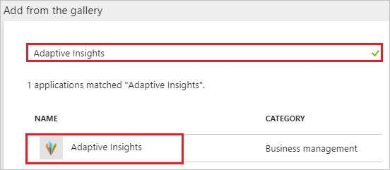
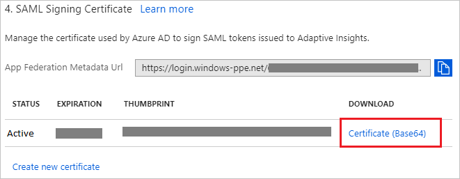

# Tutorial: Azure Active Directory integration with Adaptive Insights

In this tutorial, you learn how to integrate Adaptive Insights with Azure Active Directory (Azure AD).

Integrating Adaptive Insights with Azure AD provides you with the following benefits:

- You can control in Azure AD who has access to Adaptive Insights
- You can enable your users to automatically get signed-on to Adaptive Insights (Single Sign-On) with their Azure AD accounts
- You can manage your accounts in one central location - the Azure portal

If you want to know more details about SaaS app integration with Azure AD, see [what is application access and single sign-on with Azure Active Directory](active-directory-appssoaccess-whatis.md).

## Prerequisites

To configure Azure AD integration with Adaptive Insights, you need the following items:

- An Azure AD subscription
- An Adaptive Insights single sign-on enabled subscription

> [!NOTE]
> To test the steps in this tutorial, we do not recommend using a production environment.

To test the steps in this tutorial, you should follow these recommendations:

- Do not use your production environment, unless it is necessary.
- If you don't have an Azure AD trial environment, you can [get a one-month trial](https://azure.microsoft.com/pricing/free-trial/).

## Scenario description
In this tutorial, you test Azure AD single sign-on in a test environment. 
The scenario outlined in this tutorial consists of two main building blocks:

1. Adding Adaptive Insights from the gallery
2. Configuring and testing Azure AD single sign-on

## Adding Adaptive Insights from the gallery
To configure the integration of Adaptive Insights into Azure AD, you need to add Adaptive Insights from the gallery to your list of managed SaaS apps.

**To add Adaptive Insights from the gallery, perform the following steps:**

1. In the **[Azure portal](https://portal.azure.com)**, on the left navigation panel, click **Azure Active Directory** icon. 

	![Active Directory][1]

2. Navigate to **Enterprise applications**. Then go to **All applications**.

	![Applications][2]

3. To add new application, click **New application** button on the top of dialog.

	![Applications][3]

4. In the search box, type **Adaptive Insights**, select **Adaptive Insights** from result panel then click **Add** button to add the application.

	

##  Configuring and testing Azure AD single sign-on
In this section, you configure and test Azure AD single sign-on with Adaptive Insights based on a test user called "Britta Simon."

For single sign-on to work, Azure AD needs to know what the counterpart user in Adaptive Insights is to a user in Azure AD. In other words, a link relationship between an Azure AD user and the related user in Adaptive Insights needs to be established.

To configure and test Azure AD single sign-on with Adaptive Insights, you need to complete the following building blocks:

1. **[Configuring Azure AD Single Sign-On](#configuring-azure-ad-single-sign-on)** - to enable your users to use this feature.
2. **[Creating an Azure AD test user](#creating-an-azure-ad-test-user)** - to test Azure AD single sign-on with Britta Simon.
3. **[Creating an Adaptive Insights test user](#creating-an-adaptive-insights-test-user)** - to have a counterpart of Britta Simon in Adaptive Insights that is linked to the Azure AD representation of user.
4. **[Assigning the Azure AD test user](#assigning-the-azure-ad-test-user)** - to enable Britta Simon to use Azure AD single sign-on.
5. **[Testing Single Sign-On](#testing-single-sign-on)** - to verify whether the configuration works.

### Configuring Azure AD single sign-on

In this section, you enable Azure AD single sign-on in the Azure portal and configure single sign-on in your Adaptive Insights application.

**To configure Azure AD single sign-on with Adaptive Insights, perform the following steps:**

1. In the Azure portal, on the **Adaptive Insights** application integration page, click **Single sign-on**.

	![Configure Single Sign-On][4]

2. On the **Single sign-on** dialog, select **Mode** as **SAML-based Sign-on** to enable single sign-on.

	

3. On the **Adaptive Insights Domain and URLs** section, perform the following steps:

	

	a. In the **Identifier(Entity ID)** textbox, type a URL using the following pattern: `https://login.adaptiveinsights.com:443/samlsso/<unique-id>`

	b. In the **Reply URL** textbox, type a URL using the following pattern: `https://login.adaptiveinsights.com:443/samlsso/<unique-id>`

	>[!NOTE]
	> You can get Identifier(Entity ID) and Reply URL values from the Adaptive Insights’s **SAML SSO Settings** page.

4. On the **SAML Signing Certificate** section, click **Certificate (Base64)** and then save the certificate file on your computer.

	

5. Click **Save** button.

	

6. On the **Adaptive Insights Configuration** section, click **Configure Adaptive Insights** to open **Configure sign-on** window. Copy the **SAML Entity ID, and SAML Single Sign-On Service URL** from the **Quick Reference section.**

	 

7. In a different web browser window, log in to your Adaptive Insights company site as an administrator.

8. Go to **Admin**.

	

9. In the **Users and Roles** section, click **Manage SAML SSO Settings**.

	

10. On the **SAML SSO Settings** page, perform the following steps:

	

	a. In the **Identity provider name** textbox, type a name for your configuration.

	b. Paste the **SAML Entity ID** value copied from Azure portal into the **Identity provider Entity ID** textbox.

	c. Paste the **SAML Single Sign-On Service URL** value copied from Azure portal into the **Identity provider SSO URL** textbox.

	d. Paste the **SAML Single Sign-On Service URL** value copied from Azure portal into the **Custom logout URL** textbox.

	e. To upload your downloaded certificate, click **Choose file**.

	f. Select the following, for:

    * **SAML user id**, select **User’s Adaptive Insights user name**.

    * **SAML user id location**, select **User id in NameID of Subject**.

    * **SAML NameID format**, select **Email address**.

    * **Enable SAML**, select **Allow SAML SSO and direct Adaptive Insights login**.

	g. Copy **Adaptive Insights SSO URL** and paste into the **Identifier(Entity ID)** and **Reply URL** textboxes in the **Adaptive Insights Domain and URLs** section in the Azure portal.

	h. Click **Save**.

### Creating an Azure AD test user
The objective of this section is to create a test user in the Azure portal called Britta Simon.

![Create Azure AD User][100]

**To create a test user in Azure AD, perform the following steps:**

1. In the **Azure portal**, on the left navigation pane, click **Azure Active Directory** icon.

	 

2. To display the list of users, go to **Users and groups** and click **All users**.

	 

3. To open the **User** dialog, click **Add** on the top of the dialog.

	 

4. On the **User** dialog page, perform the following steps:

	

    a. In the **Name** textbox, type **BrittaSimon**.

    b. In the **User name** textbox, type the **email address** of BrittaSimon.

	c. Select **Show Password** and write down the value of the **Password**.

    d. Click **Create**.

### Creating an Adaptive Insights test user

To enable Azure AD users to log in to Adaptive Insights, they must be provisioned into Adaptive Insights. In the case of Adaptive Insights, provisioning is a manual task.

**To configure user provisioning, perform the following steps:** 

1. Log in to your **Adaptive Insights** company site as an administrator.
2. Go to **Admin**.

   
3. In the **Users and Roles** section, click **Add User**.

   
4. In the **New User** section, perform the following steps:

   

   a. Type the **Name**, **Login**, **Email**, **Password** of a valid Azure Active Directory user you want to provision into the related textboxes.

   b. Select a **Role**.

   c. Click **Submit**.

>[!NOTE]
>You can use any other Adaptive Insights user account creation tools or APIs provided by Adaptive Insights to provision AAD user accounts.
>

### Assigning the Azure AD test user

In this section, you enable Britta Simon to use Azure single sign-on by granting access to Adaptive Insights.

![Assign User][200]

**To assign Britta Simon to Adaptive Insights, perform the following steps:**

1. In the Azure portal, open the applications view, and then navigate to the directory view and go to **Enterprise applications** then click **All applications**.

	![Assign User][201]

2. In the applications list, select **Adaptive Insights**.

	

3. In the menu on the left, click **Users and groups**.

	![Assign User][202]

4. Click **Add** button. Then select **Users and groups** on **Add Assignment** dialog.

	![Assign User][203]

5. On **Users and groups** dialog, select **Britta Simon** in the Users list.

6. Click **Select** button on **Users and groups** dialog.

7. Click **Assign** button on **Add Assignment** dialog.

### Testing single sign-on

The objective of this section is to test your Microsoft Azure AD Single Sign-On configuration using the Access Panel.

When you click the Adaptive Insights tile in the Access Panel, you should get automatically signed-on to your Adaptive Insights application.

## Additional resources

* [List of Tutorials on How to Integrate SaaS Apps with Azure Active Directory](active-directory-saas-tutorial-list.md)
* [What is application access and single sign-on with Azure Active Directory?](active-directory-appssoaccess-whatis.md)

<!--Image references-->

[1]: ./media/active-directory-saas-adaptivesuite-tutorial/tutorial_general_01.png
[2]: ./media/active-directory-saas-adaptivesuite-tutorial/tutorial_general_02.png
[3]: ./media/active-directory-saas-adaptivesuite-tutorial/tutorial_general_03.png
[4]: ./media/active-directory-saas-adaptivesuite-tutorial/tutorial_general_04.png

[100]: ./media/active-directory-saas-adaptivesuite-tutorial/tutorial_general_100.png

[200]: ./media/active-directory-saas-adaptivesuite-tutorial/tutorial_general_200.png
[201]: ./media/active-directory-saas-adaptivesuite-tutorial/tutorial_general_201.png
[202]: ./media/active-directory-saas-adaptivesuite-tutorial/tutorial_general_202.png
[203]: ./media/active-directory-saas-adaptivesuite-tutorial/tutorial_general_203.png
