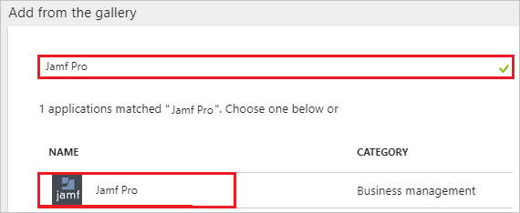
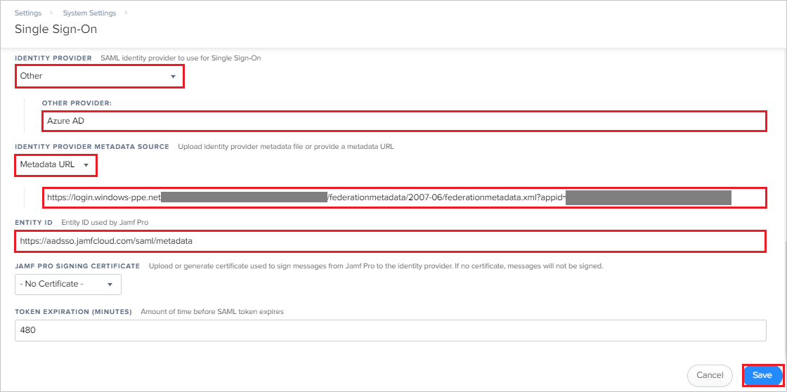

# Tutorial: Azure Active Directory integration with Jamf Pro

In this tutorial, you learn how to integrate Jamf Pro with Azure Active Directory (Azure AD).

Integrating Jamf Pro with Azure AD provides you with the following benefits:

- You can control in Azure AD who has access to Jamf Pro.
- You can enable your users to automatically get signed-on to Jamf Pro (Single Sign-On) with their Azure AD accounts.
- You can manage your accounts in one central location - the Azure portal.

If you want to know more details about SaaS app integration with Azure AD, see [what is application access and single sign-on with Azure Active Directory](manage-apps/what-is-single-sign-on.md).

## Prerequisites

To configure Azure AD integration with Jamf Pro, you need the following items:

- An Azure AD subscription
- A Jamf Pro single sign-on enabled subscription

> [!NOTE]
> To test the steps in this tutorial, we do not recommend using a production environment.

To test the steps in this tutorial, you should follow these recommendations:

- Do not use your production environment, unless it is necessary.
- If you don't have an Azure AD trial environment, you can [get a one-month trial](https://azure.microsoft.com/pricing/free-trial/).

## Scenario description
In this tutorial, you test Azure AD single sign-on in a test environment. 
The scenario outlined in this tutorial consists of two main building blocks:

1. Adding Jamf Pro from the gallery
2. Configuring and testing Azure AD single sign-on

## Adding Jamf Pro from the gallery
To configure the integration of Jamf Pro into Azure AD, you need to add Jamf Pro from the gallery to your list of managed SaaS apps.

**To add Jamf Pro from the gallery, perform the following steps:**

1. In the **[Azure portal](https://portal.azure.com)**, on the left navigation panel, click **Azure Active Directory** icon. 

	![The Azure Active Directory button][1]

2. Navigate to **Enterprise applications**. Then go to **All applications**.

	![The Enterprise applications blade][2]
	
3. To add new application, click **New application** button on the top of dialog.

	![The New application button][3]

4. In the search box, type **Jamf Pro**, select **Jamf Pro** from result panel then click **Add** button to add the application.

	

## Configure and test Azure AD single sign-on

In this section, you configure and test Azure AD single sign-on with Jamf Pro based on a test user called "Britta Simon".

For single sign-on to work, Azure AD needs to know what the counterpart user in Jamf Pro is to a user in Azure AD. In other words, a link relationship between an Azure AD user and the related user in Jamf Pro needs to be established.

To configure and test Azure AD single sign-on with Jamf Pro, you need to complete the following building blocks:

1. **[Configure Azure AD Single Sign-On](#configure-azure-ad-single-sign-on)** - to enable your users to use this feature.
2. **[Create an Azure AD test user](#create-an-azure-ad-test-user)** - to test Azure AD single sign-on with Britta Simon.
3. **[Create a Jamf Pro test user](#create-a-jamf-pro-test-user)** - to have a counterpart of Britta Simon in Jamf Pro that is linked to the Azure AD representation of user.
4. **[Assign the Azure AD test user](#assign-the-azure-ad-test-user)** - to enable Britta Simon to use Azure AD single sign-on.
5. **[Test single sign-on](#test-single-sign-on)** - to verify whether the configuration works.

### Configure Azure AD single sign-on

In this section, you enable Azure AD single sign-on in the Azure portal and configure single sign-on in your Jamf Pro application.

**To configure Azure AD single sign-on with Jamf Pro, perform the following steps:**

1. In the Azure portal, on the **Jamf Pro** application integration page, click **Single sign-on**.

	![Configure single sign-on link][4]

2. On the **Single sign-on** dialog, select **Mode** as	**SAML-based Sign-on** to enable single sign-on.
 
	

3. On the **Jamf Pro Domain and URLs** section, perform the following steps if you wish to configure the application in **IDP** initiated mode:

	

    a. In the **Identifier (Entity ID)** textbox, type a URL using the following pattern: `https://<subdomain>.jamfcloud.com/saml/metadata`

	b. In the **Reply URL** textbox, type a URL using the following pattern: `https://<subdomain>.jamfcloud.com/saml/SSO`

4. Check **Show advanced URL settings** and perform the following step if you wish to configure the application in **SP** initiated mode:

	

    In the **Sign-on URL** textbox, type a URL using the following pattern: `https://<subdomain>.jamfcloud.com`
	 
	> [!NOTE]
	> These values are not real. Update these values with the actual Identifier, Reply URL, and Sign-On URL. You will get the actual Identifier value from **Single Sign-On** section in Jamf Pro portal, which is explained later in the tutorial. You can extract the actual **subdomain** value from the identifier value and use that **subdomain** information in Sign-on URL and Reply URL.

5. On the **SAML Signing Certificate** section, click the copy button to copy **App Federation Metadata Url** and paste it into Notepad.

	 

6. Click **Save** button.

	
	
7. In a different web browser window, log into your Jamf Pro company site as an administrator.

8. Click on the **Settings icon** from the top right corner of the page.

	

9. Click on **Single Sign On**.

	

10. Scroll down upto **IDENTITY PROVIDER** under the **Single Sign-On** section and perform the following steps:

	

	a. Select **Other** as a option from the **IDENTITY PROVIDER** dropdown.

	b. In the **OTHER PROVIDER** textbox, enter **Azure AD**.

	c. Select **Metadata URL** as a option from the **IDENTITY PROVIDER METADATA SOURCE** dropdown and in the following textbox, paste the **App Federation Metadata Url** value which you have copied from the Azure portal.

	d. Copy the **Entity ID** vlaue and paste it into the **Identifier (Entity ID)** textbox in **Jamf Pro Domain and URLs** section on Azure portal.

	>[!NOTE]
	> Here `aadsso` is the subdomain part (which is for reference purpose). Use this value to complete the Sign-on URL and Reply URL in the **Jamf Pro Domain and URLs** section on Azure portal.

	e. Click **Save**.

### Create an Azure AD test user

The objective of this section is to create a test user in the Azure portal called Britta Simon.

   ![Create an Azure AD test user][100]

**To create a test user in Azure AD, perform the following steps:**

1. In the Azure portal, in the left pane, click the **Azure Active Directory** button.

    

2. To display the list of users, go to **Users and groups**, and then click **All users**.

    

3. To open the **User** dialog box, click **Add** at the top of the **All Users** dialog box.

    

4. In the **User** dialog box, perform the following steps:

    

    a. In the **Name** box, type **BrittaSimon**.

    b. In the **User name** box, type the email address of user Britta Simon.

    c. Select the **Show Password** check box, and then write down the value that's displayed in the **Password** box.

    d. Click **Create**.
 
### Create a Jamf Pro test user

To enable Azure AD users to log in to Jamf Pro, they must be provisioned into Jamf Pro. In the case of Jamf Pro, provisioning is a manual task.

**To provision a user account, perform the following steps:**

1. Log in to your Jamf Pro company site as an administrator.

2. Click on the **Settings icon** from the top right corner of the page.

	

3. Click on **Jamf Pro User Accounts & Groups**.

	

4. Click **New**.

	

5. Select **Create Standard Account**.

	

6. On the **New Account** dailog, perform the following steps:

	

	a. In the **USERNAME** textbox, type the full name of BrittaSimon.

	b. Select appropriate options as per your organization for **ACCESS LEVEL**, **PRIVILEGE SET**, and for **ACCESS STATUS**.
	
	c. In the **FULL NAME** textbox, type the full name of Britta Simon.

	d. In the **EMAIL ADDRESS** textbox, type the email address of Britta Simon account.

	e. In the **PASSWORD** textbox, type the password of the user.

	f. In the **VERIFY PASSWORD** textbox, type the password of the user.

	g. Click **Save**.

### Assign the Azure AD test user

In this section, you enable Britta Simon to use Azure single sign-on by granting access to Jamf Pro.

![Assign the user role][200] 

**To assign Britta Simon to Jamf Pro, perform the following steps:**

1. In the Azure portal, open the applications view, and then navigate to the directory view and go to **Enterprise applications** then click **All applications**.

	![Assign User][201] 

2. In the applications list, select **Jamf Pro**.

	  

3. In the menu on the left, click **Users and groups**.

	![The "Users and groups" link][202]

4. Click **Add** button. Then select **Users and groups** on **Add Assignment** dialog.

	![The Add Assignment pane][203]

5. On **Users and groups** dialog, select **Britta Simon** in the Users list.

6. Click **Select** button on **Users and groups** dialog.

7. Click **Assign** button on **Add Assignment** dialog.
	
### Test single sign-on

In this section, you test your Azure AD single sign-on configuration using the Access Panel.

When you click the Jamf Pro tile in the Access Panel, you should get automatically signed-on to your Jamf Pro application.
For more information about the Access Panel, see [Introduction to the Access Panel](active-directory-saas-access-panel-introduction.md). 

## Additional resources

* [List of Tutorials on How to Integrate SaaS Apps with Azure Active Directory](active-directory-saas-tutorial-list.md)
* [What is application access and single sign-on with Azure Active Directory?](manage-apps/what-is-single-sign-on.md)

<!--Image references-->

[1]: ./media/active-directory-saas-jamfprosamlconnector-tutorial/tutorial_general_01.png
[2]: ./media/active-directory-saas-jamfprosamlconnector-tutorial/tutorial_general_02.png
[3]: ./media/active-directory-saas-jamfprosamlconnector-tutorial/tutorial_general_03.png
[4]: ./media/active-directory-saas-jamfprosamlconnector-tutorial/tutorial_general_04.png

[100]: ./media/active-directory-saas-jamfprosamlconnector-tutorial/tutorial_general_100.png

[200]: ./media/active-directory-saas-jamfprosamlconnector-tutorial/tutorial_general_200.png
[201]: ./media/active-directory-saas-jamfprosamlconnector-tutorial/tutorial_general_201.png
[202]: ./media/active-directory-saas-jamfprosamlconnector-tutorial/tutorial_general_202.png
[203]: ./media/active-directory-saas-jamfprosamlconnector-tutorial/tutorial_general_203.png

