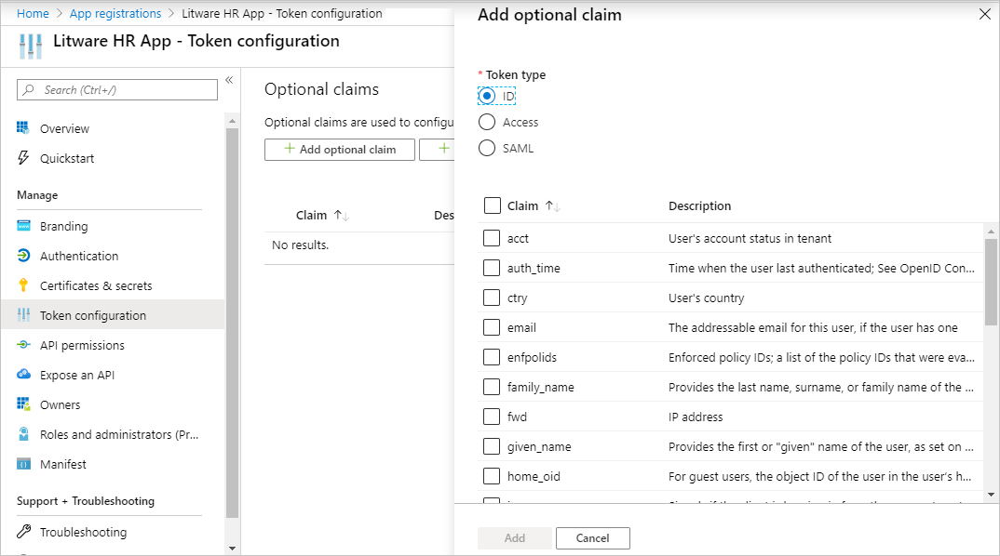
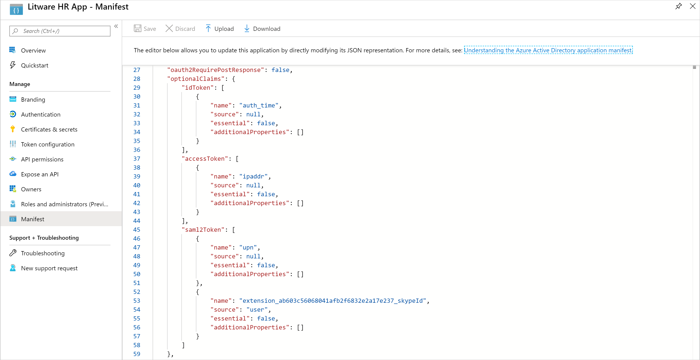
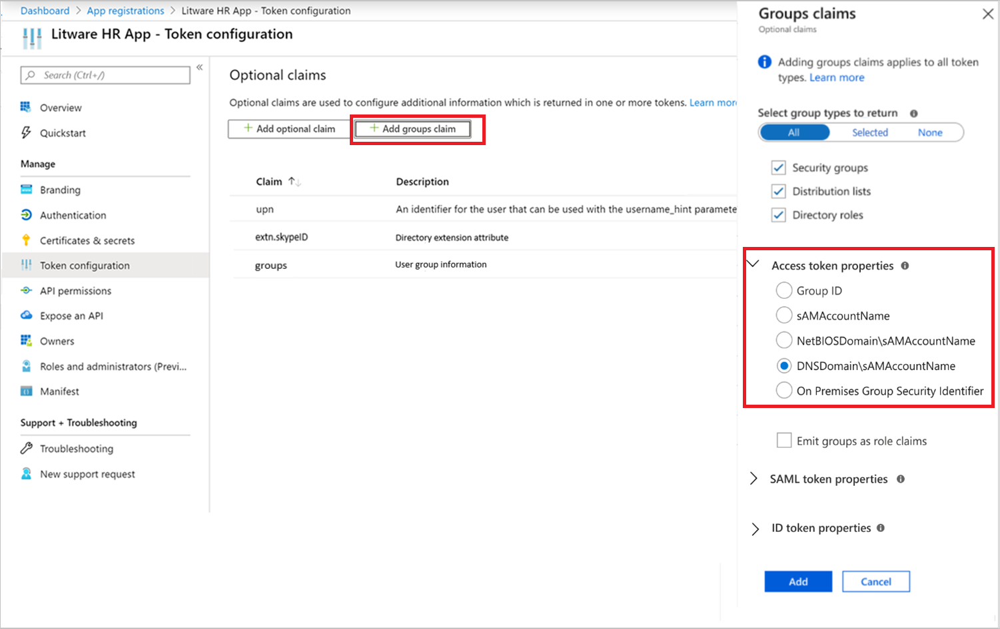
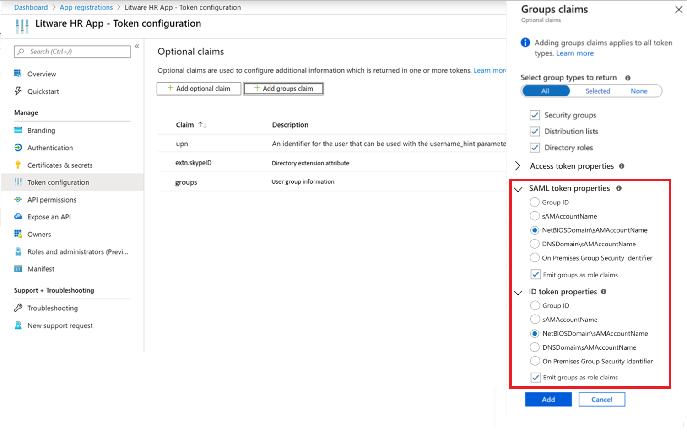
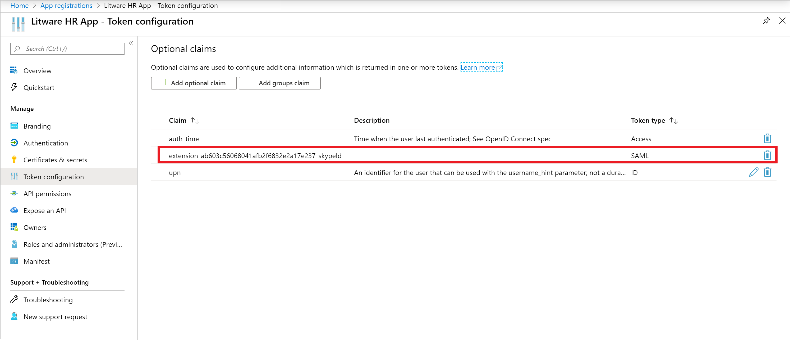

# How to: Provide optional claims to your app

Application developers can use optional claims in their Azure AD applications to specify which claims they want in tokens sent to their application.

You can use optional claims to:

- Select additional claims to include in tokens for your application.
- Change the behavior of certain claims that Microsoft identity platform returns in tokens.
- Add and access custom claims for your application.

For the lists of standard claims, see the [access token](access-tokens.md) and [id_token](id-tokens.md) claims documentation.

While optional claims are supported in both v1.0 and v2.0 format tokens, as well as SAML tokens, they provide most of their value when moving from v1.0 to v2.0. One of the goals of the [v2.0 Microsoft identity platform endpoint](./v2-overview.md) is smaller token sizes to ensure optimal performance by clients. As a result, several claims formerly included in the access and ID tokens are no longer present in v2.0 tokens and must be asked for specifically on a per-application basis.

**Table 1: Applicability**

| Account Type               | v1.0 tokens | v2.0 tokens |
|----------------------------|-------------|-------------|
| Personal Microsoft account | N/A         | Supported   |
| Azure AD account           | Supported   | Supported   |

## v1.0 and v2.0 optional claims set

The set of optional claims available by default for applications to use are listed below. To add custom optional claims for your application, see [Directory Extensions](#configuring-directory-extension-optional-claims), below. When adding claims to the **access token**, the claims apply to access tokens requested *for* the application (a web API), not claims requested *by* the application. No matter how the client accesses your API, the right data is present in the access token that is used to authenticate against your API.

> [!NOTE]
> The majority of these claims can be included in JWTs for v1.0 and v2.0 tokens, but not SAML tokens, except where noted in the Token Type column. Consumer accounts support a subset of these claims, marked in the "User Type" column.  Many of the claims listed do not apply to consumer users (they have no tenant, so `tenant_ctry` has no value).

**Table 2: v1.0 and v2.0 optional claim set**

| Name                       |  Description   | Token Type | User Type | Notes  |
|----------------------------|----------------|------------|-----------|--------|
| `auth_time`                | Time when the user last authenticated. See OpenID Connect spec.| JWT        |           |  |
| `tenant_region_scope`      | Region of the resource tenant | JWT        |           | |
| `sid`                      | Session ID, used for per-session user sign-out. | JWT        |  Personal and Azure AD accounts.   |         |
| `verified_primary_email`   | Sourced from the user's PrimaryAuthoritativeEmail      | JWT        |           |         |
| `verified_secondary_email` | Sourced from the user's SecondaryAuthoritativeEmail   | JWT        |           |        |
| `vnet`                     | VNET specifier information. | JWT        |           |      |
| `fwd`                      | IP address.| JWT    |   | Adds the original IPv4 address of the requesting client (when inside a VNET) |
| `ctry`                     | User's country/region | JWT, SAML |  | Azure AD returns the `ctry` optional claim if it's present and the value of the field is a standard two-letter country/region code, such as FR, JP, SZ, and so on. |
| `tenant_ctry`              | Resource tenant's country | JWT | | Same as `ctry` except set at a tenant level by an admin.  Must also be a standard two-letter value. |
| `xms_pdl`             | Preferred data location   | JWT | | For Multi-Geo tenants, the preferred data location is the three-letter code showing the geographic region the user is in. For more info, see the [Azure AD Connect documentation about preferred data location](../hybrid/how-to-connect-sync-feature-preferreddatalocation.md).<br/>For example: `APC` for Asia Pacific. |
| `xms_pl`                   | User preferred language  | JWT ||The user's preferred language, if set. Sourced from their home tenant, in guest access scenarios. Formatted LL-CC ("en-us"). |
| `xms_tpl`                  | Tenant preferred language| JWT | | The resource tenant's preferred language, if set. Formatted LL ("en"). |
| `ztdid`                    | Zero-touch Deployment ID | JWT | | The device identity used for [Windows AutoPilot](/windows/deployment/windows-autopilot/windows-10-autopilot) |
| `email`                    | The addressable email for this user, if the user has one.  | JWT, SAML | MSA, Azure AD | This value is included by default if the user is a guest in the tenant.  For managed users (the users inside the tenant), it must be requested through this optional claim or, on v2.0 only, with the OpenID scope.  For managed users, the email address must be set in the [Office admin portal](https://portal.office.com/adminportal/home#/users).|
| `acct`                | Users account status in tenant | JWT, SAML | | If the user is a member of the tenant, the value is `0`. If they are a guest, the value is `1`. |
| `groups`| Optional formatting for group claims |JWT, SAML| |Used in conjunction with the GroupMembershipClaims setting in the [application manifest](reference-app-manifest.md), which must be set as well. For details see [Group claims](#configuring-groups-optional-claims) below. For more information about group claims, see [How to configure group claims](../hybrid/how-to-connect-fed-group-claims.md)
| `upn`                      | UserPrincipalName | JWT, SAML  |           | An identifer for the user that can be used with the username_hint parameter.  Not a durable identifier for the user and should not be used to uniquely identity user information (for example, as a database key). Instead, use the user object ID (`oid`) as a database key. Users signing in with an [alternate login ID](../authentication/howto-authentication-use-email-signin.md) should not be shown their User Principal Name (UPN). Instead, use the following ID token claims for displaying sign-in state to the user: `preferred_username` or `unique_name` for v1 tokens and `preferred_username` for v2 tokens. Although this claim is automatically included, you can specify it as an optional claim to attach additional properties to modify its behavior in the guest user case.  |
| `idtyp`                    | Token type   | JWT access tokens | Special: only in app-only access tokens |  Value is `app` when the token is an app-only token. This is the most accurate way for an API to determine if a token is an app token or an app+user token.|

## v2.0-specific optional claims set

These claims are always included in v1.0 Azure AD tokens, but not included in v2.0 tokens unless requested. These claims are only applicable for JWTs (ID tokens and Access Tokens).

**Table 3: v2.0-only optional claims**

| JWT Claim     | Name                            | Description                                | Notes |
|---------------|---------------------------------|-------------|-------|
| `ipaddr`      | IP Address                      | The IP address the client logged in from.   |       |
| `onprem_sid`  | On-Premises Security Identifier |                                             |       |
| `pwd_exp`     | Password Expiration Time        | The datetime at which the password expires. |       |
| `pwd_url`     | Change Password URL             | A URL that the user can visit to change their password.   |   |
| `in_corp`     | Inside Corporate Network        | Signals if the client is logging in from the corporate network. If they're not, the claim isn't included.   |  Based off of the [trusted IPs](../authentication/howto-mfa-mfasettings.md#trusted-ips) settings in MFA.    |
| `family_name` | Last Name                       | Provides the last name, surname, or family name of the user as defined in the user object. <br>"family_name":"Miller" | Supported in MSA and Azure AD. Requires the `profile` scope.   |
| `given_name`  | First name                      | Provides the first or "given" name of the user, as set on the user object.<br>"given_name": "Frank"                   | Supported in MSA and Azure AD .  Requires the `profile` scope. |
| `upn`         | User Principal Name | An identifer for the user that can be used with the username_hint parameter.  Not a durable identifier for the user and should not be used to uniquely identity user information (for example, as a database key). Instead, use the user object ID (`oid`) as a database key. Users signing in with an [alternate login ID](../authentication/howto-authentication-use-email-signin.md) should not be shown their User Principal Name (UPN). Instead, use the following ID token claims for displaying sign-in state to the user: `preferred_username` or `unique_name` for v1 tokens and `preferred_username` for v2 tokens. | See [additional properties](#additional-properties-of-optional-claims) below for configuration of the claim. Requires the `profile` scope.|

### Additional properties of optional claims

Some optional claims can be configured to change the way the claim is returned. These additional properties are mostly used to help migration of on-premises applications with different data expectations. For example, `include_externally_authenticated_upn_without_hash` helps with clients that cannot handle hash marks (`#`) in the UPN.

**Table 4: Values for configuring optional claims**

| Property name  | Additional Property name | Description |
|----------------|--------------------------|-------------|
| `upn`          |                          | Can be used for both SAML and JWT responses, and for v1.0 and v2.0 tokens. |
|                | `include_externally_authenticated_upn`  | Includes the guest UPN as stored in the resource tenant. For example, `foo_hometenant.com#EXT#@resourcetenant.com` |
|                | `include_externally_authenticated_upn_without_hash` | Same as above, except that the hash marks (`#`) are replaced with underscores (`_`), for example `foo_hometenant.com_EXT_@resourcetenant.com` |

#### Additional properties example

```json
"optionalClaims": {
    "idToken": [
        {
            "name": "upn",
            "essential": false,
            "additionalProperties": [
                "include_externally_authenticated_upn"
            ]
        }
    ]
}
```

This OptionalClaims object causes the ID token returned to the client to include a `upn` claim with the additional home tenant and resource tenant information. The `upn` claim is only changed in the token if the user is a guest in the tenant (that uses a different IDP for authentication).

## Configuring optional claims

> [!IMPORTANT]
> Access tokens are **always** generated using the manifest of the resource, not the client.  So in the request `...scope=https://graph.microsoft.com/user.read...` the resource is the Microsoft Graph API.  Thus, the access token is created using the Microsoft Graph API manifest, not the client's manifest.  Changing the manifest for your application will never cause tokens for the Microsoft Graph API to look different.  In order to validate that your `accessToken` changes are in effect, request a token for your application, not another app.

You can configure optional claims for your application through the UI or application manifest.

1. Go to the [Azure portal](https://portal.azure.com). Search for and select **Azure Active Directory**.
1. From the **Manage** section, select **App registrations**.
1. Select the application you want to configure optional claims for in the list.

**Configuring optional claims through the UI:**

[](./media/active-directory-optional-claims/token-configuration.png)

1. From the **Manage** section, select **Token configuration**.
1. Select **Add optional claim**.
1. Select the token type you want to configure.
1. Select the optional claims to add.
1. Select **Add**.

> [!NOTE]
> The UI option **Token configuration** blade is not available for apps registered in an Azure AD B2C tenant currently . For applications registered in a B2C tenant , the optional claims can be configured by modifying the application manifest . For more information see [Add claims and customize user input using custom policies in Azure Active Directory B2C](../../active-directory-b2c/custom-policy-configure-user-input.md) 

**Configuring optional claims through the application manifest:**

[](./media/active-directory-optional-claims/app-manifest.png)

1. From the **Manage** section, select **Manifest**. A web-based manifest editor opens, allowing you to edit the manifest. Optionally, you can select **Download** and edit the manifest locally, and then use **Upload** to reapply it to your application. For more information on the application manifest, see the [Understanding the Azure AD application manifest article](reference-app-manifest.md).

    The following application manifest entry adds the auth_time, ipaddr, and upn optional claims to ID, access, and SAML tokens.

    ```json
    "optionalClaims": {
        "idToken": [
            {
                "name": "auth_time",
                "essential": false
            }
        ],
        "accessToken": [
            {
                "name": "ipaddr",
                "essential": false
            }
        ],
        "saml2Token": [
            {
                "name": "upn",
                "essential": false
            },
            {
                "name": "extension_ab603c56068041afb2f6832e2a17e237_skypeId",
                "source": "user",
                "essential": false
            }
        ]
    }
    ```

2. When finished, select **Save**. Now the specified optional claims will be included in the tokens for your application.


### OptionalClaims type

Declares the optional claims requested by an application. An application can configure optional claims to be returned in each of three types of tokens (ID token, access token, SAML 2 token) that it can receive from the security token service. The application can configure a different set of optional claims to be returned in each token type. The OptionalClaims property of the Application entity is an OptionalClaims object.

**Table 5: OptionalClaims type properties**

| Name          | Type                       | Description                                           |
|---------------|----------------------------|-------------------------------------------------------|
| `idToken`     | Collection (OptionalClaim) | The optional claims returned in the JWT ID token.     |
| `accessToken` | Collection (OptionalClaim) | The optional claims returned in the JWT access token. |
| `saml2Token`  | Collection (OptionalClaim) | The optional claims returned in the SAML token.       |

### OptionalClaim type

Contains an optional claim associated with an application or a service principal. The idToken, accessToken, and saml2Token properties of the [OptionalClaims](/graph/api/resources/optionalclaims) type is a collection of OptionalClaim.
If supported by a specific claim, you can also modify the behavior of the OptionalClaim using the AdditionalProperties field.

**Table 6: OptionalClaim type properties**

| Name                   | Type                    | Description                                                                                                                                                                                                                                                                                                   |
|------------------------|-------------------------|---------------------------------------------------------------------------------------------------------------------------------------------------------------------------------------------------------------------------------------------------------------------------------------------------------------|
| `name`                 | Edm.String              | The name of the optional claim.                                                                                                                                                                                                                                                                               |
| `source`               | Edm.String              | The source (directory object) of the claim. There are predefined claims and user-defined claims from extension properties. If the source value is null, the claim is a predefined optional claim. If the source value is user, the value in the name property is the extension property from the user object. |
| `essential`            | Edm.Boolean             | If the value is true, the claim specified by the client is necessary to ensure a smooth authorization experience for the specific task requested by the end user. The default value is false.                                                                                                                 |
| `additionalProperties` | Collection (Edm.String) | Additional properties of the claim. If a property exists in this collection, it modifies the behavior of the optional claim specified in the name property.                                                                                                                                                   |

## Configuring directory extension optional claims

In addition to the standard optional claims set, you can also configure tokens to include extensions. For more info, see [the Microsoft Graph extensionProperty documentation](/graph/api/resources/extensionproperty).

Schema and open extensions are not supported by optional claims, only the AAD-Graph style directory extensions. This feature is useful for attaching additional user information that your app can use – for example, an additional identifier or important configuration option that the user has set. See the bottom of this page for an example.

> [!NOTE]
> Directory schema extensions are an Azure AD-only feature. If your application manifest requests a custom extension and an MSA user logs in to your app, these extensions will not be returned.

### Directory extension formatting

When configuring directory extension optional claims using the application manifest, use the full name of the extension (in the format: `extension_<appid>_<attributename>`). The `<appid>` must match the ID of the application requesting the claim.

Within the JWT, these claims will be emitted with the following name format:  `extn.<attributename>`.

Within the SAML tokens, these claims will be emitted with the following URI format: `http://schemas.microsoft.com/identity/claims/extn.<attributename>`

## Configuring groups optional claims

   > [!NOTE]
   > The ability to emit group names for users and groups synced from on-premises is Public Preview.

This section covers the configuration options under optional claims for changing the group attributes used in group claims from the default group objectID to attributes synced from on-premises Windows Active Directory. You can configure groups optional claims for your application through the UI or application manifest.

> [!IMPORTANT]
> For more details including important caveats for the public preview of group claims from on-premises attributes, see [Configure group claims for applications with Azure AD](../hybrid/how-to-connect-fed-group-claims.md).

**Configuring groups optional claims through the UI:**

1. Sign in to the [Azure portal](https://portal.azure.com).
1. After you've authenticated, choose your Azure AD tenant by selecting it from the top-right corner of the page.
1. Select **Azure Active Directory** from the left-hand menu.
1. Under the **Manage** section, select **App registrations**.
1. Select the application you want to configure optional claims for in the list.
1. Under the **Manage** section, select **Token configuration**.
1. Select **Add groups claim**.
1. Select the group types to return (**Security groups**, or **Directory roles**, **All groups**, and/or **Groups assigned to the application**). The **Groups assigned to the application** option includes only groups assigned to the application. The **All Groups** option includes **SecurityGroup**, **DirectoryRole**, and **DistributionList**, but not **Groups assigned to the application**. 
1. Optional: select the specific token type properties to modify the groups claim value to contain on premises group attributes or to change the claim type to a role.
1. Select **Save**.

**Configuring groups optional claims through the application manifest:**

1. Sign in to the [Azure portal](https://portal.azure.com).
1. After you've authenticated, choose your Azure AD tenant by selecting it from the top-right corner of the page.
1. Select **Azure Active Directory** from the left-hand menu.
1. Select the application you want to configure optional claims for in the list.
1. Under the **Manage** section, select **Manifest**.
1. Add the following entry using the manifest editor:

   The valid values are:

   - "All" (this option includes SecurityGroup, DirectoryRole, and DistributionList)
   - "SecurityGroup"
   - "DirectoryRole"
   - "ApplicationGroup" (this option includes only groups that are assigned to the application)

   For example:

    ```json
    "groupMembershipClaims": "SecurityGroup"
    ```

   By default Group ObjectIDs will be emitted in the group claim value.  To modify the claim value to contain on premises group attributes, or to change the claim type to role, use OptionalClaims configuration as follows:

1. Set group name configuration optional claims.

   If you want groups in the token to contain the on premises AD group attributes in the optional claims section, specify which token type optional claim should be applied to, the name of optional claim requested and any additional properties desired.  Multiple token types can be listed:

   - idToken for the OIDC ID token
   - accessToken for the OAuth access token
   - Saml2Token for SAML tokens.

   > [!NOTE]
   > The Saml2Token type applies to both SAML1.1 and SAML2.0 format tokens.

   For each relevant token type, modify the groups claim to use the OptionalClaims section in the manifest. The OptionalClaims schema is as follows:

    ```json
    {
        "name": "groups",
        "source": null,
        "essential": false,
        "additionalProperties": []
    }
    ```

   | Optional claims schema | Value |
   |----------|-------------|
   | **name:** | Must be "groups" |
   | **source:** | Not used. Omit or specify null |
   | **essential:** | Not used. Omit or specify false |
   | **additionalProperties:** | List of additional properties.  Valid options are "sam_account_name", "dns_domain_and_sam_account_name", "netbios_domain_and_sam_account_name", "emit_as_roles" |

   In additionalProperties only one of "sam_account_name", "dns_domain_and_sam_account_name", "netbios_domain_and_sam_account_name" are required.  If more than one is present, the first is used and any others ignored.

   Some applications require group information about the user in the role claim.  To change the claim type from a group claim to a role claim, add "emit_as_roles" to additional properties.  The group values will be emitted in the role claim.

   > [!NOTE]
   > If "emit_as_roles" is used, any application roles configured that the user is assigned will not appear in the role claim.

**Examples:**

1) Emit groups as group names in OAuth access tokens in dnsDomainName\sAMAccountName format

    **UI configuration:**

    [](./media/active-directory-optional-claims/groups-example-1.png)

    **Application manifest entry:**

    ```json
    "optionalClaims": {
        "accessToken": [
            {
                "name": "groups",
                "additionalProperties": [
                    "dns_domain_and_sam_account_name"
                ]
            }
        ]
    }
    ```

2) Emit group names to be returned in netbiosDomain\sAMAccountName format as the roles claim in SAML and OIDC ID Tokens

    **UI configuration:**

    [](./media/active-directory-optional-claims/groups-example-2.png)

    **Application manifest entry:**

    ```json
    "optionalClaims": {
        "saml2Token": [
            {
                "name": "groups",
                "additionalProperties": [
                    "netbios_name_and_sam_account_name",
                    "emit_as_roles"
                ]
            }
        ],
        "idToken": [
            {
                "name": "groups",
                "additionalProperties": [
                    "netbios_name_and_sam_account_name",
                    "emit_as_roles"
                ]
            }
        ]
    }
    ```

## Optional claims example

In this section, you can walk through a scenario to see how you can use the optional claims feature for your application.
There are multiple options available for updating the properties on an application's identity configuration to enable and configure optional claims:

- You can use the **Token configuration** UI (see example below)
- You can use the **Manifest** (see example below). Read the [Understanding the Azure AD application manifest document](./reference-app-manifest.md) first for an introduction to the manifest.
- It's also possible to write an application that uses the [Microsoft Graph API](/graph/use-the-api) to update your application. The [OptionalClaims](/graph/api/resources/optionalclaims) type in the Microsoft Graph API reference guide can help you with configuring the optional claims.

**Example:**

In the example below, you will use the **Token configuration** UI and **Manifest** to add optional claims to the access, ID, and SAML tokens intended for your application. Different optional claims will be added to each type of token that the application can receive:

- The ID tokens will now contain the UPN for federated users in the full form (`<upn>_<homedomain>#EXT#@<resourcedomain>`).
- The access tokens that other clients request for this application will now include the auth_time claim.
- The SAML tokens will now contain the skypeId directory schema extension (in this example, the app ID for this app is ab603c56068041afb2f6832e2a17e237). The SAML tokens will expose the Skype ID as `extension_skypeId`.

**UI configuration:**

1. Sign in to the [Azure portal](https://portal.azure.com).
1. After you've authenticated, choose your Azure AD tenant by selecting it from the top-right corner of the page.

1. Select **Azure Active Directory** from the left-hand menu.

1. Under the **Manage** section, select **App registrations**.

1. Find the application you want to configure optional claims for in the list and select it.

1. Under the **Manage** section, select **Token configuration**.

1. Select **Add optional claim**, select the **ID** token type, select **upn** from the list of claims, and then select **Add**.

1. Select **Add optional claim**, select the **Access** token type, select **auth_time** from the list of claims, then select **Add**.

1. From the Token Configuration overview screen, select the pencil icon next to **upn**, select the **Externally authenticated** toggle, and then select **Save**.

1. Select **Add optional claim**, select the **SAML** token type, select **extn.skypeID** from the list of claims (only applicable if you've created an Azure AD user object called skypeID), and then select **Add**.

    [](./media/active-directory-optional-claims/token-config-example.png)

**Manifest configuration:**

1. Sign in to the [Azure portal](https://portal.azure.com).
1. After you've authenticated, choose your Azure AD tenant by selecting it from the top-right corner of the page.
1. Select **Azure Active Directory** from the left-hand menu.
1. Find the application you want to configure optional claims for in the list and select it.
1. Under the **Manage** section, select **Manifest** to open the inline manifest editor.
1. You can directly edit the manifest using this editor. The manifest follows the schema for the [Application entity](./reference-app-manifest.md), and automatically formats the manifest once saved. New elements will be added to the `OptionalClaims` property.

    ```json
    "optionalClaims": {
        "idToken": [
            {
                "name": "upn",
                "essential": false,
                "additionalProperties": [
                    "include_externally_authenticated_upn"
                ]
            }
        ],
        "accessToken": [
            {
                "name": "auth_time",
                "essential": false
            }
        ],
        "saml2Token": [
            {
                "name": "extension_ab603c56068041afb2f6832e2a17e237_skypeId",
                "source": "user",
                "essential": true
            }
        ]
    }
    ```

1. When you're finished updating the manifest, select **Save** to save the manifest.

## Next steps

Learn more about the standard claims provided by Azure AD.

- [ID tokens](id-tokens.md)
- [Access tokens](access-tokens.md)