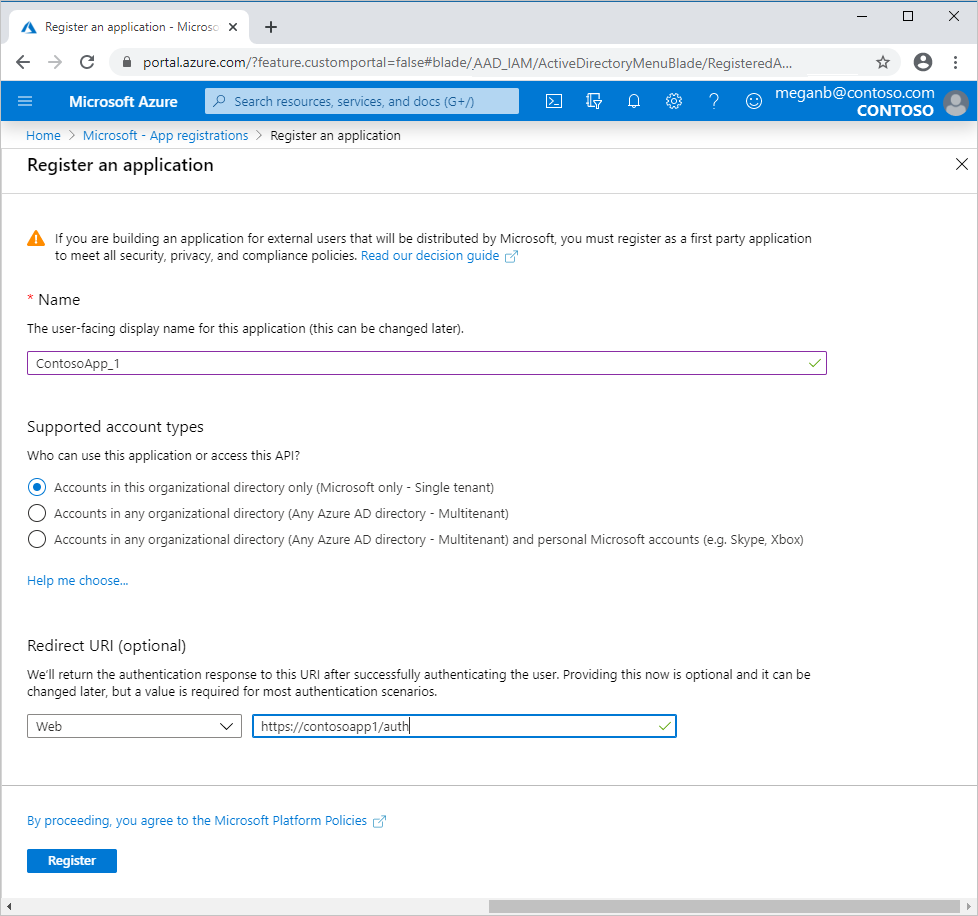

# Quickstart: Register an application with the Microsoft identity platform

In this quickstart, you register an application using the **App registrations** experience in the Azure portal. Your app is integrated with the Microsoft identity platform. Enterprise developers and software-as-a-service (SaaS) providers can develop commercial cloud services or line-of-business applications that can be integrated with Microsoft identity platform. Integration provides secure sign-in and authorization for such services.

## Prerequisites

* An Azure account with an active subscription. [Create an account for free](https://azure.microsoft.com/free/?ref=microsoft.com&utm_source=microsoft.com&utm_medium=docs&utm_campaign=visualstudio).

## Register a new application using the Azure portal

1. Sign in to the [Azure portal](https://portal.azure.com) using either a work or school account or a personal Microsoft account.
1. If your account gives you access to more than one tenant, select your account in the upper right corner. Set your portal session to the Azure AD tenant that you want.
1. Search for and select **Azure Active Directory**. Under **Manage**, select **App registrations**.
1. Select **New registration**.
1. In **Register an application**, enter a meaningful application name to display to users.
1. Specify who can use the application, as follows:

    | Supported account types | Description |
    |-------------------------|-------------|
    | **Accounts in this organizational directory only** | Select this option if you're building a line-of-business (LOB) application. This option isn't available if you're not registering the application in a directory.  This option maps to Azure AD only single-tenant.  This option is the default unless you're registering the app outside of a directory. In cases where the app is registered outside of a directory, the default is Azure AD multi-tenant and personal Microsoft accounts. |
    | **Accounts in any organizational directory** | Select this option if you would like to target all business and educational customers.  This option maps to an Azure AD only multi-tenant.  If you registered the app as Azure AD only single-tenant, you can update it to be Azure AD multi-tenant and back to single-tenant through the **Authentication** page. |
    | **Accounts in any organizational directory and personal Microsoft accounts** | Select this option to target the widest set of customers.  This option maps to Azure AD multi-tenant and personal Microsoft accounts.  If you registered the app as Azure AD multi-tenant and personal Microsoft accounts, you can't change this setting in the UI. Instead, you must use the application manifest editor to change the supported account types. |

1. Under **Redirect URI (optional)**, select the type of app you're building: **Web** or **Public client (mobile & desktop)**. Then enter the redirect URI, or reply URL, for your application.

    * For web applications, provide the base URL of your app. For example, `https://localhost:31544` might be the URL for a web app running on your local machine. Users would use this URL to sign in to a web client application.
    * For public client applications, provide the URI used by Azure AD to return token responses. Enter a value specific to your application, such as `myapp://auth`.

    For examples for web applications or native applications, see the quickstarts in [Microsoft identity platform](https://docs.microsoft.com/azure/active-directory/develop).

1. When finished, select **Register**.

    

Azure AD assigns a unique application, or client, ID to your app. The portal opens your application's **Overview** page. To add  capabilities to your application, you can select other configuration options including branding, certificates and secrets, API permissions, and more.

## Next steps

Advance to the next article to learn how to access web APIs.
> [!div class="nextstepaction"]
> [Quickstart: Configure a client application to access web APIs](quickstart-configure-app-access-web-apis.md)

* To learn about the permissions, see [Permissions and consent in the Microsoft identity platform endpoint](v2-permissions-and-consent.md).

* To expose web APIs, see [Quickstart: Configure an application to expose web APIs](quickstart-configure-app-expose-web-apis.md).

* To manage supported accounts, see [Quickstart: Modify the accounts supported by an application](quickstart-modify-supported-accounts.md).

* To build an app and add functionality, see the quickstarts in [Microsoft identity platform](https://docs.microsoft.com/azure/active-directory/develop).

* To learn more about the two Azure AD objects that represent a registered application and the relationship between them, see [Application objects and service principal objects](app-objects-and-service-principals.md).

* To learn more about the branding guidelines you should use when developing apps, see [Branding guidelines for applications](howto-add-branding-in-azure-ad-apps.md).
