---

title: Install Azure Backup Server on Azure Stack | Microsoft Docs
description: Use Azure Backup Server to protect or back up workloads in Azure Stack.
services: backup
documentationcenter: ''
author: markgalioto
manager: carmonm
editor: ''
keywords: azure backup server; protect workloads; back up workloads
ms.service: backup
ms.workload: storage-backup-recovery
ms.tgt_pltfrm: na
ms.devlang: na
ms.topic: article
ms.date: 5/18/2018
ms.author: markgal

---
# Install Azure Backup Server on Azure Stack

This article explains how to install Azure Backup Server on Azure Stack. With Azure Backup Server, you can protect application workloads running in Azure Stack from a single console.

> [!NOTE]
> To learn about security capabilities, refer to [Azure Backup security features documentation](backup-azure-security-feature.md).
>

You can also protect Infrastructure as a Service (IaaS) workloads such as VMs in Azure.

The first step towards getting the Azure Backup Server up and running is to set up a virtual machine in Azure Stack.

## Using an IaaS VM in Azure Stack

When choosing a server for running Azure Backup Server, it is recommended you start with a gallery image of Windows Server 2012 R2 Datacenter or Windows Server 2016 Datacenter. The article, [Create your first Windows virtual machine in the Azure portal](../virtual-machines/virtual-machines-windows-hero-tutorial.md?toc=%2fazure%2fvirtual-machines%2fwindows%2ftoc.json), provides a tutorial for getting started with the recommended virtual machine, even if you've never used Azure Stack before. The recommended minimum requirements for the server virtual machine (VM) should be: A2 Standard with two cores and 3.5 GB RAM.

Protecting workloads with Azure Backup Server has many nuances. The article, [Install DPM as an Azure virtual machine](https://technet.microsoft.com/library/jj852163.aspx), helps explain these nuances. Before deploying the machine, read this article completely.

> [!NOTE]
> Azure Backup Server is designed to run on a dedicated, single-purpose virtual machine. You cannot install Azure Backup Server on:
> - A computer running as a domain controller
> - A computer on which the Application Server role is installed
> - A computer on which Exchange Server is running
> - A computer that is a node of a cluster

Always join Azure Backup Server to a domain. If you plan to move the server to a different domain, install Azure Backup Server first, then join the server to the new domain. Moving an existing Azure Backup Server machine to a new domain after deployment is *not supported*.

[!INCLUDE [backup-create-rs-vault.md](../../includes/backup-create-rs-vault.md)]

### Set Storage Replication

The Recovery Services vault storage replication option allows you to choose between geo-redundant storage and locally redundant storage. By default, Recovery Services vaults use geo-redundant storage. If this vault is your primary vault, leave the storage option set to geo-redundant storage. Choose locally redundant storage if you want a cheaper option that isn't quite as durable. Read more about [geo-redundant](../storage/common/storage-redundancy-grs.md) and [locally redundant](../storage/common/storage-redundancy-lrs.md) storage options in the [Azure Storage replication overview](../storage/common/storage-redundancy.md).

To edit the storage replication setting:

1. Select your vault to open the vault dashboard and the Settings menu. If the **Settings** menu doesn't open, click **All settings** in the vault dashboard.
2. On the **Settings** menu, click **Backup Infrastructure** > **Backup Configuration** to open the **Backup Configuration** blade. On the **Backup Configuration** menu, choose the storage replication option for your vault.

    

## Download Azure Backup Server installer

Once you create a Recovery Services vault, use the Getting Started menu in the Recovery Services vault to download the Azure Backup Server installer to your Azure Stack virtual machine. The following steps take place in your Azure subscription.

1. From your Azure Stack virtual machine, [sign in to your Azure subscription in the Azure portal](https://portal.azure.com/).
2. In the left-hand menu, select **All Services**.

    

3. In the **All services** dialog, type *Recovery Services*. As you begin typing, your input filters the list of resources. Once you see it, select **Recovery Services vaults**.

    

    The list of Recovery Services vaults in the subscription appears.

4. From the list of Recovery Services vaults, select your vault to open its dashboard.

    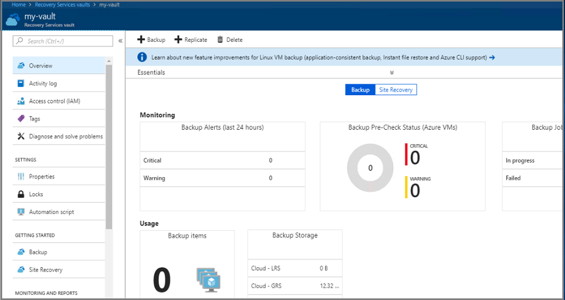

5. In the vault's Getting Started menu, click **Backup** to open the Getting Started wizard.

    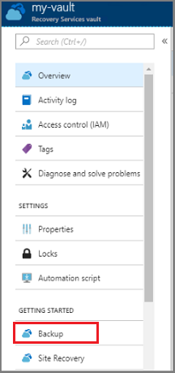

    The backup menu opens.

    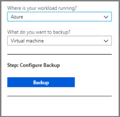

6. In the backup menu, from the **Where is your workload running** menu, select **On-premises**. From the **What do you want to backup?** drop-down menu, select the workloads you want to protect using Azure Backup Server. If you aren't sure which workloads to select, choose **Hyper-V Virtual Machines** and then click **Prepare Infrastructure**.

    

    The **Prepare infrastructure** menu opens.

7. In the **Prepare infrastructure** menu, click **Download** to open a web page to download Azure Backup Server installation files.

    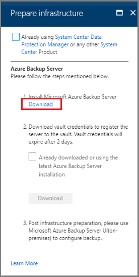

    The Microsoft web page that hosts the downloadable files for Azure Backup Server, opens.

8. In the Microsoft Azure Backup Server download page, select a language, and click **Download**.

    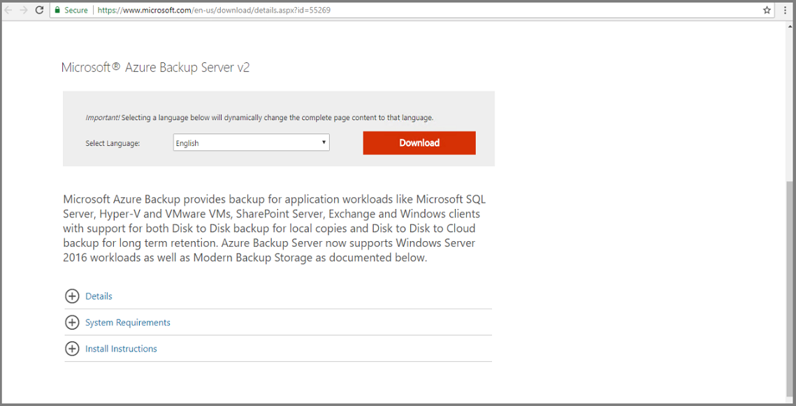

9. The Azure Backup Server installer is comprised of eight files - an installer and seven .bin files. Check **File Name** to select all required files and click **Next**. Download all files to the same folder.

    

    Since the download size of all the files is > 3G, on a 10Mbps download link it may take up to 60 minutes for the download to complete. The files will download to your specified download location.

## Extract Azure Backup Server install files

After you've downloaded all files to your virtual machine, go to the download location.

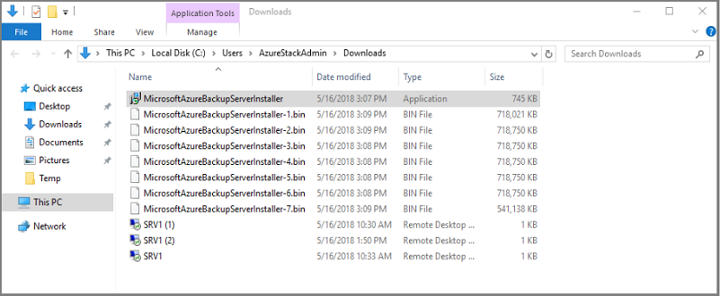

1. To start the installation, from the list of downloaded files, click **MicrosoftAzureBackupserverInstaller.exe**.

    > [!WARNING]
    > At least 4GB of free space is required to extract the setup files.
    >

2. In the Azure Backup Server installer, click **Next** to start the wizard.

    

3. Choose where to install Azure Backup Server and click **Next**.

   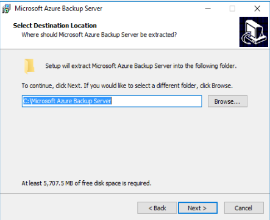

4. Verify the installation location, and click **Extract**.

   

5. The installer extracts the files and readies the installation process.

   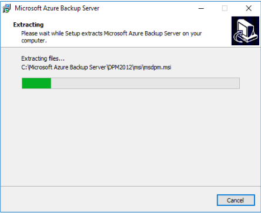

6. Once the extraction process completes, click **Finish** to launch *setup.exe*. Setup.exe installs Microsoft Azure Backup Server.

   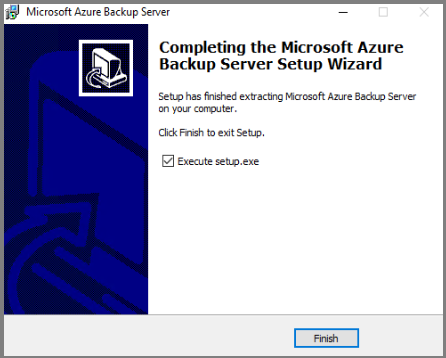

## Install the software package

In the previous step, you clicked **Finish** to exit the extraction phase, and start the Azure Backup Server setup wizard.


Azure Backup Server shares code with Data Protection Manager. You will see references to Data Protection Manager and DPM in the Azure Backup Server installer. Though Azure Backup Server and Data Protection Manager are separate products, the references, or tools that have Data Protection Manager or DPM, apply to Azure Backup Server.

1. To launch the setup wizard, click **Microsoft Azure Backup** .

   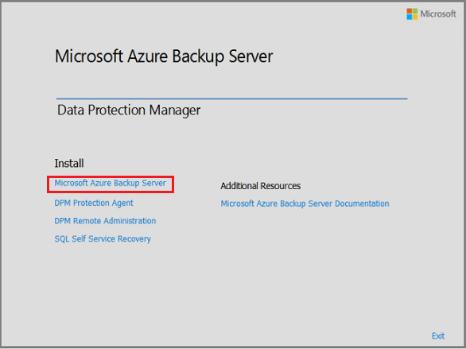

2. On the Welcome screen click **Next**.

    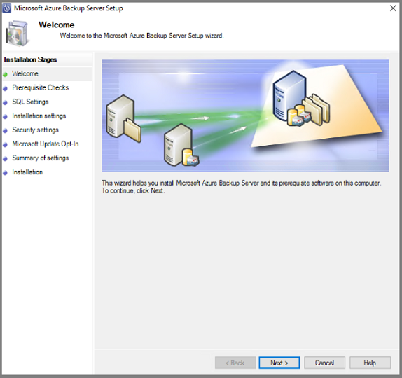

3. On the *Prerequisite Checks* screen, click **Check** to determine if the hardware and software prerequisites for Azure Backup Server have been met.

    

    If your environment has the necessary prerequisites, you will see a message indicating that the machine meets the requirements. Click **Next**.

    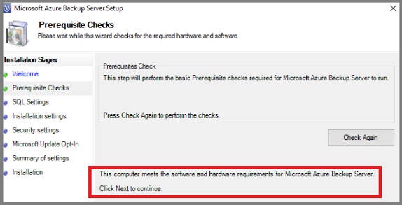

4. Microsoft Azure Backup Server requires SQL Server. The Azure Backup Server installation package comes bundled with the appropriate SQL Server binaries needed if you don't want to use your own SQL. The recommended choice is to let the installer add a new instance of SQL Server. To ensure your environment use SQL Server, click **Check and Install**.

   > [!NOTE]
   > Azure Backup Server will not work with a remote SQL Server instance. The instance used by Azure Backup Server must be local.
   >

    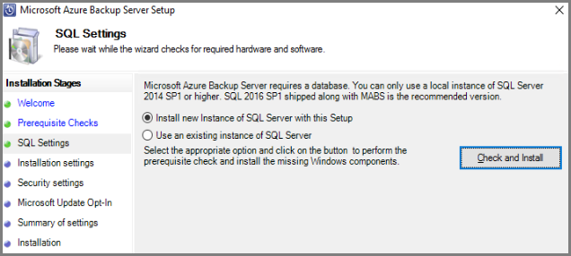

    After checking, if the computer has the necessary prerequisites for installing Azure Backup Server, click **Next**.

    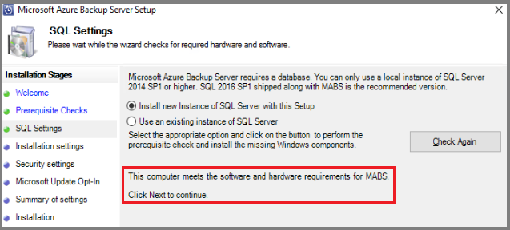

    If a failure occurs with a recommendation to restart the machine, do so, restart the installer, at this screen, click **Check Again**.

5. In the **Installation Settings**, provide a location for the installation of Microsoft Azure Backup server files and click **Next**.

    

    The scratch location is required to back up to Azure. Ensure the size of the scratch location is equivalent to at least 5% of the data planned to be backed up to Azure. For disk protection, separate disks need to be configured once the installation completes. For more information regarding storage pools, see [Configure storage pools and disk storage](https://technet.microsoft.com/library/hh758075.aspx).

6. On the **Security Settings** screen, provide a strong password for restricted local user accounts and click **Next**.

    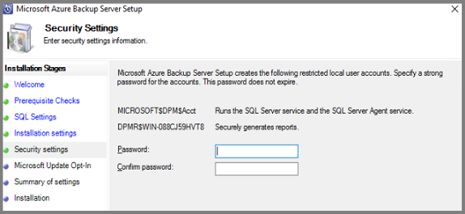

7. On the **Microsoft Update Opt-In** screen, select whether you want to use *Microsoft Update* to check for updates and click **Next**.

   > [!NOTE]
   > We recommend having Windows Update redirect to Microsoft Update, which offers security and important updates for Windows and other products like Microsoft Azure Backup Server.
   >
   >
    

8. Review the *Summary of Settings* and click **Install**.

    

    When Azure Backup Server finishes installing, the installer immediately launches the Microsoft Azure Recovery Services agent installer.

9. The Microsoft Azure Recovery Services Agent installer opens, and checks for Internet connectivity. If Internet connectivity is available you can proceed with the installation. If there is no connectivity, you need to provide proxy details to connect to the Internet. Once you've specified your proxy settings, click **Next**.

    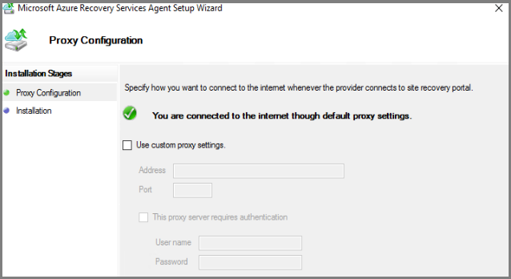

10. To install the Microsoft Azure Recovery Services Agent, click **Install**.

    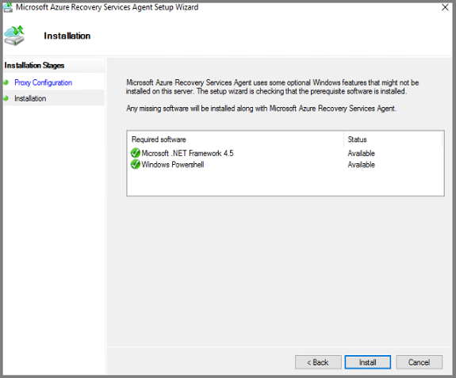

    The Microsoft Azure Recovery Services agent, also called the Azure Backup agent, configures the Azure Backup Server to the Recovery Services vault. Once configured, Azure Backup Server will always backup data to the same Recovery Services vault.

11. Once the Microsoft Azure Recovery Services agent finishes installing, click **Next** to start the next phase: registering Azure Backup Server with the Recovery Services vault.

    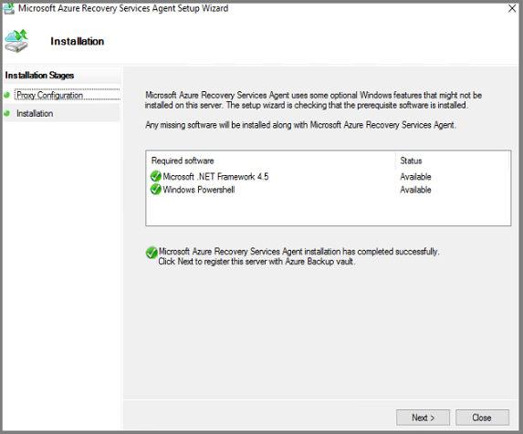

    The installer launches the **Register Server Wizard**.

12. Switch to your Azure subscription and your Recovery Services vault. In the **Prepare Infrastructure** menu, click **Download** to download vault credentials. If the **Download** button in step two is not active, check **Already downloaded or using the latest Azure Backup Server installation**, to activate the button. The vault credentials download to the location where you store downloads. Be aware of this location because you'll need it for the next step.

    

13. In the **Vault Identification** menu, click **Browse** to find the Recovery Services vault credentials.

    

    In the **Select Vault Credentials** dialog, go to the download location, select your vault credentials, and click **Open**.

    The path to the credentials appears in the Vault Identification menu. Click **Next** to advance to the Encryption Setting.

14. In the **Encryption Setting** dialog, provide a passphrase for the backup encryption, and a location to store the passphrase, and click **Next**.

    

    You can provide your own passphrase, or use the passphrase generator to create one for you. The passphrase is yours, and Microsoft does not save or manage this passphrase. In case you need to recover data in a disaster, save your passphrase to an accessible location.

    Once you click **Next**, the Azure Backup Server is registered with the Recovery Services vault. The installer continues installing SQL Server and the Azure Backup Server.

    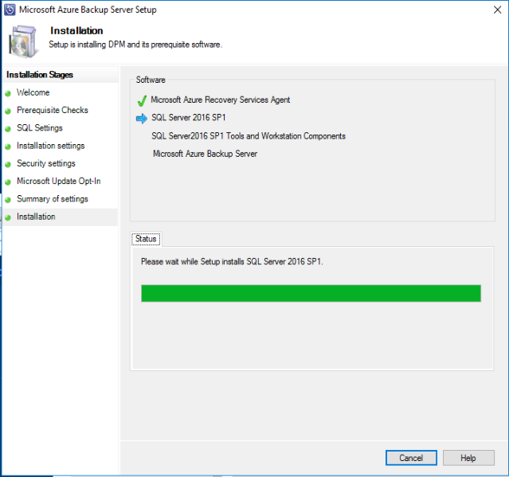

15. When the installer completes, the Status shows that all software has been successfully installed.

    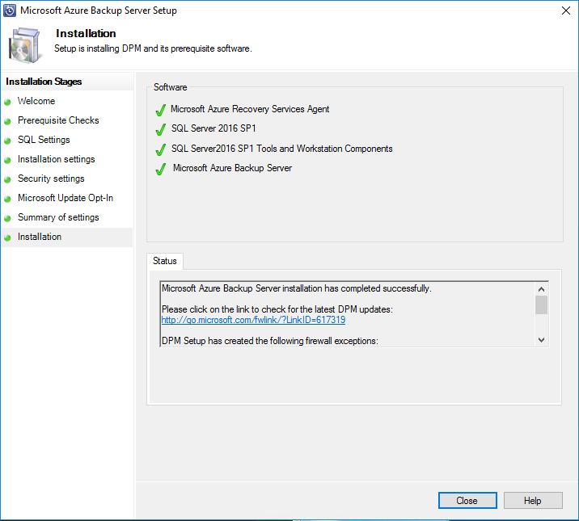

    When installation completes, the Azure Backup Server console and the Azure Backup Server PowerShell icons are created on the server desktop.

### Add backup storage

The first backup copy is kept on storage attached to the Azure Backup Server machine. For more information about adding disks, see [Configure storage pools and disk storage](https://technet.microsoft.com/library/hh758075.aspx).

> [!NOTE]
> You need to add backup storage even if you plan to send data to Azure. In the current architecture of Azure Backup Server, the Azure Backup vault holds the *second* copy of the data while the local storage holds the first (and mandatory) backup copy.
>
>

## Network connectivity

Azure Backup Server requires connectivity to the Azure Backup service for the product to work successfully. To validate whether the machine has the connectivity to Azure, use the ```Get-DPMCloudConnection``` cmdlet in the Azure Backup Server PowerShell console. If the output of the cmdlet is TRUE then connectivity exists, else there is no connectivity.

At the same time, the Azure subscription needs to be in a healthy state. To find out the state of your subscription and to manage it, log in to the [subscription portal](https://account.windowsazure.com/Subscriptions).

Once you know the state of the Azure connectivity and of the Azure subscription, you can use the table below to find out the impact on the backup/restore functionality offered.

| Connectivity State | Azure Subscription | Back up to Azure | Back up to disk | Restore from Azure | Restore from disk |
| --- | --- | --- | --- | --- | --- |
| Connected |Active |Allowed |Allowed |Allowed |Allowed |
| Connected |Expired |Stopped |Stopped |Allowed |Allowed |
| Connected |Deprovisioned |Stopped |Stopped |Stopped and Azure recovery points deleted |Stopped |
| Lost connectivity > 15 days |Active |Stopped |Stopped |Allowed |Allowed |
| Lost connectivity > 15 days |Expired |Stopped |Stopped |Allowed |Allowed |
| Lost connectivity > 15 days |Deprovisioned |Stopped |Stopped |Stopped and Azure recovery points deleted |Stopped |

### Recovering from loss of connectivity

If you have a firewall or a proxy that is preventing access to Azure, you need to whitelist the following domain addresses in the firewall/proxy profile:

- www.msftncsi.com
- \*.Microsoft.com
- \*.WindowsAzure.com
- \*.microsoftonline.com
- \*.windows.net

Once connectivity to Azure has been restored to the Azure Backup Server machine, the operations that can be performed are determined by the Azure subscription state. The table above has details about the operations allowed once the machine is "Connected".

### Handling subscription states

It is possible to take an Azure subscription from an *Expired* or *Deprovisioned* state to the *Active* state. However this has some implications on the product behavior while the state is not *Active*:

- A *Deprovisioned* subscription loses functionality for the period that it is deprovisioned. On turning *Active*, the product functionality of backup/restore is revived. The backup data on the local disk also can be retrieved if it was kept with a sufficiently large retention period. However, the backup data in Azure is irretrievably lost once the subscription enters the *Deprovisioned* state.
- An *Expired* subscription only loses functionality for until it has been made *Active* again. Any backups scheduled for the period that the subscription was *Expired* will not run.

## Troubleshooting

If Microsoft Azure Backup server fails with errors during the setup phase (or backup or restore), refer to this [error codes document](https://support.microsoft.com/kb/3041338)  for more information.
You can also refer to [Azure Backup related FAQs](backup-azure-backup-faq.md)

## Next steps

You can get detailed information about [preparing your environment for DPM](https://technet.microsoft.com/library/hh758176.aspx) on the Microsoft TechNet site. It also contains information about supported configurations on which Azure Backup Server can be deployed and used.

You can use these articles to gain a deeper understanding of workload protection using Microsoft Azure Backup server.

- [SQL Server backup](backup-azure-backup-sql.md)
- [SharePoint server backup](backup-azure-backup-sharepoint.md)
- [Alternate server backup](backup-azure-alternate-dpm-server.md)
