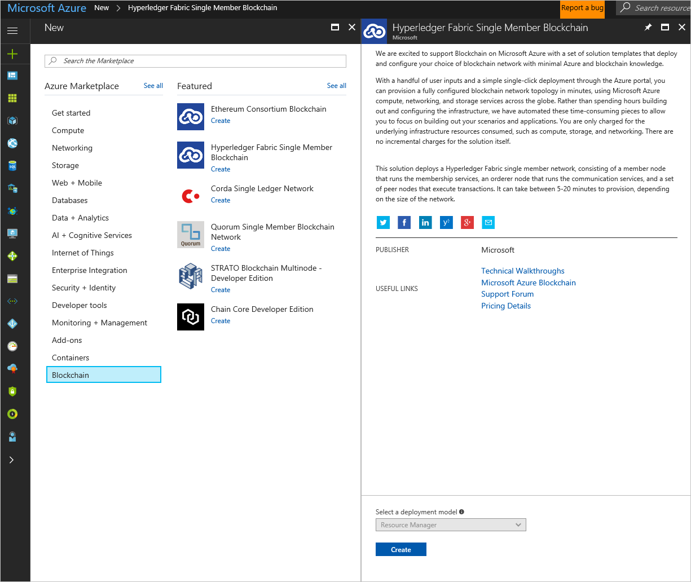
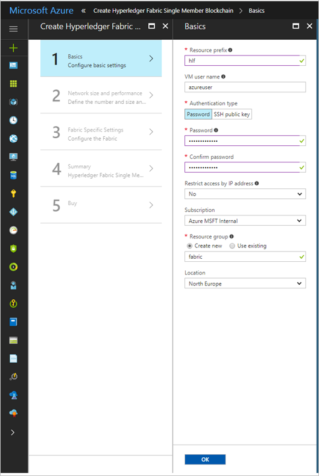
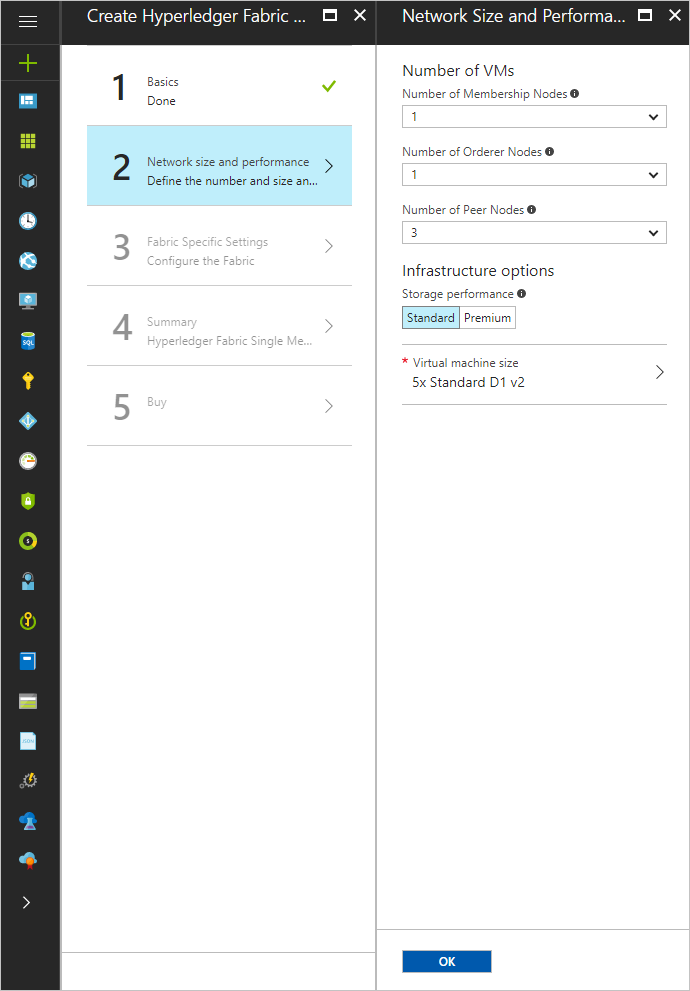
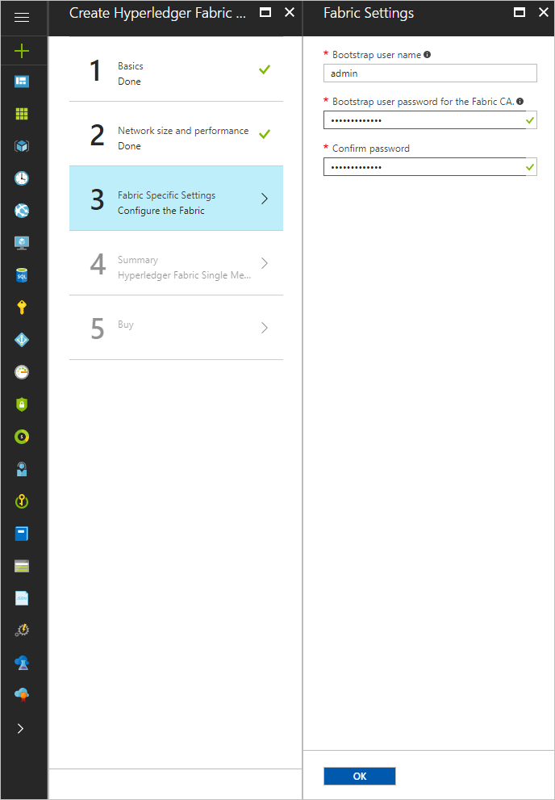
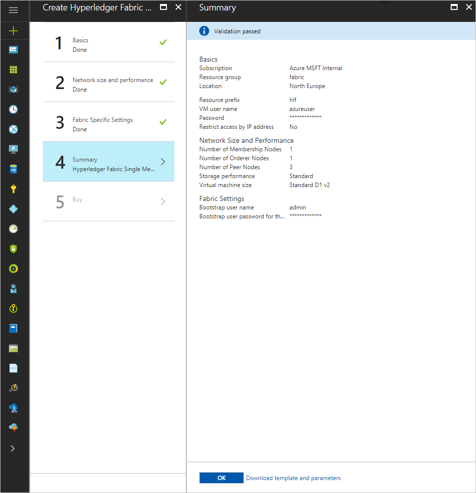
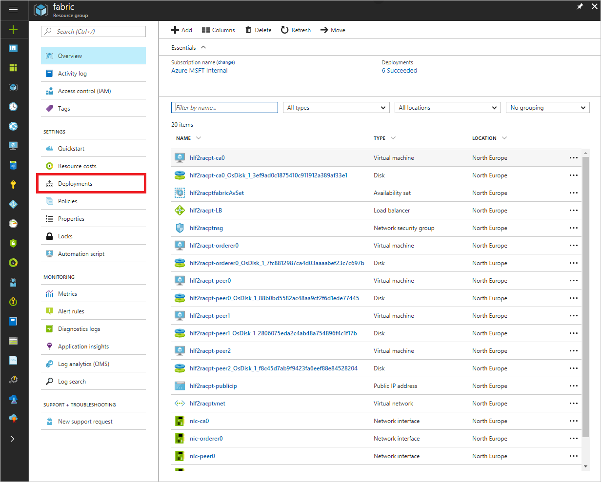
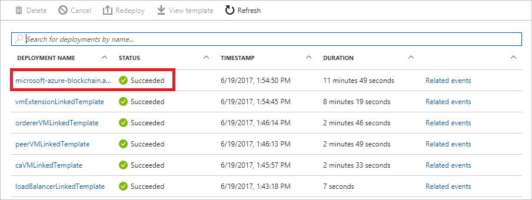
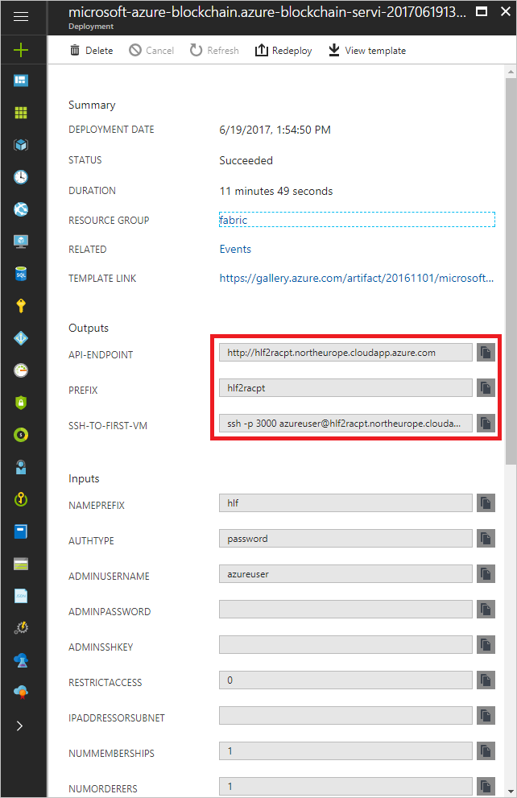

# Hyperledger Fabric single member network

You can use the Hyperledger Fabric Consortium solution template to deploy and configure a Hyperledger Fabric single member (multi-node) network.

After reading this article, you will:

- Obtain working knowledge of blockchain, Hyperledger Fabric, and more complicated consortium network architectures
- Learn how to deploy and configure a single-member Hyperledger Fabric consortium network from within the Azure portal

## About blockchain

If you are new to the blockchain community, this is a great opportunity to learn about the technology in an easy and configurable manner on Azure. Blockchain is the underlying technology behind Bitcoin; however, it is much more than just an enabler for a virtual currency. It is a composite of existing database, distributed system, and cryptographic technologies that enables secure multi-party computation with guarantees around immutability, verifiability, auditability, and resiliency to attack. Different protocols employ different mechanisms to provide these attributes. [Hyperledger Fabric](https://github.com/hyperledger/fabric) is one such protocol.

## Consortium architecture on Azure

This template deploys a topology to help test and simulate production for users within a single organization (single member). This deployment comprises of a multi-node network in a single region, soon to be expanded to multiple regions.

The network comprises of three types of nodes:

1. **Member Node** : A node running the Fabric membership service that registers and manages members of the network. This node can eventually be clustered for scalability and high availability, however in this lab, a single member node will be used.
2. **Orderer Nodes** : A node running the communication service implementing a delivery guarantee, such as total order broadcast or atomic transactions.
3. **Peer Nodes** : A node that commits transactions and maintains the state and a copy of the distributed ledger.

## Getting started

To begin, you will need an Azure subscription that can support deploying several virtual machines and standard storage accounts. If you do not have an Azure subscription, you can [create a free Azure account](https://azure.microsoft.com/free/).

By default, most subscription types support a small deployment topology without needing to increase quota. The smallest possible deployment for one member will need:

- 5 virtual machines (5 cores)
- 1 VNet
- 1 load balancer
- 1 public IP address

Once you have a subscription, go to the [Azure portal](https://portal.azure.com). Select **+**, select Blockchain, and select **Hyperledger Fabric Single Member Blockchain**.

## Deployment

To start, select the **Hyperledger Fabric Single Member Blockchain** and click **Create**. This will open the **Basics** blade in the wizard.

The Template Deployment will walk you through configuring the multi-node network. The deployment flow is divided into three steps: Basics, Network configuration, and Fabric configuration.

### Basics

Under the **Basics** blade, specify values for standard parameters for any deployment, such as subscription, resource group, and basic virtual machine properties.

Parameter Name| Description| Allowed Values|Default Value
---|---|---|---
**Resource prefix**| A string used as a base for naming the deployed resources.|6 characters or less|NA
**VM user name**| The user name of the administrator for each of the virtual machines deployed for this member.|1 - 64 characters|azureuser
**Authentication type**| The method to authenticate to the virtual machine.|Password or SSH public key|Password
**Password (Authentication type = Password)**|The password for the administrator account for each of the virtual machines deployed. The password must contain 3 of the following: 1 upper case character, 1 lower case character, 1 number, and 1 special character.  While all VMs initially have the same password, you can change the password after provisioning.|12 - 72 characters|NA
**SSH Key (Authentication type = Public Key)**|The secure shell key used for remote login.||NA
**Restrict access by IP address**|Setting to determine type whether client endpoint access is restricted or not.|Yes/No| No
**Allowed IP address or subnet (restrict access by IP address = Yes)**|The IP address or the set of IP addresses that is allowed to access the client endpoint when access control is enabled.||NA
**Subscription** |The subscription to which to deploy.
**Resource Group** |The resource group to which to deploy the consortium network.||NA
**Location** |The Azure region to which to deploy the first member**s network footprint.

### Network size and performance

Next, under **Network size and performance,** specify inputs for the size of the consortium network, such as the number of membership, orderer, and peer nodes. Choose infrastructure options and your virtual machine size.

Parameter Name| Description| Allowed Values|Default Value
---|---|---|---
**Number of Membership Nodes**|The number of nodes that run the membership service. For additional details on the membership service, look at Security & Membership Services under the Hyperledger [documentation](https://media.readthedocs.org/pdf/hyperledger-fabric/latest/hyperledger-fabric.pdf).  This value is currently restricted to 1 node, but we plan to support scale out through clustering in the next revision.|1| 1
**Number of Orderer Nodes** |The number of nodes that order (organize) transactions into a block.--> This statement is wordy and confusing. For additional details on the ordering service, visit the Hyperledger [documentation](http://hyperledger-fabric.readthedocs.io/en/latest/orderingservice.html).  This value is currently restricted to 1 node, but we plan to support scale out in the next version.|1 |1
**Number of Peer Nodes**| Nodes that are owned by consortium members that execute transactions and maintain the state and a copy of the ledger.  For additional details on the ordering service, visit the Hyperledger [documentation](https://hyperledger-fabric.readthedocs.io/en/latest/glossary.html).|3| 3 - 9
**Storage performance**|The type of storage backing each of the deployed nodes. To learn more about storage, visit [Introduction to Microsoft Azure Storage](https://docs.microsoft.com/azure/storage/common/storage-introduction) and [Premium Storage](https://docs.microsoft.com/azure/virtual-machines/windows/premium-storage).|Standard or Premium|Standard
**Virtual machine size** |The virtual machine size used for all nodes in the network|Standard A, Standard D, Standard D-v2, Standard F series, Standard DS, and Standard FS|Standard D1_v2

### Fabric specific settings

Finally, under **Fabric Settings**, specify Fabric-related configuration settings.

Parameter Name| Description| Allowed Values|Default Value
---|---|---|---
**Bootstrap User Name**| The initial authorized user that will be registered with the member services in the deployed network.|9 or fewer characters|admin
**Bootstrap User Password for Fabric CA**|The administrator password used to secure the Fabric CA account imported into the Membership node.  The password must contain the following: 1 upper case character, 1 lower case character, and 1 number.|12 or more characters|NA

### Deploy

In **Summary**, review the inputs specified and to run basic pre-deployment validation.

Review legal and privacy terms and click **Purchase** to deploy. Depending on the number of VMs being provisioned, deployment time can vary from a few minutes to tens of minutes.

### Accessing nodes

Once the deployment is finished, an **Overview** is displayed.

If the screen does not appear automatically (maybe because you moved around the management portal while the deployment was running), you can always find it in the Resource Groups tab in the left-side navigation bar. Click on the Resource Group name you entered in step 1 to go to the **Overview** page.

Overview lists all of the resources that were deployed by the solution template. You can explore them at will, but from this screen you can also access the _output parameters_ generated by the template. These output parameters will give you useful information when connecting to your Hyperledger Fabric network.

To access the output parameters, first click on the Deployments tab in the Resource Group blade. This opens the Deployment History as shown below.

From the Deployment History, click on the first deployment in the list to look at the details.

The details screen will show you a summary of the deployment, followed by three useful output parameters:

- The _API-ENDPOINT_ can be used once you deploy an application on the network.
- The _PREFIX_ , also called _deployment prefix_ , uniquely identifies your resources and your deployment. It
    will be used when using the command-line based tools.
- The _SSH-TO-FIRST-VM_ gives you a pre-assembled ssh command with all the right parameters required
    to connect to the first VM in your network; in the case of Hyperledger Fabric, it will be the Fabric-CA
    node.

You can remotely connect to the virtual machines for each node via SSH with your provided admin username and password/SSH key. Since the node VMs do not have their own public IP addresses, you will need to go through the load balancer and specify the port number. The SSH command to access the first transaction node is the third template output, **SSH-TO-FIRST-VM (for the sample deployment: `sh -p 3000 azureuser@hlf2racpt.northeurope.cloudapp.azure.com`). To get to additional transaction nodes, increment the port number by one (For example, the first transaction node is on port 3000, the second is on 3001, the third is on 3002, etc.).

## Next steps

You are now ready to focus on application and chaincode development against your Hyperledger consortium blockchain network.
