# Manage entities
After you identify your app's [intents](luis-concept-intent.md), you need to [label example utterances](luis-concept-utterance.md) with [entities](luis-concept-entity-types.md). Entities are the important pieces of a command or question, and may be essential for your client app to perform its task. 

You can add, edit, or delete entities in your app through the **Entities list** on the **Entities** page. LUIS offers two main types of entities: [prebuilt entities](luis-reference-prebuilt-entities.md), and your own custom entities.

The following sections are only available inside a LUIS app, from the **Build** section. The **Build** link is in the top navigation bar. Once inside the **Build** section, select **Entities** from the left navigation menu. Once an entity is added to the application, if the entity is machine-learned, you can [label the entity](add-example-utterances.md) inside the utterance. Once the app is trained and published, you can receive entity data [extracted](luis-concept-data-extraction.md) from the prediction. 

## Add prebuilt entity
Prebuilt entities are defined in the [Recognizers-Text](https://github.com/Microsoft/Recognizers-Text) project. Common prebuilt entities added to an application are *number* and *datetimeV2*. 

1. In your app, from the **Build** section, and then click **Entities** in the left panel.
 
2. On the **Entities** page, select **Manage prebuilt entities**.

    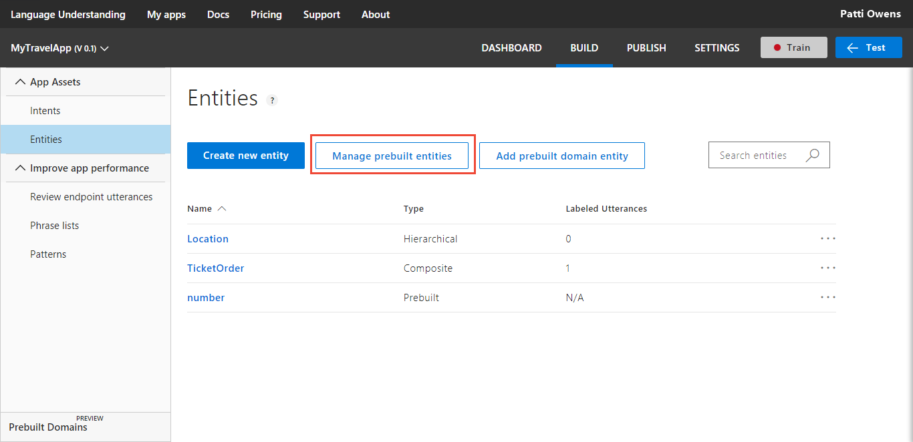

3. In **Add or remove prebuilt entities** dialog box, select the **number** and **datetimeV2** prebuilt entities. Then select **Done**.

    

    See [Data Extraction](luis-concept-data-extraction.md#prebuilt-entity-data) to learn more about extracting the prebuilt entity from the endpoint JSON query response.

## Add simple entities
A simple entity is a generic entity that describes a single concept. 

1. In your app, from the **Build** section, and then click **Entities** in the left panel, and then select **Create new entity**.

    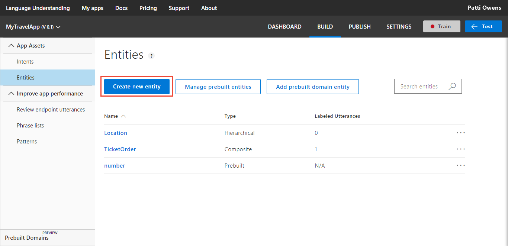

2. In the pop-up dialog box, type `Airline` in the **Entity name** box,  select **Simple** from the **Entity type** list, and then select **Done**.

    

    See [Data Extraction](luis-concept-data-extraction.md#simple-entity-data) to learn more about extracting the simple entity from the endpoint JSON query response. Try the simple entity [quickstart](luis-quickstart-primary-and-secondary-data.md) to learn more about how to use a simple entity.

## Add regular expression entities
A regular expression entity is used to pull out data from the utterance based on a regular expression you provide. 

1. In your app, select **Entities** from the left navigation, and then select **Create new entity**.

2. In the pop-up dialog box, , type `AirFrance Flight` in the **Entity name** box,  select **Regular expression** from the **Entity type** list, enter the regular expression `AFR[0-9]{3,4}`, and then select **Done**. 

    This AirFrance Flight regular expression expects three characters, literally `AFR`, then 3 or 4 digits. The digits can be any number between 0 and 9. The regular expression matches AirFrance flight numbers such as: "AFR101", "ARF1302", and "AFR5006". See [Data Extraction](luis-concept-data-extraction.md) to learn more about extracting the entity from the endpoint JSON query response.

    

    See [Data Extraction](luis-concept-data-extraction.md#regular-expression-entity-data) to learn more about extracting the regular expression entity from the endpoint JSON query response. Try the regular expression entity [quickstart](luis-quickstart-intents-regex-entity.md) to learn more about how to use a regular expression entity.

## Add hierarchical entities
A hierarchical entity is a category of contextually learned and conceptually related entities. In the following example, the entity contains origin and destination locations. 

In the utterance `Book 2 tickets from Seattle to Cairo`, Seattle is the origin location and Cairo is the destination location. Each location is contextually different and learned from word order and word choice in the utterance.

To add hierarchical entities, complete the following steps: 

1. In your app, select **Entities** from the left navigation, and then select **Create new entity**.

2. In the pop-up dialog box, type `Location` in the **Entity name** box, and then select **Hierarchical** from the **Entity type** list.

    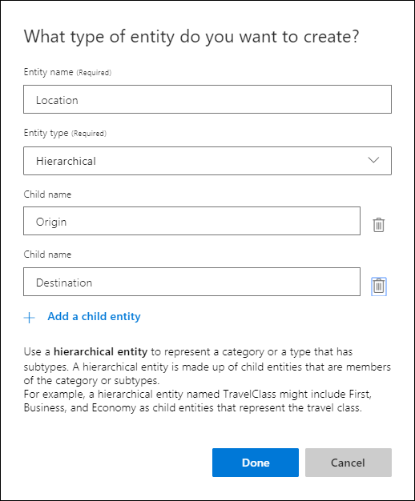

3. Select **Add Child**, and then type "Origin" in **Child #1** box. 

4. Select **Add Child**, and then type "Destination" in **Child #2** box. Select **Done**.
5. 
    >[!NOTE]
    >To delete a child, select the trash bin icon next to it.

    >[!CAUTION]
    >Child entity names must be unique across all entities in a single app. Two different hierarchical entities may not contain child entities with the same name. 

    See [Data Extraction](luis-concept-data-extraction.md#hierarchical-entity-data) to learn more about extracting the hierarchical entity from the endpoint JSON query response. Try the hierarchical entity [quickstart](luis-quickstart-intent-and-hier-entity.md) to learn more about how to use a hierarchical entity.

## Add composite entities
You can define relationships between several existing entities by creating a composite entity. In the following example, the entity contains count of tickets, origin, and destination locations. 

In the utterance `Book 2 tickets from Seattle to Cairo`, the number 2 is matched to a prebuilt entity, Seattle is the origin location and Cairo is the destination location. Each entity is part of a larger, parent entity after the composite entity is created.

1. In your app, add the prebuilt entity **number**. For instructions, see [Add Prebuilt Entities](#add-prebuilt-entity). 

2. Add the hierarchical entity `Location`, including the subtypes: `origin`, `destination`. For more instructions, see [Add hierarchical entities](#add-hierarchical-entities). 

3. Select **Entities** from the left navigation, and then select **Create new entity**.

4. In the pop-up dialog box, type `TicketsOrder` in the **Entity name** box, and then select **Composite** from the **Entity type** list.

5. Select **Add Child** to add a new child.

6. In **Child #1**, select the entity **number** from the list.

7. In **Child #2**, select the entity **Location::Origin** from the list. 

8. In **Child #3**, select the entity **Location::Destination** from the list. 

9. Select **Done**.

    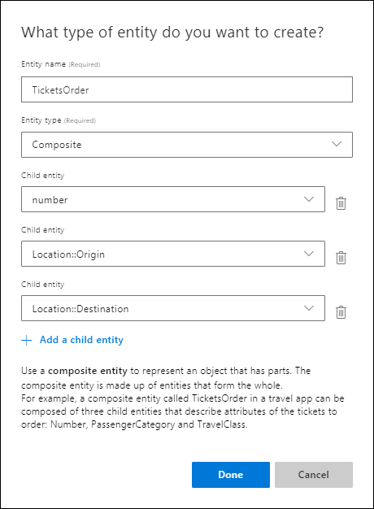

    >[!NOTE]
    >To delete a child, select the trash button next to it.

    See [Data Extraction](luis-concept-data-extraction.md#composite-entity-data) to learn more about extracting the composite entity from the endpoint JSON query response. Try the composite entity [tutorial](luis-tutorial-composite-entity.md) to learn more about how to use a composite entity.


## Add Pattern.any entities
[Pattern.any](luis-concept-entity-types.md) entities are only valid in [patterns](luis-how-to-model-intent-pattern.md). This entity helps LUIS find the end of entities of varying length and word choice. Because this entity is used in a pattern, LUIS knows where the end of the entity is in the utterance.

If an app has a `FindBookInfo` intent, the title of the book may interfere with the intent prediction. In order to clarify which words are in the book title, use a Pattern.any within a pattern. The LUIS prediction begins with the utterance. First, the utterance is checked and matched for entities, when the entities are found, then the pattern is checked and matched. 

In the utterance `Who wrote the book Ask and when was it published?`, the book title, Ask, is tricky because it is not contextually obvious where the title ends and where the rest of the utterance begins. Book titles can be any order of words including a single word, complex phrases with punctuation, and nonsensical ordering of words. A pattern allows you to create an entity where the full and exact entity can be extracted. Once the book title is found, the `FindBookInfo` intent is predicted because that is the intent for the pattern.

1. In your app, from the **Build** section, and then click **Entities** in the left panel, and then select **Create new entity**.

2. In the **Add Entity** dialog box, type `BookTitle` in the **Entity name** box and select **Pattern.any** as the **Entity type**.
 
    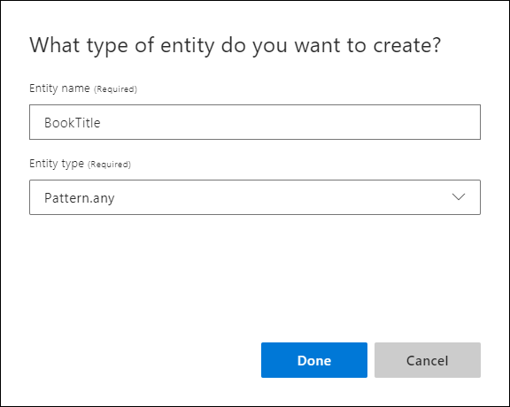

    To use the pattern.any entity, add a pattern on the **Patterns** page (under the **Improve app performance** section) with the correct curly brace syntax, such as "For **{BookTitle}** who is the author?".

    See [Data Extraction](luis-concept-data-extraction.md#patternany-entity-data) to learn more about extracting the Pattern.any entity from the endpoint JSON query response. Try the [Pattern](luis-tutorial-pattern.md) tutorial to learn more about how to use a Pattern.any entity.

If you find that your pattern, when it includes a Pattern.any, extracts entities incorrectly, use an [explicit list](luis-concept-patterns.md#explicit-lists) to correct this problem. 

## Add role to pattern-based entity
A role is a named subtype of an entity based on context. It is comparable to a [hierarchical](#add-hierarchical-entities) entity but roles are only used in [patterns](luis-how-to-model-intent-pattern.md). 

For example, a plane ticket has an *origin city* and a *destination city*, but both are cities. LUIS determines that both are cities and can determine origin and destination cities based on context of word order and word choice. 

The syntax for a role is **{Entity name:Role name}** where the entity name is followed by a colon, then the role name. For example, "Book a ticket from {Location:Origin} to {Location:Destination}".

1. In your app, from the **Build** section, and then select **Entities** in the left panel.

2. Select **Create new entity**. Enter the name of `Location`. Select the type **Simple** and select **Done**

3. Select **Entities** from the left panel, then select the new entity **Location** created in step 2.

4. In the **Role name** textbox, enter the name of the role `Origin` and enter. Add a second role name of `Destination`. As an example, a plane trip can have an origin and a destination city. The two roles are "Origin" and "Destination".

    

    See [Data Extraction](luis-concept-data-extraction.md) to learn more about extracting roles from the endpoint JSON query response. Try the pattern tutorial to learn more about how to use a Pattern.any entity.

## Add list entities
List entities represent a fixed, closed set of related words in your system. 

For a drinks list entity, you can have two normalized values: water and soda pop. Each normalized name has synonyms. For water, synonyms are H20, gas, flat. For soda pop, synonyms are fruit, cola, ginger. You don't have to know all the values when you create the entity. You can add more after reviewing real user utterances with synonyms.

|Normalized name|Synonyms|
|--|--|
|Water|H20, gas, flat|
|Soda pop|Fruit, cola, ginger|

1. In your app, from the **Build** section, and then click **Entities** in the left panel, and then select **Create new entity**.

2. In the **Add Entity** dialog box, type `Drinks` in the **Entity name** box and select **List** as the **Entity type**. Select **Done**.
 
    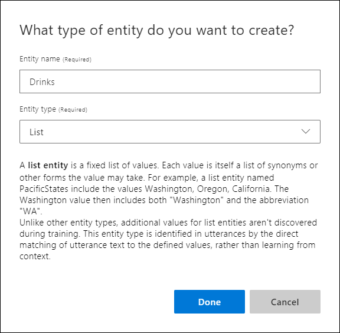
  
3.  The list entity page allows you to add normalized names. In the **Values** textbox, enter an item for the list, such as `Water` for the drinks list then press Enter on the keyboard. 

    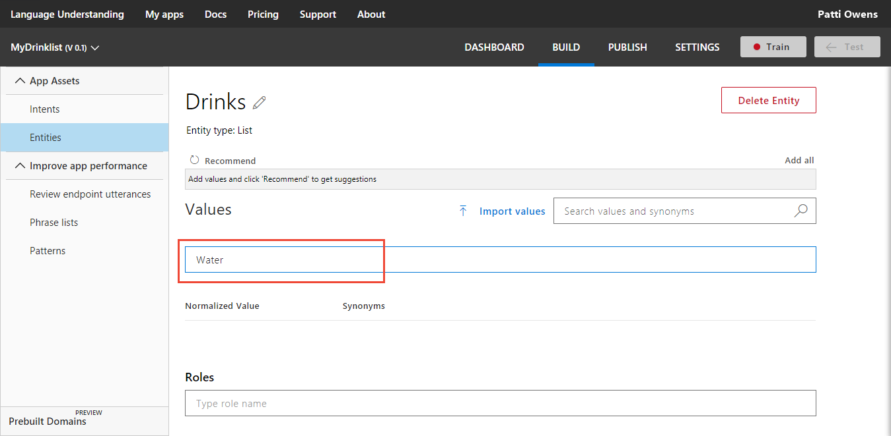

4. To the right of the normalized value **water**, enter synonyms `h20`, `flat`, and `gas`, pressing Enter on the keyboard after each item.

    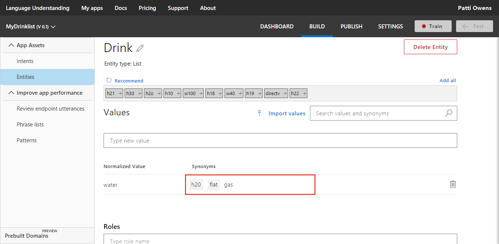

5. If you want more normalized items for the list, select **Recommend** to see options from the [semantic dictionary](luis-glossary.md#semantic-dictionary).

    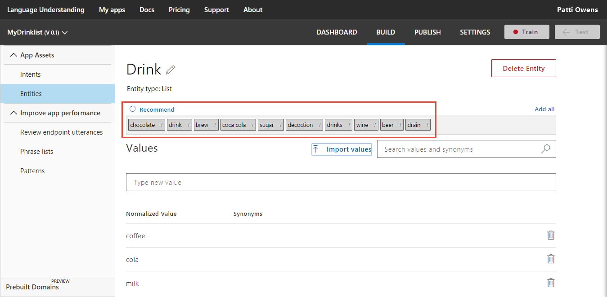

6. Select an item in the recommended list to add it as a normalized value or select **Add all** to add all the items. 

    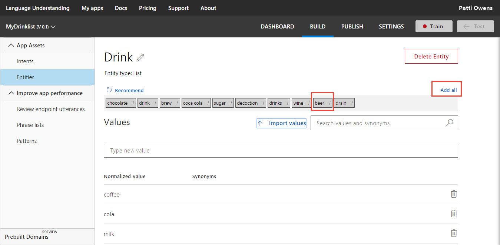

    See [Data Extraction](luis-concept-data-extraction.md#list-entity-data) to learn more about extracting list entities from the endpoint JSON query response. Try the [quickstart](luis-quickstart-intent-and-list-entity.md) to learn more about how to use a list entity.

## Import list entity values
You can import values into an existing list entity.

 1. On the list entity page, select **Import Lists**.

 2. In **Import New Entries** dialog box, select **Choose File** and select the JSON file that includes the list.

    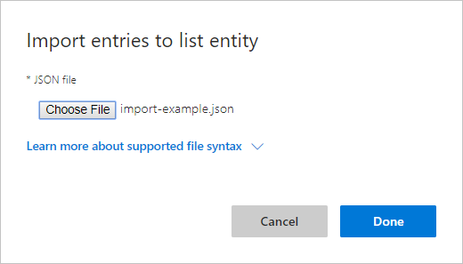

    >[!NOTE]
    >LUIS imports files with the extension ".json" only.

 3. To learn about the supported list syntax in JSON, select **Learn about supported list syntax** to expand the dialog and display an example of allowed syntax. To collapse the dialog and hide syntax, select the link title again.

 4. Select **Done**.

    An example of valid json for a **Colors** list entity is shown in the following JSON-formatted code:

    ```
    [
        {
            "canonicalForm": "Blue",
            "list": [
                "navy",
                "royal",
                "baby"
            ]
        },
        {
            "canonicalForm": "Green",
            "list": [
                "kelly",
                "forest",
                "avacado"
            ]
        }
    ]  
    ```

## Edit entity name
1. On the **Entities** list page, select the entity in the list. This action takes you to the **Entity** page.

2. On the **Entity** page, you edit the entity name by selecting the edit icon next to the entity name. The entity type is not editable. 

## Delete entity

On the **Entity** page, select the **Delete Entity** button. Then, select **Ok** in the confirmation message to confirm deletion.
 
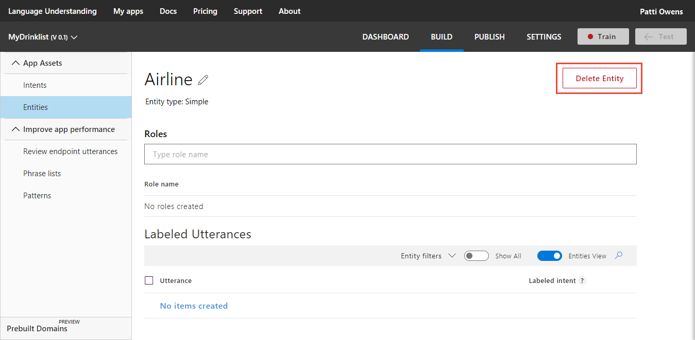

>[!NOTE]
>* Deleting a hierarchical entity deletes all its children entities.
>* Deleting a composite entity deletes only the composite and breaks the composite relationship, but doesn't delete the entities forming it.

## Changing entity type
LUIS does not allow you to change the type of the entity because it doesn't know what to add or remove to construct that entity. In order to change the type, it is better to create a new entity of the correct type with a slightly different name. Once the entity is created, in each utterance, remove the old labeled entity name and add the new entity name. Once all the utterances have been relabeled, delete the old entity. 

## Create a pattern from an utterance
See [Add pattern from existing utterance on intent or entity page](luis-how-to-model-intent-pattern.md#add-pattern-from-existing-utterance-on-intent-or-entity-page).

## Search utterances
You can search and filter utterances with the magnifying glass icon on the toolbar. 

## Train your app after changing model with entities
After you add, edit, or remove entities, [train](luis-how-to-train.md) and [publish](PublishApp.md) your app for your changes to affect endpoint queries. 

## Next steps
Now that you have added intents, utterances and entities, you have a basic LUIS app. Learn how to [train](luis-how-to-train.md), [test](train-test.md), and [publish](publishapp.md) your app.
 
