---
title: Create a LUIS app that returns sentiment analysis - Azure | Microsoft Docs 
description: Learn how to add sentiment analysis to your LUIS app to analyze utterances for positive, negative, and neutral feelings. 
services: cognitive-services
author: v-geberr
manager: kaiqb 

ms.service: cognitive-services
ms.component: luis
ms.topic: quickstart
ms.date: 05/07/2018
ms.author: v-geberr
#Customer intent: As a new user, I want to understand what sentiment is conveyed in a user's utterances. 

--- 

# Quickstart: Create app that returns sentiment along with intent prediction
In this quickstart, create an app that demonstrates how to extract positive, negative, and neutral sentiment from utterances.

For this article, you need a free [LUIS][LUIS] account in order to author your LUIS application.

## Sentiment analysis
Sentiment analysis is the ability to determine if a user's utterance is positive, negative, or neutral. 

The following utterances show examples of sentiment:

|Sentiment and score|Utterance|
|:--|--|
|positive - 0.89 |The soup and salad combo was great.|
|negative - 0.07 |I didn't like the appetizer during the dinner service.|

Sentiment analysis is as app setting that applies to every utterance. You do not have to find the words indicating sentiment in utterance and label them. LUIS will do that for you.

## Create a new app
1. Log in to the [LUIS][LUIS] website. Make sure to log into the [region][LUIS-regions] where you need the LUIS endpoints published.

2. On the [LUIS][LUIS] website, select **Create new app**. 

    [](media/luis-quickstart-intent-and-sentiment-analysis/app-list.png#lightbox)

3. On the **Create new app** dialog box, name the app `Restaurant Reservations With Sentiment` and select **Done**. 

    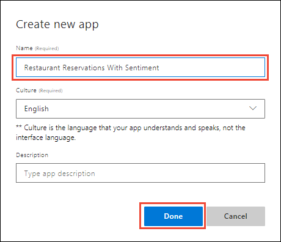

    When the app creation process completes, LUIS displays the intents list containing the None intent.

    [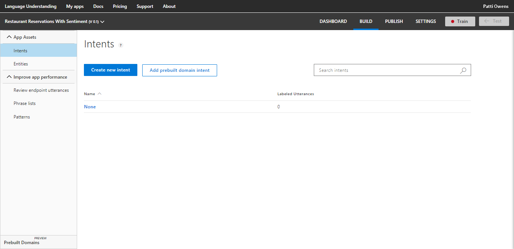](media/luis-quickstart-intent-and-sentiment-analysis/intents-list.png#lightbox)

## Add a prebuilt domain
Add a prebuilt domain to quickly add intents, entities, and labeled utterances.

1. Select **Prebuilt Domains** from the left menu.

    [ ](./media/luis-quickstart-intent-and-sentiment-analysis/prebuilt-domains-button-expanded.png#lightbox)

2. Select **Add domain** for the **RestaurantReservation** prebuilt domain. Wait until the domain is added.

    [ 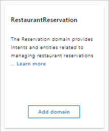](./media/luis-quickstart-intent-and-sentiment-analysis/prebuilt-domains-list-expanded.png#lightbox)

3. Select **Intents** in the left navigation. This prebuilt domain has one intent.

    [ 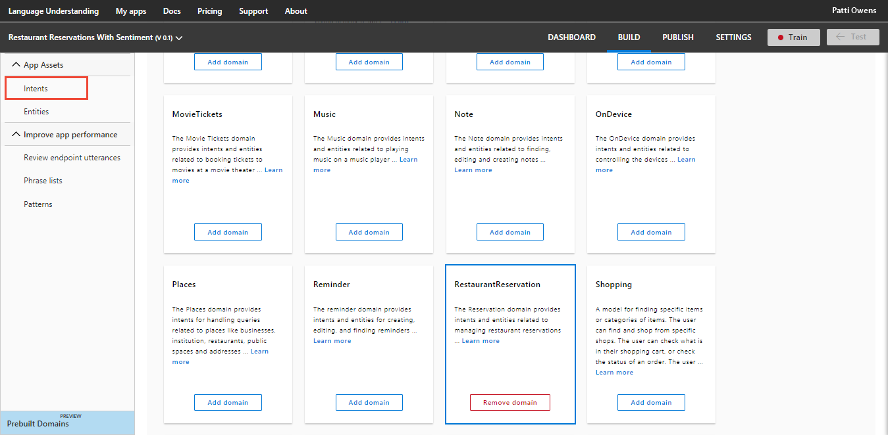](./media/luis-quickstart-intent-and-sentiment-analysis/prebuilt-domains-list-domain-added-expanded.png#lightbox)

4.  Select the **RestaurantReservation.Reserve** intent. 

    [ 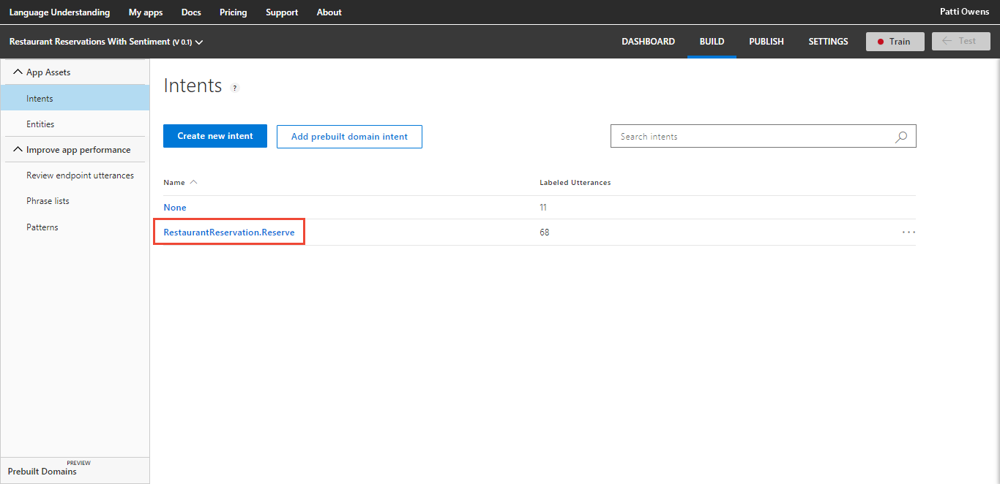](./media/luis-quickstart-intent-and-sentiment-analysis/select-intent.png#lightbox)

5. Toggle the **Entities View** to see the many utterances provided with domain-specific entities labeled.

    [ 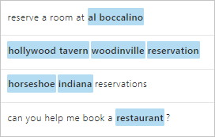](./media/luis-quickstart-intent-and-sentiment-analysis/utterance-list-expanded.png#lightbox)

## Train the LUIS app
LUIS doesn't know about the changes to the intents and entities (the model), until it is trained. 

1. In the top right side of the LUIS website, select the **Train** button.

    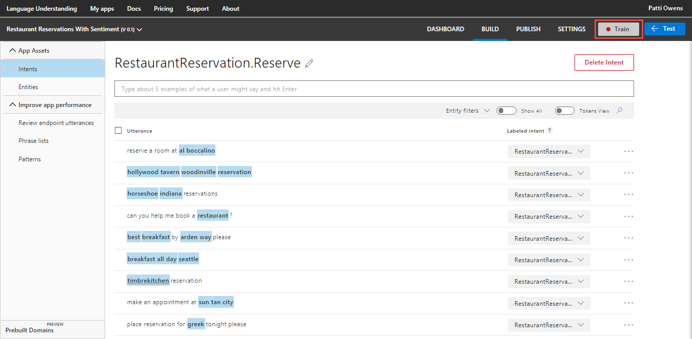

2. Training is complete when you see the green status bar at the top of the website confirming success.

    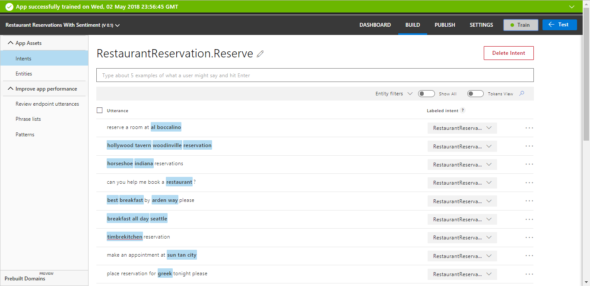

## Configure app to include sentiment analysis
Sentiment analysis is enabled on the **Publish** page. 

1. Select **Publish** in the top right navigation.

    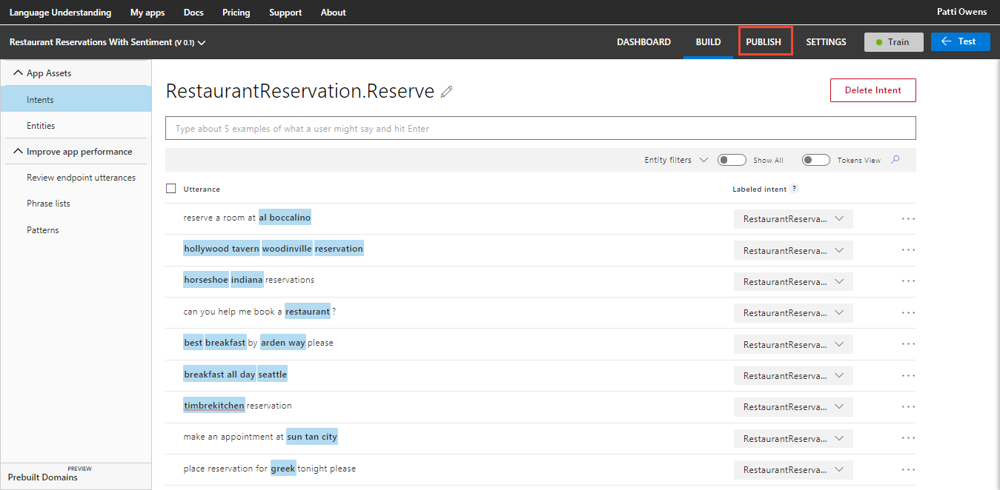

2. Select **Enable Sentiment Analysis**.

    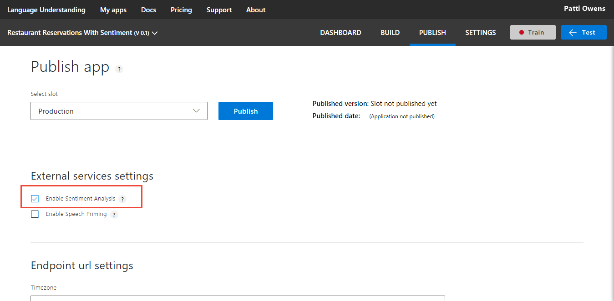

3. Select the Production slot and the **Publish** button.

    [](media/luis-quickstart-intent-and-sentiment-analysis/publish-to-production-expanded.png#lightbox)

4. Publishing is complete when you see the green status bar at the top of the website confirming success.

## Query the endpoint with an utterance

1. On the **Publish** page, select the **endpoint** link at the bottom of the page. This action opens another browser window with the endpoint URL in the address bar. 

    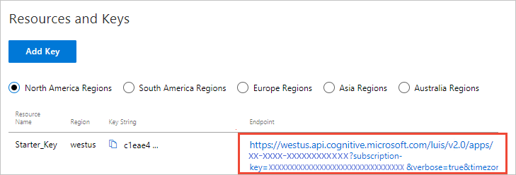

2. Go to the end of the URL in the address and enter `Reserve table for  10 on upper level away from kitchen`. The last querystring parameter is `q`, the utterance **query**. This utterance is not the same as any of the labeled utterances so it is a good test and should return the `RestaurantReservation.Reserve` intent with the sentiment analysis extracted.

```
{
  "query": "Reserve table for 10 on upper level away from kitchen",
  "topScoringIntent": {
    "intent": "RestaurantReservation.Reserve",
    "score": 0.9926384
  },
  "intents": [
    {
      "intent": "RestaurantReservation.Reserve",
      "score": 0.9926384
    },
    {
      "intent": "None",
      "score": 0.00961109251
    }
  ],
  "entities": [],
  "sentimentAnalysis": {
    "label": "neutral",
    "score": 0.5
  }
}
```

## What has this LUIS app accomplished?
This app, with sentiment analysis enabled, identified a natural language query intention and returned the extracted data including the overall sentiment as a score. 

Your chat bot now has enough information to determine the next step in the conversation. 

## Where is this LUIS data used? 
LUIS is done with this request. The calling application, such as a chat bot, can take the topScoringIntent result and the sentiment data from the utterance to take the next step. LUIS doesn't do that programmatic work for the bot or calling application. LUIS only determines what the user's intention is. 

## Clean up resources
When no longer needed, delete the LUIS app. To do so, select the three dot menu (...) to the right of the app name in the app list, select **Delete**. On the pop-up dialog **Delete app?**, select **Ok**.

## Next steps

[Call LUIS endpoint API with C#](luis-get-started-cs-get-intent.md). 


<!--References-->
[LUIS]:luis-reference-regions.md#luis-website
[LUIS-regions]:luis-reference-regions.md#publishing-regions
