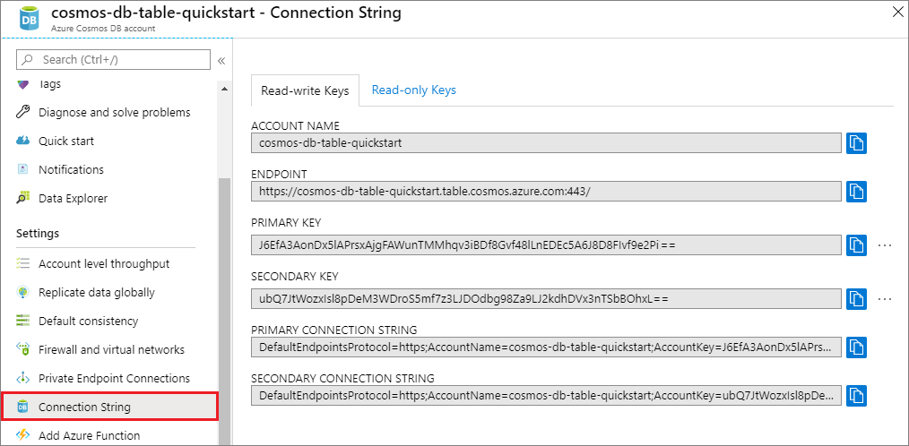

# Quickstart: Build a Table API app with Node.js and Azure Cosmos DB

This quickstart shows how to use Node.js and the Azure Cosmos DB [Table API](table-introduction.md) to build an app by cloning an example from GitHub. This quickstart also shows you how to create an Azure Cosmos DB account and how to use Data Explorer to create tables and entities in the web-based Azure portal.

Azure Cosmos DB is Microsoft’s globally distributed multi-model database service. You can quickly create and query document, key/value, wide-column, and graph databases, all of which benefit from the global distribution and horizontal scale capabilities at the core of Azure Cosmos DB. 

## Prerequisites

[!INCLUDE [quickstarts-free-trial-note](../../includes/quickstarts-free-trial-note.md)]
[!INCLUDE [cosmos-db-emulator-docdb-api](../../includes/cosmos-db-emulator-docdb-api.md)]

In addition:

* [Node.js](https://nodejs.org/en/) version v0.10.29 or higher
* [Git](http://git-scm.com/)

## Create a database account

> [!IMPORTANT] 
> You need to create a new Table API account to work with the generally available Table API SDKs. Table API accounts created during preview are not supported by the generally available SDKs.
>

[!INCLUDE [cosmos-db-create-dbaccount-table](../../includes/cosmos-db-create-dbaccount-table.md)]

## Add a table

[!INCLUDE [cosmos-db-create-table](../../includes/cosmos-db-create-table.md)]

## Add sample data

[!INCLUDE [cosmos-db-create-table-add-sample-data](../../includes/cosmos-db-create-table-add-sample-data.md)]

## Clone the sample application

Now let's clone a Table app from github, set the connection string, and run it. You'll see how easy it is to work with data programmatically. 

1. Open a command prompt, create a new folder named git-samples, then close the command prompt.

    ```bash
    md "C:\git-samples"
    ```

2. Open a git terminal window, such as git bash, and use the `cd` command to change to the new folder to install the sample app.

    ```bash
    cd "C:\git-samples"
    ```

3. Run the following command to clone the sample repository. This command creates a copy of the sample app on your computer.

    ```bash
    git clone https://github.com/Azure-Samples/storage-table-node-getting-started.git
    ```

## Update your connection string

Now go back to the Azure portal to get your connection string information and copy it into the app. This enables your app to communicate with your hosted database. 

1. In the [Azure portal](http://portal.azure.com/), click **Connection String**. 

    

2. Copy the PRIMARY CONNECTION STRING using the copy button on the right-side.

3. Open the app.config file, and paste the value into the connectionString on line three. 

    > [!IMPORTANT]
    > If your Endpoint uses documents.azure.com, that means you have a preview account, and you need to create a [new Table API account](#create-a-database-account) to work with the generally available Table API SDK.
    >

3. Save the app.config file.

You've now updated your app with all the info it needs to communicate with Azure Cosmos DB. 

## Run the app

1. In the git terminal window, `cd` to the storage-table-java-getting-started folder.

    ```
    cd "C:\git-samples\storage-table-node-getting-started"
    ```

2. Run the following command to install the [azure], [node-uuid], [nconf] and [async] modules locally as well as to save an entry for them to the package.json file

   ```
   npm install azure-storage node-uuid async nconf --save
   ```

2. In the git terminal window, run the following commands to run start the Node application.

    ```
    node ./tableSample.js 
    ```

    The console window displays the table data being added to the new table database in Azure Cosmos DB.

    You can now go back to Data Explorer and see query, modify, and work with this new data. 

## Review SLAs in the Azure portal

[!INCLUDE [cosmosdb-tutorial-review-slas](../../includes/cosmos-db-tutorial-review-slas.md)]

## Clean up resources

[!INCLUDE [cosmosdb-delete-resource-group](../../includes/cosmos-db-delete-resource-group.md)]

## Next steps

In this quickstart, you've learned how to create an Azure Cosmos DB account, create a table using the Data Explorer, and run an app.  Now you can query your data using the Table API.  

> [!div class="nextstepaction"]
> [Import table data to the Table API](table-import.md)
