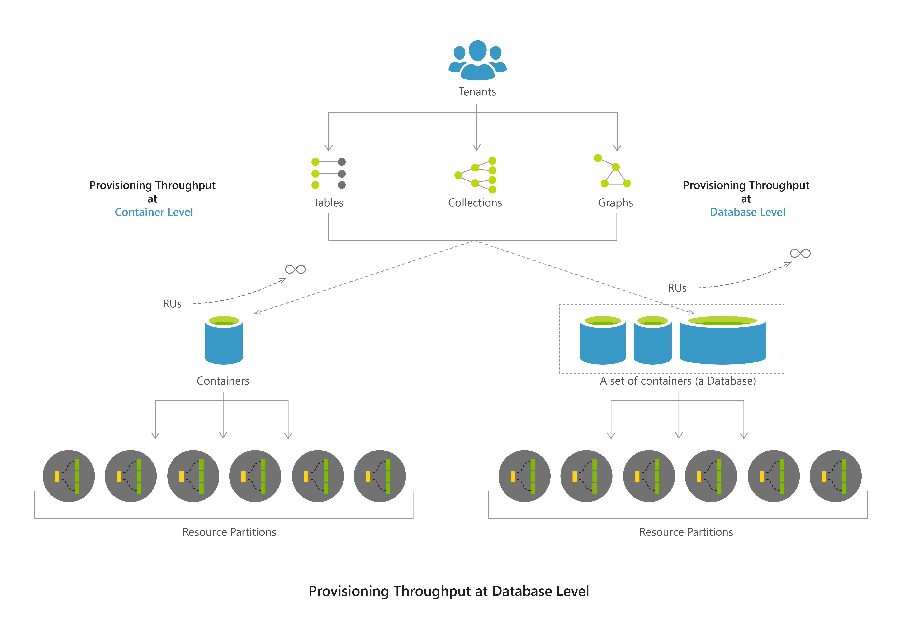
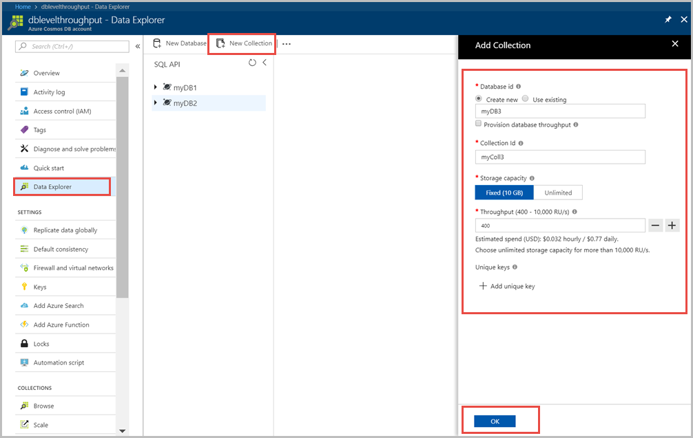
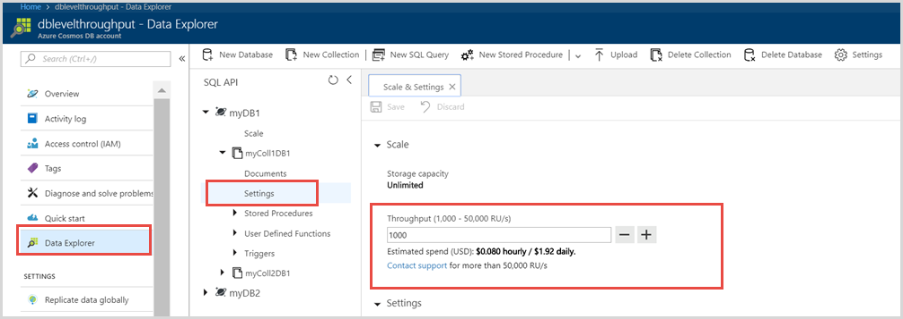
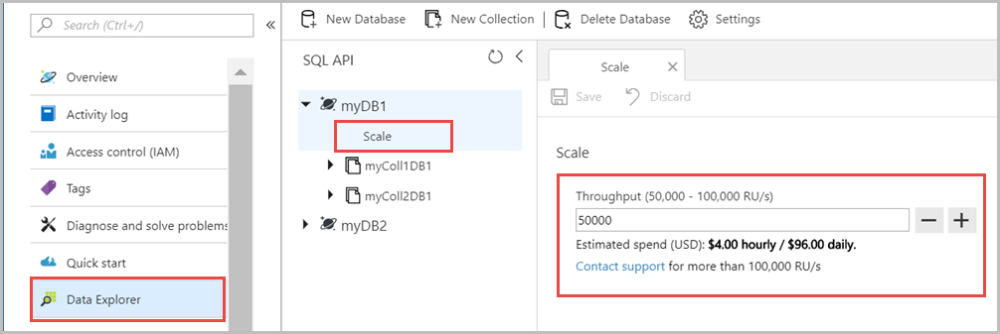
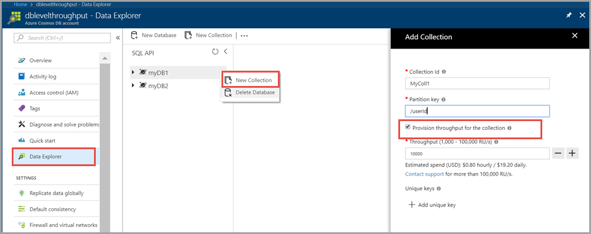

# Set and get throughput for Azure Cosmos DB containers and database

You can set throughput for an Azure Cosmos DB container or a set of containers by using Azure portal or by using the client SDKs. When you provision throughput for a set of containers, all those containers share the provisioned throughput. Provisioning throughput for individual containers will guarantee the reservation of throughput for that specific container. On the other hand, provisioning throughput for a database allows you to share the throughput among all the containers that belong to that database. Within an Azure Cosmos DB database, you can have a set of containers which share the throughput as well as containers, which have dedicated throughput. 

Based on the provisioned throughput, Azure Cosmos DB will allocate physical partitions to host your container(s) and splits/rebalances data across partitions as it grows.

When assigning RU/sec at the individual container level, the containers can be created as *fixed* or *unlimited*. Fixed-size containers have a maximum limit of 10 GB and 10,000 RU/s throughput. To create an unlimited container, you must specify a minimum throughput of 1,000 RU/s and a [partition key](partition-data.md). Since your data might have to be split across multiple partitions, it is necessary to pick a partition key that has a high cardinality (100 to millions of distinct values). By selecting a partition key with many distinct values, you ensure that your container/table/graph and requests can be scaled uniformly by Azure Cosmos DB. 

When assigning RU/sec across a set of containers, the containers belonging to this set are treated as *unlimited* containers and must specify a partition key.



This article walks you through the steps required to configure throughput at different levels for an Azure Cosmos DB account. 

## Provision throughput by using Azure portal

### Provision throughput for a container (collection/graph/table)

1. Sign in to the [Azure portal](https://portal.azure.com).  
2. From the left nav, select **All resources** and find your Azure Cosmos DB account.  
3. You can configure throughput while creating a container (collection, graph, table) or update throughput for an existing container.  
4. To assign throughput while creating a container, open the **Data Explorer** blade and select **New Collection** (New Graph, New Table for other APIs)  
5. Fill the form in **Add Collection** blade. Fields in this blade are described in the following table:  

   |**Setting**  |**Description**  |
   |---------|---------|
   |Database id  |  Provide a unique name to identify your database. Database is a logical container of one or more collections. Database names must contain from 1 through 255 characters, and they cannot contain /, \\, #, ?, or a trailing space. |
   |Collection id  | Provide a unique name to identify your collection. Collection ids have the same character requirements as database names. |
   |Storage capacity   | This value represents the storage capacity of the database. When provisioning throughput for an individual collection, storage capacity can be **Fixed (10 GB)** or **Unlimited**. Unlimited storage capacity requires you to set a partition key for your data.  |
   |Throughput   | Each collection and database can have throughput in request units per second.  For fixed storage capacity, minimum throughput is 400 request units per second (RU/s), for unlimited storage capacity, minimum throughput is set to 1000 RU/s.|

6. After you enter values for these fields, select **OK** to save the settings.  

   

7. To update throughput for an existing container, expand your database and the container and then click **Settings**. In the new window, type the new throughput value and then select **Save**.  

   

### Provision throughput for a set of containers or at the database level

1. Sign in to the [Azure portal](https://portal.azure.com).  
2. From the left nav, select **All resources** and find your Azure Cosmos DB account.  
3. You can configure throughput while creating a database or update throughput for an existing database.  
4. To assign throughput while creating a database, open the **Data Explorer** blade and select **New Database**  
5. Fill the **Database id** value, check **Provision throughput** option, and configure throughput value. A database can be provisioned with minimum throughput value 50,000 RU/s.  

   

6. To update throughput for an existing database, expand your database and the container and then click **Scale**. In the new window, type the new throughput value and then select **Save**.  

   

### Provision throughput for a set of containers as well as for an individual container in a database

1. Sign in to the [Azure portal](https://portal.azure.com).  
2. From the left nav, select **All resources** and find your Azure Cosmos DB account.  
3. Create a database and assign throughput to it. Open the **Data Explorer** blade and select **New Database**  
4. Fill the **Database id** value, check **Provision throughput** option, and configure throughput value. A database can be provisioned with minimum throughput value 50,000 RU/s.  

   

5. Next create a collection within the database you created in above step. To create a collection, right-click on the database and select **New Collection**.  

6. In the **Add Collection** blade, enter a name for the collection, and partition key. Optionally, you can provision throughput for that specific container if you choose not to assign a throughput value, the throughput assigned to the database is shared to the collection.  

   

## Considerations when provisioning throughput

Below are some considerations that help you decide on a throughput reservation strategy.

Consider provisioning throughput at database level (that is for set of containers) in the following cases:

* If you have a dozen or more number of containers that could share throughput across some or all of them.  

* When you are migrating from a single-tenant database that is designed to run on IaaS-hosted VMs or on-premises (for example, NoSQL or relational databases) to Azure Cosmos DB and have many containers.  

* If you want to consider unplanned spikes in workloads by using pooled throughput at the database level.  

* Instead of setting throughput on an individual container, you are interested in getting the aggregate throughput across a set of containers within the database.

Consider provisioning throughput at an individual container in the following cases:

* If you have less number of Azure Cosmos DB containers.  

* If you want to get the guaranteed throughput on a given container backed by SLA.

## Throughput ranges

The following table lists the throughput available for containers:

<table border="0" cellspacing="0" cellpadding="0">
    <tbody>
        <tr>
            <td valign="top"><p></p></td>
            <td valign="top"><p><strong>Single Partition Container</strong></p></td>
            <td valign="top"><p><strong>Partitioned Container</strong></p></td>
            <td valign="top"><p><strong>Set of Containers</strong></p></td>
        </tr>
        <tr>
            <td valign="top"><p>Minimum Throughput</p></td>
            <td valign="top"><p>400 request units per second</p></td>
            <td valign="top"><p>1,000 request units per second</p></td>
            <td valign="top"><p>50,000 request units per second</p></td>
        </tr>
        <tr>
            <td valign="top"><p>Maximum Throughput</p></td>
            <td valign="top"><p>10,000 request units per second</p></td>
            <td valign="top"><p>Unlimited</p></td>
            <td valign="top"><p>Unlimited</p></td>
        </tr>
    </tbody>
</table>

<a id="set-throughput-sdk"></a>

## Set throughput by using SQL API for .NET

Here is a code snippet for creating a container with 3,000 request units per second for an individual container using the SQL API's .NET SDK:

```csharp
DocumentCollection myCollection = new DocumentCollection();
myCollection.Id = "coll";
myCollection.PartitionKey.Paths.Add("/deviceId");

await client.CreateDocumentCollectionAsync(
    UriFactory.CreateDatabaseUri("db"),
    myCollection,
    new RequestOptions { OfferThroughput = 3000 });
```

Here is a code snippet for provisioning 100,000 request units per second across a set of containers using the SQL API's .NET SDK:

```csharp
// Provision 100,000 RU/sec at the database level. 
// sharedCollection1 and sharedCollection2 will share the 100,000 RU/sec from the parent database
// dedicatedCollection will have its own dedicated 4,000 RU/sec, independant of the 100,000 RU/sec provisioned from the parent database
Database database = client.CreateDatabaseAsync(new Database { Id = "myDb" }, new RequestOptions { OfferThroughput = 100000 }).Result;

DocumentCollection sharedCollection1 = new DocumentCollection();
sharedCollection1.Id = "sharedCollection1";
sharedCollection1.PartitionKey.Paths.Add("/deviceId");

await client.CreateDocumentCollectionAsync(database.SelfLink, sharedCollection1, new RequestOptions())

DocumentCollection sharedCollection2 = new DocumentCollection();
sharedCollection2.Id = "sharedCollection2";
sharedCollection2.PartitionKey.Paths.Add("/deviceId");

await client.CreateDocumentCollectionAsync(database.SelfLink, sharedCollection2, new RequestOptions())

DocumentCollection dedicatedCollection = new DocumentCollection();
dedicatedCollection.Id = "dedicatedCollection";
dedicatedCollection.PartitionKey.Paths.Add("/deviceId");

await client.CreateDocumentCollectionAsync(database.SelfLink, dedicatedCollection, new RequestOptions { OfferThroughput = 4000 )
```

Azure Cosmos DB operates on a reservation model for throughput. That is, you are billed for the amount of throughput *reserved*, regardless of how much of that throughput is actively *used*. As your application's load, data, and usage patterns change you can easily scale up and down the number of reserved RUs through SDKs or using the [Azure Portal](https://portal.azure.com).

Each container, or set of containers, is mapped to an `Offer` resource in Azure Cosmos DB, which has metadata about the provisioned throughput. You can change the allocated throughput by looking up the corresponding offer resource for a container, then updating it with the new throughput value. Here is a code snippet for changing the throughput of a container to 5,000 request units per second using the .NET SDK:

```csharp
// Fetch the resource to be updated
// For a updating throughput for a set of containers, replace the collection's self link with the database's self link
Offer offer = client.CreateOfferQuery()
                .Where(r => r.ResourceLink == collection.SelfLink)    
                .AsEnumerable()
                .SingleOrDefault();

// Set the throughput to 5000 request units per second
offer = new OfferV2(offer, 5000);

// Now persist these changes to the database by replacing the original resource
await client.ReplaceOfferAsync(offer);
```

There is no impact to the availability of your container, or set of containers, when you change the throughput. Typically the new reserved throughput is effective within seconds on application of the new throughput.

<a id="set-throughput-java"></a>

## To set the throughput by using the SQL API for Java

The following code snippet retrieves the current throughput and changes it to 500 RU/s. For a complete code sample, see the [OfferCrudSamples.java](https://github.com/Azure/azure-documentdb-java/blob/master/documentdb-examples/src/test/java/com/microsoft/azure/documentdb/examples/OfferCrudSamples.java) file on GitHub. 

```Java
// find offer associated with this collection
// To change the throughput for a set of containers, use the database's resource id instead of the collection's resource id
Iterator < Offer > it = client.queryOffers(
    String.format("SELECT * FROM r where r.offerResourceId = '%s'", collectionResourceId), null).getQueryIterator();
assertThat(it.hasNext(), equalTo(true));

Offer offer = it.next();
assertThat(offer.getString("offerResourceId"), equalTo(collectionResourceId));
assertThat(offer.getContent().getInt("offerThroughput"), equalTo(throughput));

// update the offer
int newThroughput = 500;
offer.getContent().put("offerThroughput", newThroughput);
client.replaceOffer(offer);
```

## <a id="GetLastRequestStatistics"></a>Get throughput by using MongoDB API's GetLastRequestStatistics command

The MongoDB API supports a custom command, *getLastRequestStatistics*, for retrieving the request charges for a given operation.

For example, in the Mongo shell, execute the operation that you want to verify the request charge for.
```
> db.sample.find()
```

Next, execute the command *getLastRequestStatistics*.
```
> db.runCommand({getLastRequestStatistics: 1})
{
    "_t": "GetRequestStatisticsResponse",
    "ok": 1,
    "CommandName": "OP_QUERY",
    "RequestCharge": 2.48,
    "RequestDurationInMilliSeconds" : 4.0048
}
```

One method for estimating the amount of reserved throughput required by your application is to record the request unit charge associated with running typical operations against a representative item used by your application and then estimate the number of operations you anticipate to perform each second.

> [!NOTE]
> If you have item types which will differ dramatically in terms of size and the number of indexed properties, then record the applicable operation request unit charge associated with each *type* of typical item.
> 
> 

## Get throughput by using MongoDB API portal metrics

The simplest way to get a good estimate of request unit charges for your MongoDB API database is to use the [Azure portal](https://portal.azure.com) metrics. With the *Number of requests* and *Request Charge* charts, you can get an estimate of how many request units each operation is consuming and how many request units they consume relative to one another.

![MongoDB API portal metrics][1]

### <a id="RequestRateTooLargeAPIforMongoDB"></a> Exceeding reserved throughput limits in the MongoDB API
Applications that exceed the provisioned throughput for a container or a set of containers will be rate-limited until the consumption rate drops below the provisioned throughput rate. When a rate-limitation occurs, the backend will end the request with a `16500` error code - `Too Many Requests`. By default, the MongoDB API automatically retries up to 10 times before returning a `Too Many Requests` error code. If you are receiving many `Too Many Requests` error codes, you may want to consider either adding a retry logic in your application's error handling routines or [increase provisioned throughput for the container](set-throughput.md).

## Throughput FAQ

**Can I set my throughput to less than 400 RU/s?**

400 RU/s is the minimum throughput available on Cosmos DB single partition containers (1000 RU/s is the minimum for partitioned containers). Request units are set in 100 RU/s intervals, but throughput cannot be set to 100 RU/s or any value smaller than 400 RU/s. If you're looking for a cost effective method to develop and test Cosmos DB, you can use the free [Azure Cosmos DB Emulator](local-emulator.md), which you can deploy locally at no cost. 

**How do I set throughput using the MongoDB API?**

There's no MongoDB API extension to set throughput. The recommendation is to use the SQL API, as shown in [To set the throughput by using the SQL API for .NET](#set-throughput-sdk).

## Next steps

* To learn about estimating throughput and request units, see [Request units & estimating throughput in Azure Cosmos DB](request-units.md)

* To learn more about provisioning and going planet-scale with Cosmos DB, see [Partitioning and scaling with Cosmos DB](partition-data.md).

[1]: ./media/set-throughput/api-for-mongodb-metrics.png
