# 3 - Customize the Azure IoT Central operator's view

This tutorial shows you, as a builder, how to customize the operator's view of your application. When you make a change to the application as a builder, you can preview the operator's view in the Microsoft Azure IoT Central application.

In this tutorial, you customize the application to display relevant information about the connected air conditioner device to an operator. Your customizations enable the operator to manage the air conditioner devices connected to the application.

In this tutorial, you learn how to:

> [!div class="checklist"]
> * Configure your device dashboard
> * Configure your device settings layout
> * Configure your device properties layout
> * Preview the device as an operator
> * Configure your default home page
> * Preview the default home page as an operator

## Prerequisites

Before you begin, you should complete the two previous tutorials:

1. [Define a new device type in your Azure IoT Central application](tutorial-define-device-type.md).
1. [Configure rules and actions for your device](tutorial-configure-rules.md).

## Configure your device dashboard

As a builder, you can define what information displays on a device dashboard. In the [Define a new device type in your application](tutorial-define-device-type.md) tutorial, you added a line-chart and other information to the **Connected Air Conditioner-1** dashboard.

1. To edit the **Connected Air Conditioner** device template, choose **Explorer** on the left navigation menu:

    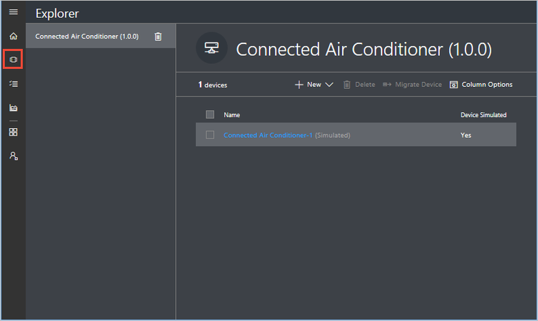

1. To start customizing your connected air conditioner device dashboard, select the **Connected Air Conditioner (1.0.0)** device template. Choose the **Connected Air Conditioner-1** device you created in the [Define a new device type in your application](tutorial-define-device-type.md) tutorial:

    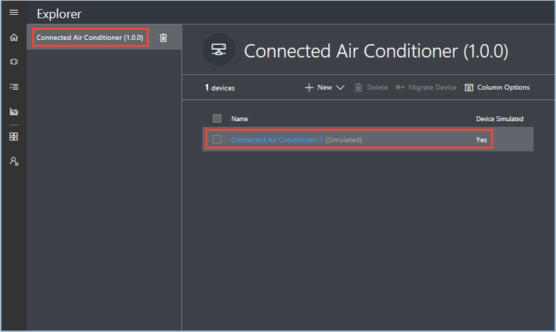

    When you make a change to a device, such as **Connected Air Conditioner-1**, you make a change to the underlying template. For more information, see [Create a new device template version](howto-version-devicetemplate.md).

1. To edit the dashboard, choose **Dashboard**:

    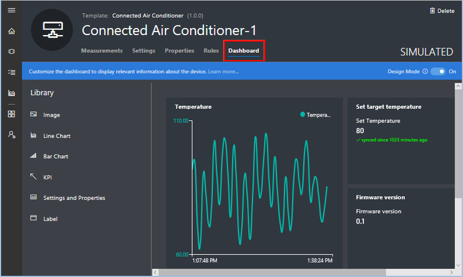

1. To add a KPI tile to the dashboard, choose **KPI**:

    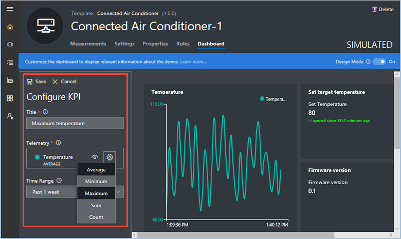

    To define the KPI, use the information in the following table:

    | Setting     | Value |
    | ----------- | ----- |
    | Name        | Maximum temperature |
    | Measurement | temperature |
    | Aggregation | Maximum |
    | Time range  | Past 1 week |

1. Choose **Save**. You can now see the KPI tile on the dashboard:

    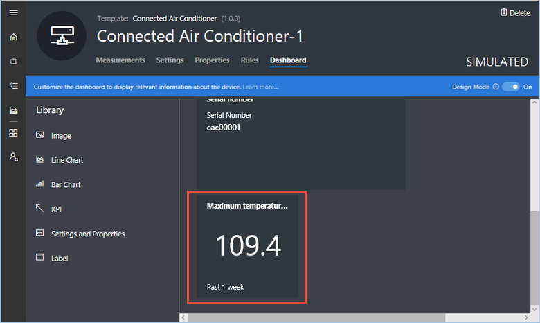

1. To move or resize a tile on the dashboard, move the mouse pointer over the tile. You can drag the tile to a new location or resize it:

    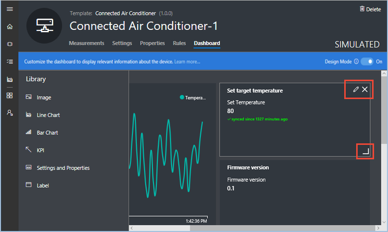

## Configure your settings layout

As a builder, you can also configure the operator's view of the device settings. An operator uses the device settings page to configure a device. For example, an operator uses the settings page to set the target temperature for the refrigerator.

1. To edit the settings layout for your connected air conditioner, choose **Settings**:

    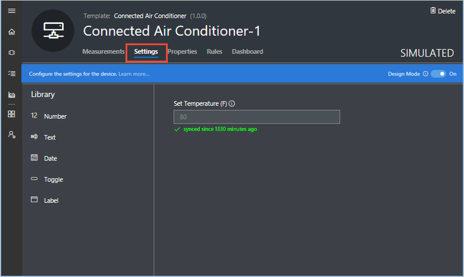

1. You can move and resize the settings tiles:

    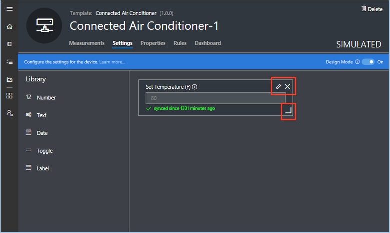

> [!NOTE]
> In **Design Mode**, you can't edit the values of the settings.

## Configure your properties layout

In addition to the dashboard and settings, you can also configure the operator's view of the device properties. An operator uses the device properties page to manage device metadata. For example, an operator uses the properties page to view a device serial number or update contact details for the manufacturer.

1. To edit the properties layout for your connected air conditioner, choose **Properties**:

    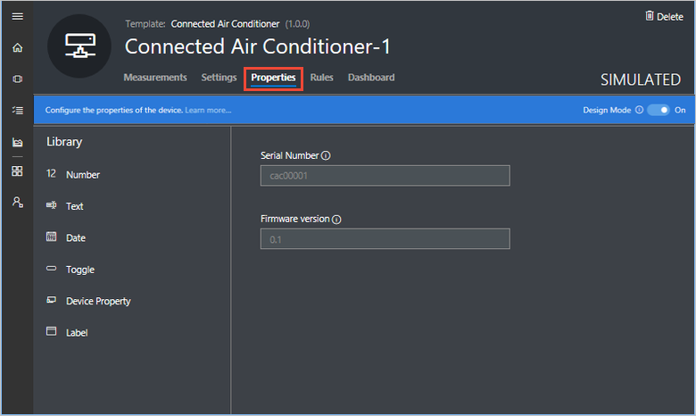

1. You can move and resize the properties fields:

    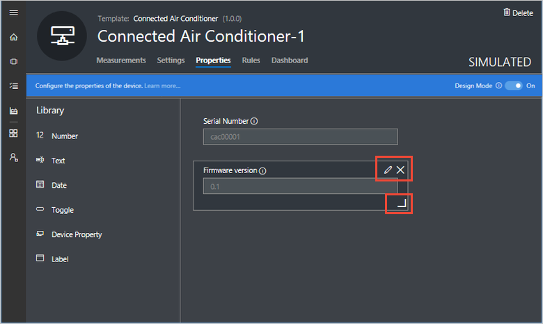

> [!NOTE]
> In **Design Mode**, you can't edit the values of the properties.

## Preview the connected air conditioner device as an operator

In **Design Mode**, you can customize the dashboard, settings, and properties pages for an operator. If you switch **Design Mode** off, you can view the application as an operator.

1. To view your connected air conditioner device as an operator, you need to switch **Design Mode** off. To switch **Design Mode** off, toggle off the **Design Mode** on the top right of the page.

1. To update the serial number of this device, edit the value  in the serial number tile and choose **Save**:

    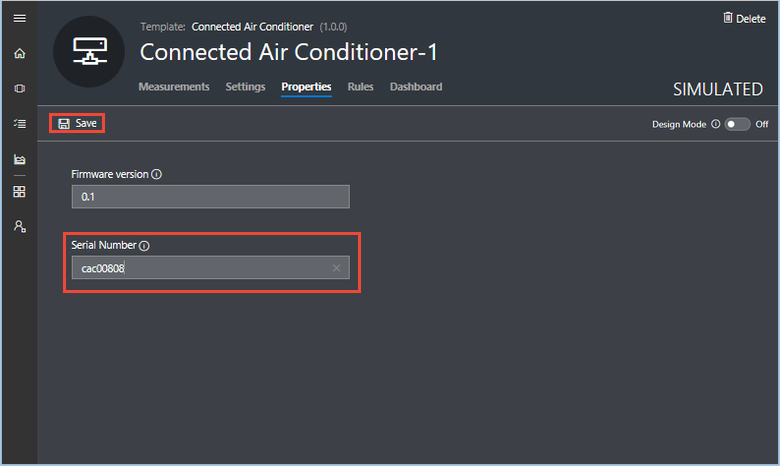

1. To send a setting to your connected air conditioner, choose **Settings**, change a setting value in a tile, and choose **Update**:

    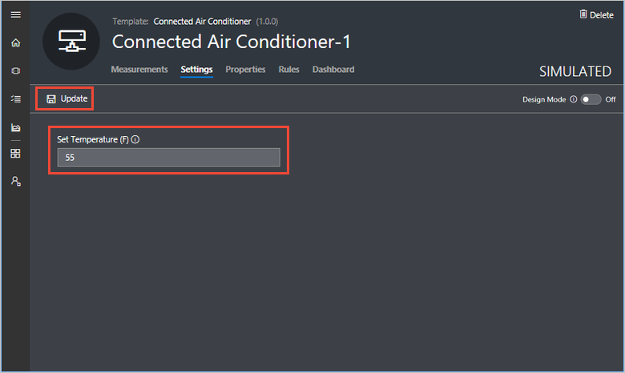

    When the device acknowledges the new setting value, the setting shows as **synced** on the tile.

1. As an operator, you can view the device dashboard as configured by the builder:

    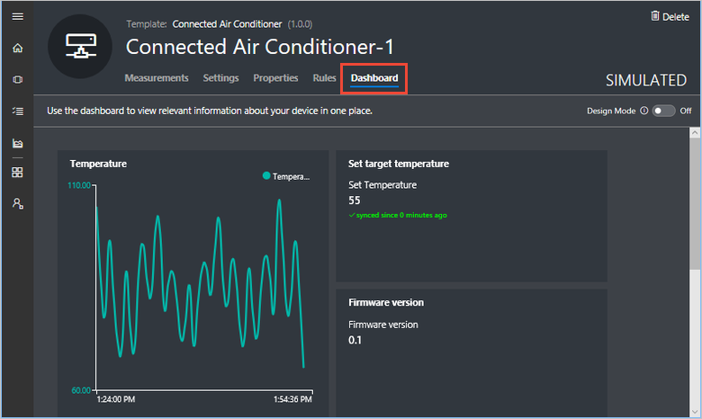

## Configure the default home page

When a builder or operator signs in to an Azure IoT Central application, they see a home page. As a builder, you can configure the content of this home page to include the most useful and relevant content for an operator.

1. To customize the default home page, navigate to the **Home** page and switch **Design Mode** on, on the top right of the page. On turning on **Design Mode**, a panel will slide out from the right with a list of objects you can add to your Homepage.

    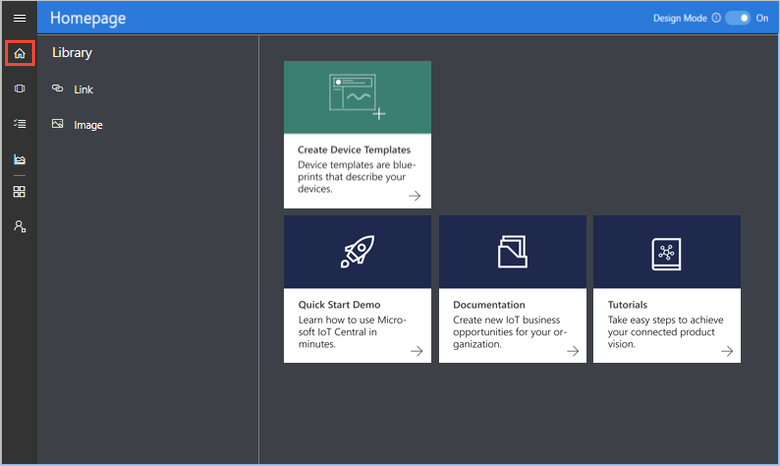

1. To customize the home page, add tiles from the **Library**. Choose **Link**, and add details of your organization's web site. Then choose **Save**:

    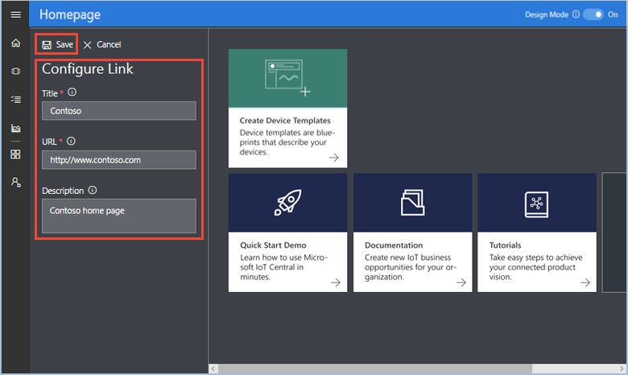

    > [!NOTE]
    > You can also add links to pages within your Azure IoT Central application. For example, you could add a link to a device dashboard or settings page.

1. Optionally, choose **Image** and upload an image to display on your home page. An image can have a URL that you navigate to when you click on it:

    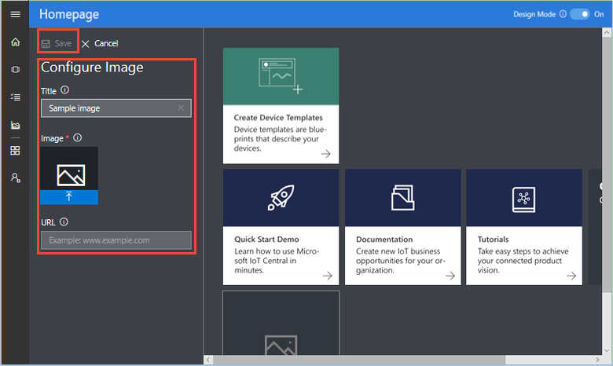

    To learn more, see [How to prepare and upload images to your Azure IoT Central application](howto-prepare-images.md).

## Preview the default home page as an operator

To preview the home page as an operator, switch **Design Mode** off on the top right of the page:

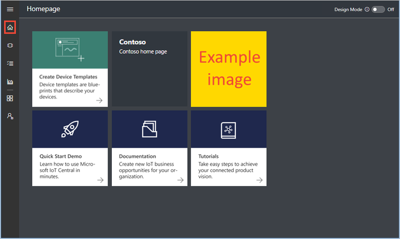

You can click on the link and image tiles to navigate to the URLs you set as a builder.

## Next steps

In this tutorial, you learned how to customize the operator's view of the application.

<!-- Repeat task list from intro -->
> [!div class="nextstepaction"]
> * Configure your device dashboard
> * Configure your device settings layout
> * Configure your device properties layout
> * Preview the device as an operator
> * Configure your default home page
> * Preview the default home page as an operator

Now that you have learned how to customize the operator's view of the application, the suggested next steps are to:

* [Monitor your devices (as an operator)](tutorial-monitor-devices.md)
* [Add a new device to your application (as an operator and device developer)](tutorial-add-device.md)
