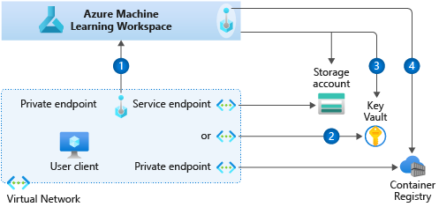
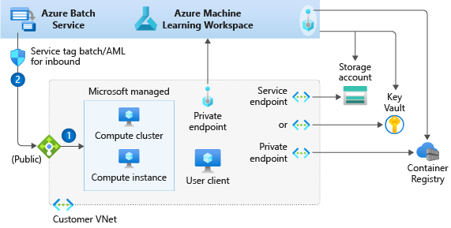
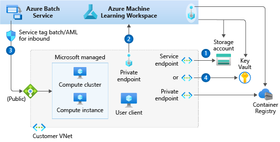
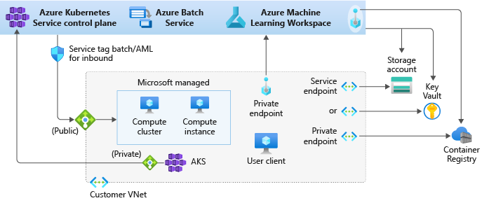

# Virtual network isolation and privacy overview

In this article, you learn how to use virtual networks (VNets) to secure network communication in Azure Machine Learning. This article uses an example scenario to show you how to configure a complete virtual network.

This article is part one of a five-part series that walks you through securing an Azure Machine Learning workflow. We highly recommend that you read through this overview article to understand the concepts first. 

Here are the other articles in this series:

**1. VNet overview** > [2. Secure the workspace](how-to-secure-workspace-vnet.md) > [3. Secure the training environment](how-to-secure-training-vnet.md) > [4. Secure the inferencing environment](how-to-secure-inferencing-vnet.md) > [5. Enable studio functionality](how-to-enable-studio-virtual-network.md)

## Prerequisites

This article assumes that you have familiarity with the following topics:
+ [Azure Virtual Networks](https://docs.microsoft.com/azure/virtual-network/virtual-networks-overview)
+ [IP networking](https://docs.microsoft.com/azure/virtual-network/virtual-network-ip-addresses-overview-arm)
+ [Azure Private Link](how-to-configure-private-link.md)
+ [Network Security Groups (NSG)](../virtual-network/security-overview.md)
+ [Network firewalls](../firewall/overview.md)

## Example scenario

In this section, you learn how a common network scenario is set up to secure Azure Machine Learning communication with private IP addresses.

The table below compares how services access different parts of an Azure Machine Learning network both with a VNet and without a VNet.

| Scenario | Workspace | Associated resources | Training compute environment | Inferencing compute environment |
|-|-|-|-|-|-|
|**No virtual network**| Public IP | Public IP | Public IP | Public IP |
|**Secure resources in a virtual network**| Private IP (private endpoint) | Public IP (service endpoint)   **- or -**   Private IP (private endpoint) | Private IP | Private IP  | 

* **Workspace** - Create a private endpoint from your VNet to connect to Private Link on the workspace. The private endpoint connects the workspace to the vnet through several private IP addresses.
* **Associated resource** - Use service endpoints or private endpoints to connect to workspace resources like Azure storage, Azure Key Vault, and Azure Container Services.
    * **Service endpoints** provide the identity of your virtual network to the Azure service. Once you enable service endpoints in your virtual network, you can add a virtual network rule to secure the Azure service resources to your virtual network. Service endpoints use public IP addresses.
    * **Private endpoints** are network interfaces that securely connect you to a service powered by Azure Private Link. Private endpoint uses a private IP address from your VNet, effectively bringing the service into your VNet.
* **Training compute access** - Access training compute targets like Azure Machine Learning Compute Instance and Azure Machine Learning Compute Clusters securely with private IP addresses. 
* **Inferencing compute access** - Access Azure Kubernetes Services (AKS) compute clusters with private IP addresses.

The next five sections show you how to secure the network scenario described above. To secure your network, you must:

1. Secure the [**workspace and associated resources**](#secure-the-workspace-and-associated-resources).
1. Secure the [**training environment**](#secure-the-training-environment).
1. Secure the [**inferencing environment**](#secure-the-inferencing-environment).
1. Optionally: [**enable studio functionality**](#optional-enable-studio-functionality).
1. Configure [**firewall settings**](#configure-firewall-settings)

## Secure the workspace and associated resources

Use the following steps to secure your workspace and associated resources. These steps allow your services to communicate in the virtual network.

1. Create a [Private Link-enabled workspace](how-to-secure-workspace-vnet.md#secure-the-workspace-with-private-endpoint) to enable communication between your VNet and workspace.
1. Add Azure Key Vault to the virtual network with a [service endpoint](../key-vault/general/overview-vnet-service-endpoints.md) or a [private endpoint](../key-vault/general/private-link-service.md). Set Key Vault to ["Allow trusted Microsoft services to bypass this firewall"](how-to-secure-workspace-vnet.md#secure-azure-key-vault).
1. Add you Azure storage account to the virtual network with a [service endpoint](how-to-secure-workspace-vnet.md#secure-azure-storage-accounts) or a [private endpoint](../storage/common/storage-private-endpoints.md)
1. [Configure Azure Container Registry to use a private endpoint](how-to-secure-workspace-vnet.md#enable-azure-container-registry-acr) and [enable subnet delegation in Azure Container Instances](how-to-secure-inferencing-vnet.md#enable-azure-container-instances-aci).

For detailed instructions on how to complete these steps, see [Secure an Azure Machine Learning workspace](how-to-secure-workspace-vnet.md). 

### Limitations

Securing your workspace and associated resources within a virtual network have the following limitations:
- Workspace Private Link is only available in the following regions: eastus, westus2, southcentralus
    - This limitation does not apply to the associated resources. For example, you can enable VNet for storage in any Azure Machine Learning region.
- All resources must be behind the same VNet. However, subnets within the same VNet are allowed.
- Some studio features like the designer, AutoML, labeling, and data profiling cannot be used with storage accounts configured to use a private endpoint. If you need to use these studio features, use service endpoints instead.

## Secure the training environment

In this section, you learn how to secure the training environment in Azure Machine Learning. You also learn how Azure Machine Learning completes a training job to understand how the network configurations work together.

To secure the training environment, use the following steps:

1. Create an Azure Machine Learning [compute instance and computer cluster in the virtual network](how-to-secure-training-vnet.md#compute-instance) to run the training job.
1. [Allow inbound communication from Azure Batch Service](how-to-secure-training-vnet.md#mlcports) so that Batch Service can submit jobs to your compute resources. 

For detailed instructions on how to complete these steps, see [Secure a training environment](how-to-secure-training-vnet.md). 

### Example training job submission 

In this section, you learn how Azure Machine Learning securely communicates between services to submit a training job. This shows you how all your configurations work together to secure communication.

1. The client uploads training scripts and training data to storage accounts that are secured with a service or private endpoint.

1. The client submits a training job to the Azure Machine Learning workspace through the private endpoint.

1. Azure Batch services receives the job from the workspace and submits the training job to the compute environment through the public load balancer that's provisioned with the compute resource. 

1. The compute resource receive the job and begins training. The compute resources accesses secure storage accounts to download training files and upload output. 

### Limitations

- Azure Compute Instance and Azure Compute Clusters must be in the same VNet, region, and subscription as the workspace and its associated resources. 

## Secure the inferencing environment

In this section, you learn the options available for securing an inferencing environment. We recommend that you use Azure Kubernetes Services (AKS) clusters for high-scale, production deployments.

You have two options for AKS clusters in a virtual network:

- Deploy or attach a default AKS cluster to your VNet.
- Attach a private AKS cluster to your VNet.

**Default AKS clusters** have a control plane with public IP addresses. You can add a default AKS cluster to your VNet during the deployment or attach a cluster after it's created.

**Private AKS clusters** have a control plane, which can only be accessed through private IPs. Private AKS clusters must be attached after the cluster is created.

For detailed instructions on how to add default and private clusters, see [Secure an inferencing environment](how-to-secure-inferencing-vnet.md). 

The following network diagram shows a secured Azure Machine Learning workspace with a private AKS cluster attached to the virtual network.

### Limitations
- AKS clusters must belong to the same VNet as the workspace and its associated resources. 

## Optional: enable studio functionality

[Secure the workspace](#secure-the-workspace-and-associated-resources) > [Secure the training environment](#secure-the-training-environment) > [Secure the inferencing environment](#secure-the-inferencing-environment) > **Enable studio functionality** > [Configure firewall settings](#configure-firewall-settings)

Although the studio can access data in a storage account configured with a service endpoint, some features are disabled by default:

* Preview data in the studio.
* Visualize data in the designer.
* Submit an AutoML experiment.
* Start a labeling project.

To enable full functionality while using a storage service endpoint, see [Use Azure Machine Learning studio in a virtual network](how-to-enable-studio-virtual-network.md#access-data-using-the-studio). Currently, the studio does not support storage private endpoints.

### Limitations
- The studio cannot access data in storage accounts configured to use private endpoints. For full functionality, you must use service endpoints for storage and use managed identity.

## Configure firewall settings

Configure your firewall to control access to your Azure Machine Learning workspace resources and the public internet. While we recommend Azure Firewall, you should be able to use  other firewall products to secure your network. If you have questions about how to allow communication through your firewall, please consult the documentation for the firewall you are using.

For more information on firewall settings, see [Use workspace behind a Firewall](how-to-access-azureml-behind-firewall.md).

## Next steps

This article is part one of a four-part virtual network series. See the rest of the articles to learn how to secure a virtual network:

* [Part 2: Virtual network overview](how-to-secure-workspace-vnet.md)
* [Part 3: Secure the training environment](how-to-secure-training-vnet.md)
* [Part 4: Secure the inferencing environment](how-to-secure-inferencing-vnet.md)
* [Part 5:Enable studio functionality](how-to-enable-studio-virtual-network.md)
