# Data science code testing with UCI adult income prediction dataset
In this article, we provide preliminary guidelines regarding code test for data science workflow. Such testing gives data scientists a systematic and efficient way to check the quality and expected outcome of their code. We use a Team Data Science Process (TDSP) [project which uses the UCI Adult Income dataset](https://github.com/Azure/MachineLearningSamples-TDSPUCIAdultIncome) we already published earlier to show how code testing can be done. 

## Introduction on code testing
"Unit testing" a longstanding practice for software development. But for data science, it is often not precisely clear what that means and how one should test code for different stages of a data science lifecycle, such as data preparation, data quality examination, modeling, model deployment etc. For this article, we replace the term "unit testing" by "code testing". We refer to testing as the functions, which help to assess if code for a certain step of a data science lifecycle is producing results "as expected". What is "as expected" is defined by the person writing the test, depending on the outcome of the function, for example, data quality check, modeling etc.

References are given below for useful resources.

## Visual Studio Team Services (VSTS) for testing framework
In this article, we describe how to perform and automate testing using VSTS. You may decide to use alternative tools. We also show how to set up automatic build using VSTS and build agents. For build agents we have used Azure Data Science Virtual Machine (DSVM).

## Overall flow of code testing
The overall work flow of doing code test in a data science project looks like this: 

   

    
## Detailed steps

### All steps for setup and execution of code testing and automated build using a build agent and VSTS are detailed below.

1. Create project in Visual Studio desktop application

    

2. Create your project in Visual Studio desktop application, you will find your project in the solution explorer on the right panel:
	
    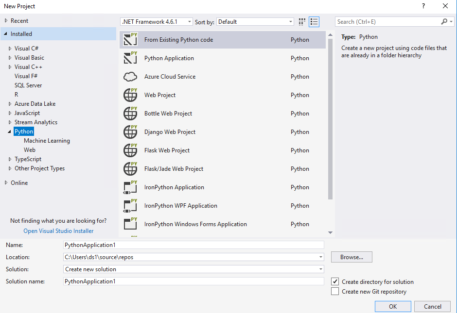

    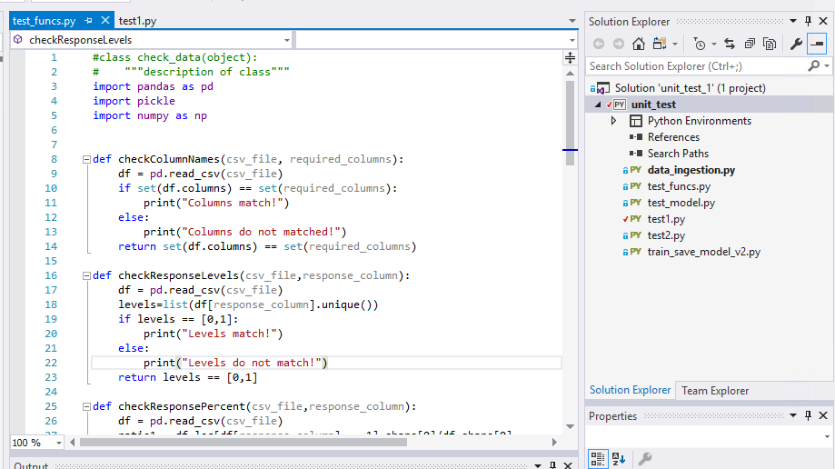

3. Feed your project code into the VSTS project code repository: 

    

4. Testing code for data processing
Suppose you have done some data preparation work such as data ingestion, feature engineering, and creating label columns, you want to make sure your code is generating the results you expect, here are some code that can be used to test the data processing code is working properly:

	* Check column names are right
	
    

	* Check response levels are right

    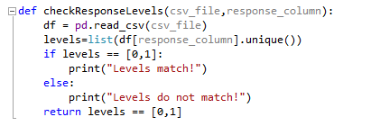

	* Check response percentage is reasonable

    

	* Check missing rate of each column in the data
	
    

5. Testing code for feature engineering
After you have done the data processing, feature engineering work, and you trained a good model, you want to make sure the model you trained is able to  score new data sets correctly, the following two tests can be used to check the prediction levels and distribution of label values.

	* Check prediction levels
	
	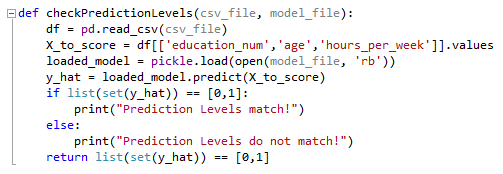

	* Check prediction value distribution

    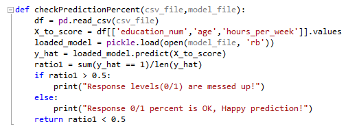

6. Put all the test functions together
Put all test functions together into a python script called **test_functions.py**:

    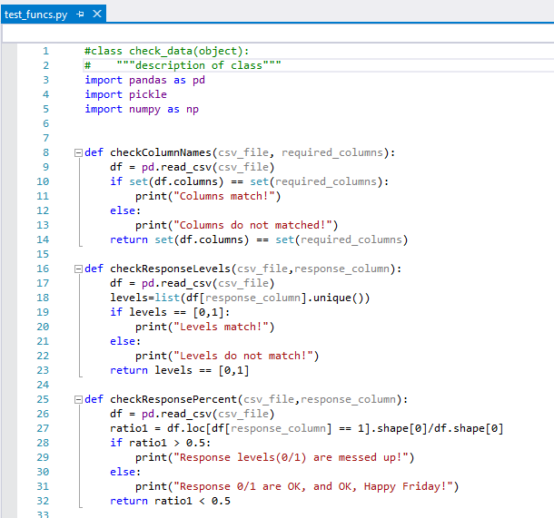

7. After the test codes are prepared, you can set up the testing environment in Visual Studio

	- Create a python file called **test1.py**, within this file create a class that includes all the tests you want to do, here I have six tests prepared
	
	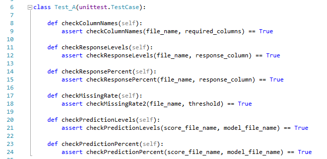

8. Running all tests using Test Explorer
Those tests can be automatically discovered if you put **codetest.testCase** after your class name, open **Test Explorer** on the right panel, click run all, all the tests will be running sequentially and telling you if the test is successful or not.

    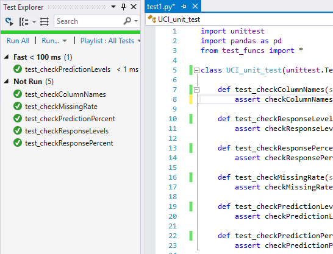

9. Check in your code in remote repository
Check in your code to the project repository using git commands and your most recent work will be reflected shortly in VSTS.

    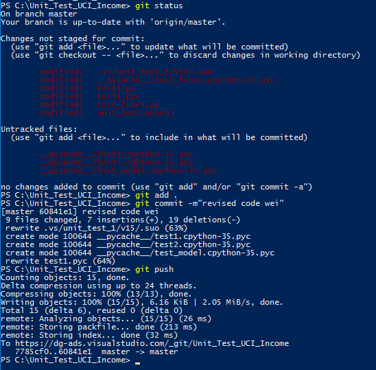

    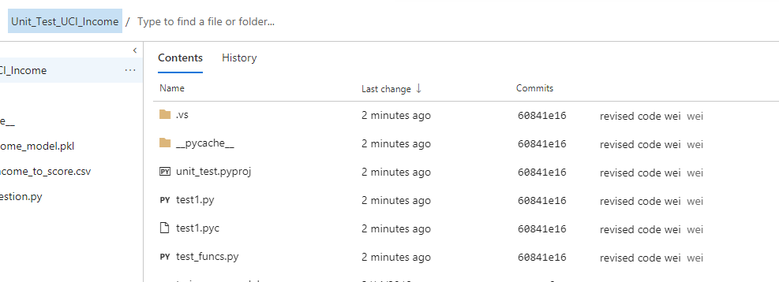

10. Set up automatic build and test in VSTS

	* In the project repository, click **Build and Release**, click **+New** to create a new build process.

     

	* Follow the prompts on the screen to select your source code location, project name, repository, and branch info
	
    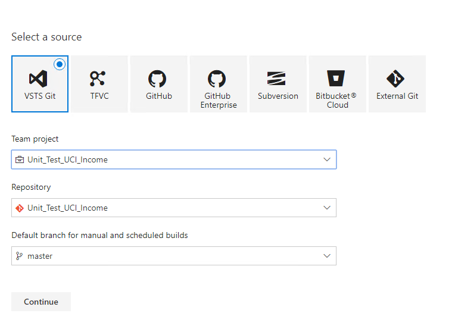

	* Select a template, since there is no python project template, we just start with an **Empty Process** 

    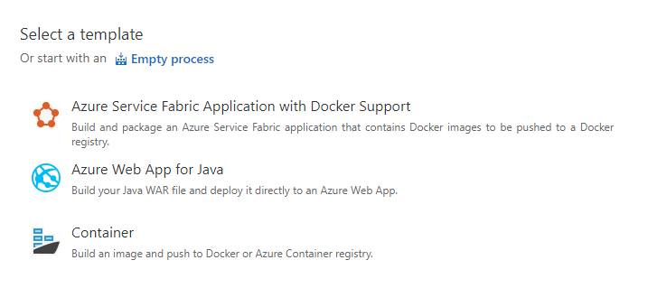

	* Name the build and select the agent, you can choose **Default**, here using default will let us use a DSVM to finish the build process. More details about setting agent can be found in [here](https://docs.microsoft.com/en-us/vsts/build-release/concepts/agents/agents?view=vsts)
	
    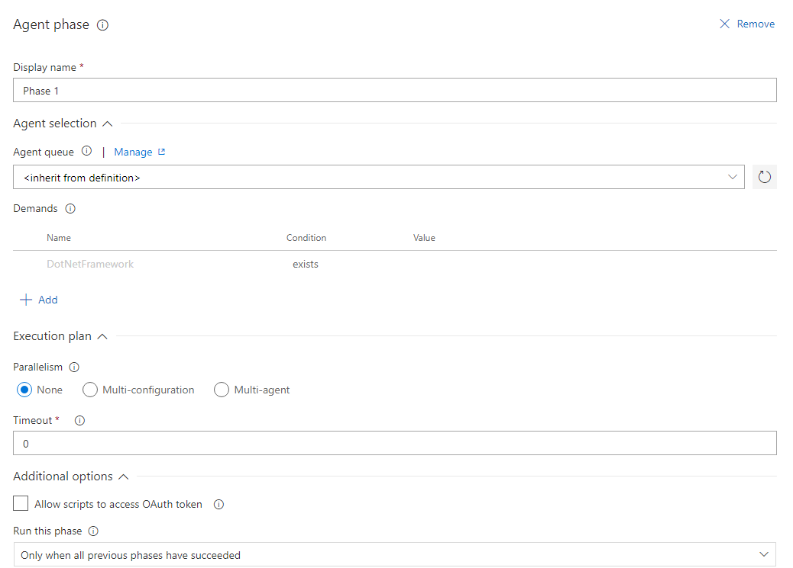

	* Click **+** on the left panel, to add a task for this build phase, since we are going to run our Python script **test1.py** to finish all the checks, this task is using PowerShell command to run python code.
	
    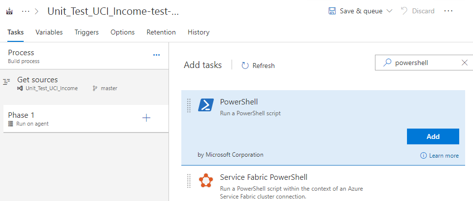

	* In the PowerShell details part, fill in the required info as needed such as name and version of PowerShell, choose **Inline Script**, in the box below, you can type _python test1.py_. Make sure environment variable is set up correctly for Python. If you need different version/kernel of python, you can explicitly specify the path as shown in the figure. 
	
    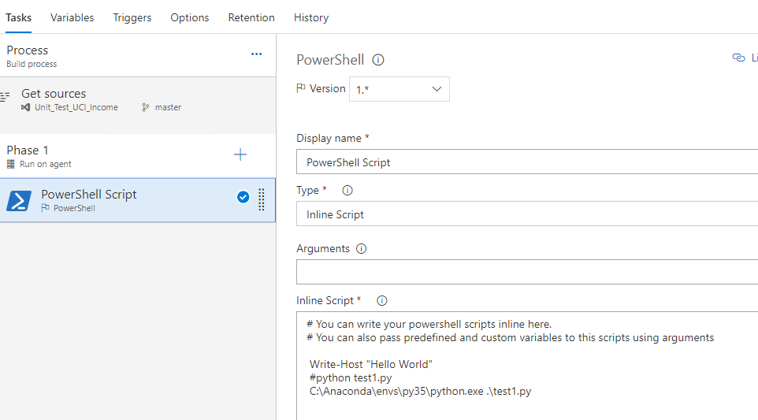

	* Click **Save & queue** to finish the build definition process.

    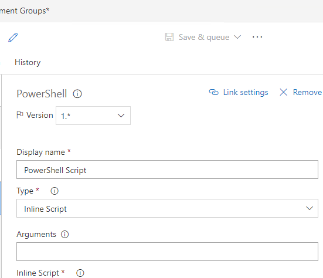

11. Automatic build process
Now every time when new commit is pushed to the code repository (here we use master, you can define any branch), the build process will be initiated automatically. Basically it runs the **test1.py** file in the agent machine to make sure everything defined in the code is correctly executed as planned. You will get notified in email (if alert set up correctly) when the build is finished. You can also check build status in VSTS. If it failed, you can dig into the details of build and find out which piece is broken.

	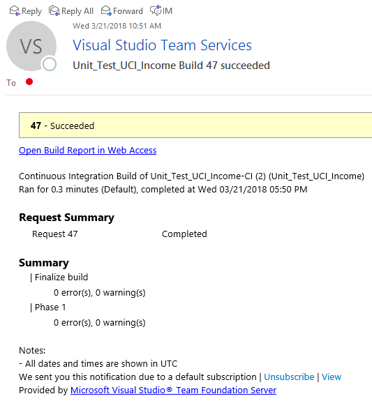

	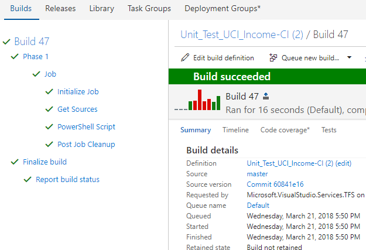

## Next steps
* Refer to the [UCI Income prediction repository](https://github.com/Azure/MachineLearningSamples-TDSPUCIAdultIncome) for unit tests for that data science scenario for some concrete examples
* Follow the above outline and examples from UCI Income prediction scenario in your own data science projects.

## References
* [Team Data Science Process (TDSP)](https://aka.ms/tdsp)
* [Visual Studio Testing TOols](https://www.visualstudio.com/vs/features/testing-tools/)
* [VSTS Testing Resources](https://www.visualstudio.com/team-services/)
* [Data Science Virtual Machine (DSVM)](https://azure.microsoft.com/services/virtual-machines/data-science-virtual-machines/)