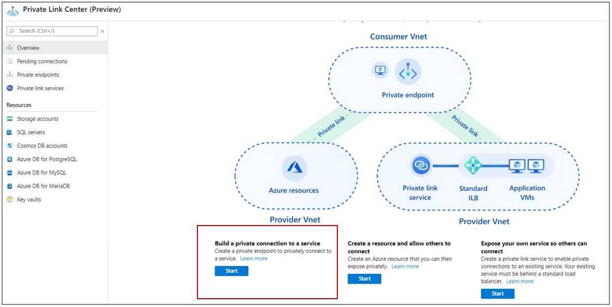
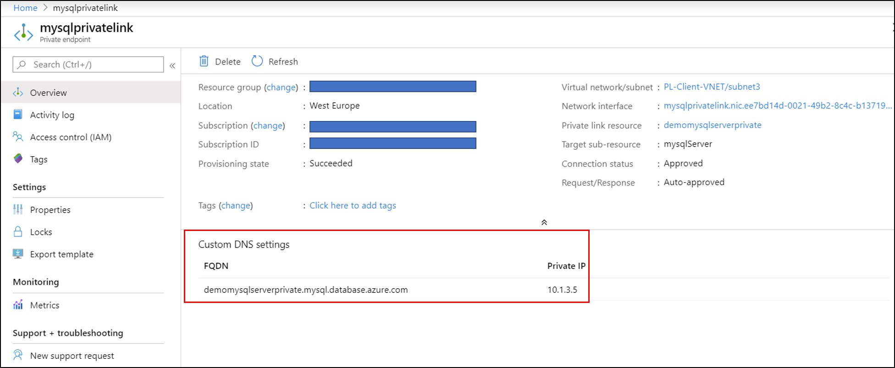

# Create and manage Private Link for Azure Database for MySQL (Preview) using Portal

A Private Endpoint is the fundamental building block for private link in Azure. It enables Azure resources, like Virtual Machines (VMs), to communicate privately with private link resources. In this article, you will learn how to use the Azure portal to create a VM in an Azure Virtual Network and an Azure Database for MySQL server with an Azure private endpoint.

If you don't have an Azure subscription, create a [free account](https://azure.microsoft.com/free/?WT.mc_id=A261C142F) before you begin.

> [!NOTE]
> This feature is available in all Azure regions where Azure Database for MySQL supports General Purpose and Memory Optimized pricing tiers.

## Sign in to Azure
Sign in to the [Azure portal](https://portal.azure.com).

## Create an Azure VM

In this section, you will create virtual network and the subnet to host the VM that is used to access your Private Link resource (a MySQL server in Azure).

### Create the virtual network
In this section, you will create a Virtual Network and the subnet to host the VM that is used to access your Private Link resource.

1. On the upper-left side of the screen, select **Create a resource** > **Networking** > **Virtual network**.
2. In **Create virtual network**, enter or select this information:

    | Setting | Value |
    | ------- | ----- |
    | Name | Enter *MyVirtualNetwork*. |
    | Address space | Enter *10.1.0.0/16*. |
    | Subscription | Select your subscription.|
    | Resource group | Select **Create new**, enter *myResourceGroup*, then select **OK**. |
    | Location | Select **West Europe**.|
    | Subnet - Name | Enter *mySubnet*. |
    | Subnet - Address range | Enter *10.1.0.0/24*. |
    |||
3. Leave the rest as default and select **Create**.

### Create Virtual Machine

1. On the upper-left side of the screen in the Azure portal, select **Create a resource** > **Compute** > **Virtual Machine**.

2. In **Create a virtual machine - Basics**, enter or select this information:

    | Setting | Value |
    | ------- | ----- |
    | **PROJECT DETAILS** | |
    | Subscription | Select your subscription. |
    | Resource group | Select **myResourceGroup**. You created this in the previous section.  |
    | **INSTANCE DETAILS** |  |
    | Virtual machine name | Enter *myVm*. |
    | Region | Select **West Europe**. |
    | Availability options | Leave the default **No infrastructure redundancy required**. |
    | Image | Select **Windows Server 2019 Datacenter**. |
    | Size | Leave the default **Standard DS1 v2**. |
    | **ADMINISTRATOR ACCOUNT** |  |
    | Username | Enter a username of your choosing. |
    | Password | Enter a password of your choosing. The password must be at least 12 characters long and meet the [defined complexity requirements](../virtual-machines/windows/faq.md?toc=%2fazure%2fvirtual-network%2ftoc.json#what-are-the-password-requirements-when-creating-a-vm).|
    | Confirm Password | Reenter password. |
    | **INBOUND PORT RULES** |  |
    | Public inbound ports | Leave the default **None**. |
    | **SAVE MONEY** |  |
    | Already have a Windows license? | Leave the default **No**. |
    |||

1. Select **Next: Disks**.

1. In **Create a virtual machine - Disks**, leave the defaults and select **Next: Networking**.

1. In **Create a virtual machine - Networking**, select this information:

    | Setting | Value |
    | ------- | ----- |
    | Virtual network | Leave the default **MyVirtualNetwork**.  |
    | Address space | Leave the default **10.1.0.0/24**.|
    | Subnet | Leave the default **mySubnet (10.1.0.0/24)**.|
    | Public IP | Leave the default **(new) myVm-ip**. |
    | Public inbound ports | Select **Allow selected ports**. |
    | Select inbound ports | Select **HTTP** and **RDP**.|
    |||


1. Select **Review + create**. You're taken to the **Review + create** page where Azure validates your configuration.

1. When you see the **Validation passed** message, select **Create**.

## Create an Azure Database for MySQL

In this section, you will create an Azure Database for MySQL server in Azure. 

1. On the upper-left side of the screen in the Azure portal, select **Create a resource** > **Databases** > **Azure Database for MySQL**.

1. In **Azure Database for MySQL** provide these information:

    | Setting | Value |
    | ------- | ----- |
    | **Project details** | |
    | Subscription | Select your subscription. |
    | Resource group | Select **myResourceGroup**. You created this in the previous section.|
    | **Server details** |  |
    |Server name  | Enter *myServer*. If this name is taken, create a unique name.|
    | Admin username| Enter an administrator name of your choosing. |
    | Password | Enter a password of your choosing. The password must be at least 8 characters long and meet the defined requirements. |
    | Location | Select an Azure region where you want to want your MySQL Server to reside. |
    |Version  | Select the database version of the MySQL server that is required.|
    | Compute + Storage| Select the pricing tier that is needed for the server based on the workload. |
    |||
 
7. Select **OK**. 
8. Select **Review + create**. You're taken to the **Review + create** page where Azure validates your configuration. 
9. When you see the Validation passed message, select **Create**. 
10. When you see the Validation passed message, select Create. 

## Create a private endpoint

In this section, you will create a MySQL server and add a private endpoint to it. 

1. On the upper-left side of the screen in the Azure portal, select **Create a resource** > **Networking** > **Private Link Center (Preview)**.

2. In **Private Link Center - Overview**, on the option to **Build a private connection to a service**, select **Start**.

    

1. In **Create a private endpoint (Preview) - Basics**, enter or select this information:

    | Setting | Value |
    | ------- | ----- |
    | **Project details** | |
    | Subscription | Select your subscription. |
    | Resource group | Select **myResourceGroup**. You created this in the previous section.|
    | **Instance Details** |  |
    | Name | Enter *myPrivateEndpoint*. If this name is taken, create a unique name. |
    |Region|Select **West Europe**.|
    |||

5. Select **Next: Resource**.
6. In **Create a private endpoint - Resource**, enter or select this information:

    | Setting | Value |
    | ------- | ----- |
    |Connection method  | Select connect to an Azure resource in my directory.|
    | Subscription| Select your subscription. |
    | Resource type | Select **Microsoft.DBforMySQL/servers**. |
    | Resource |Select *myServer*|
    |Target sub-resource |Select *mysqlServer*|
    |||
7. Select **Next: Configuration**.
8. In **Create a private endpoint (Preview) - Configuration**, enter or select this information:

    | Setting | Value |
    | ------- | ----- |
    |**NETWORKING**| |
    | Virtual network| Select *MyVirtualNetwork*. |
    | Subnet | Select *mySubnet*. |
    |**PRIVATE DNS INTEGRATION**||
    |Integrate with private DNS zone |Select **Yes**. |
    |Private DNS Zone |Select *(New)privatelink.mysql.database.azure.com* |
    |||

1. Select **Review + create**. You're taken to the **Review + create** page where Azure validates your configuration. 
2. When you see the **Validation passed** message, select **Create**. 

    

    > [!NOTE] 
    > The FQDN in the customer DNS setting does not resolve to the private IP configured. You will have to setup a DNS zone for the configured FQDN as shown [here](../dns/dns-operations-recordsets-portal.md).

## Connect to a VM using Remote Desktop (RDP)


After you've created **myVm**, connect to it from the internet as follows: 

1. In the portal's search bar, enter *myVm*.

1. Select the **Connect** button. After selecting the **Connect** button, **Connect to virtual machine** opens.

1. Select **Download RDP File**. Azure creates a Remote Desktop Protocol (*.rdp*) file and downloads it to your computer.

1. Open the *downloaded.rdp* file.

    1. If prompted, select **Connect**.

    1. Enter the username and password you specified when creating the VM.

        > [!NOTE]
        > You may need to select **More choices** > **Use a different account**, to specify the credentials you entered when you created the VM.

1. Select **OK**.

1. You may receive a certificate warning during the sign-in process. If you receive a certificate warning, select **Yes** or **Continue**.

1. Once the VM desktop appears, minimize it to go back to your local desktop.

## Access the MySQL server privately from the VM

1. In the Remote Desktop of *myVM*, open PowerShell.

2. Enter `nslookup  myServer.privatelink.mysql.database.azure.com`. 

    You'll receive a message similar to this:
    ```azurepowershell
    Server:  UnKnown
    Address:  168.63.129.16
    Non-authoritative answer:
    Name:    myServer.privatelink.mysql.database.azure.com
    Address:  10.1.3.4
    ```

3. Test the private link connection for the MySQL server using any available client. In the example below I have used [MySQL Workbench](https://dev.mysql.com/doc/workbench/en/wb-installing-windows.html) to do the operation.

4. In **New connection**, enter or select this information:

    | Setting | Value |
    | ------- | ----- |
    | Server type| Select **MySQL**.|
    | Server name| Select *myServer.privatelink.mysql.database.azure.com* |
    | User name | Enter username as username@servername which is provided during the MySQL server creation. |
    |Password |Enter a password provided during the MySQL server creation. |
    |SSL|Select **Required**.|
    ||

5. Select Connect.

6. Browse databases from left menu.

7. (Optionally) Create or query information from the MySQL server.

8. Close the remote desktop connection to myVm.

## Clean up resources
When you're done using the private endpoint, MySQL server, and the VM, delete the resource group and all of the resources it contains:

1. Enter *myResourceGroup* in the **Search** box at the top of the portal and select *myResourceGroup* from the search results.
2. Select **Delete resource group**.
3. Enter myResourceGroup for **TYPE THE RESOURCE GROUP NAME** and select **Delete**.

## Next steps

In this how-to, you created a VM on a virtual network, an Azure Database for MySQL, and a private endpoint for private access. You connected to one VM from the internet and securely communicated to the MySQL server using Private Link. To learn more about private endpoints, see [What is Azure private endpoint](https://docs.microsoft.com/azure/private-link/private-endpoint-overview).
