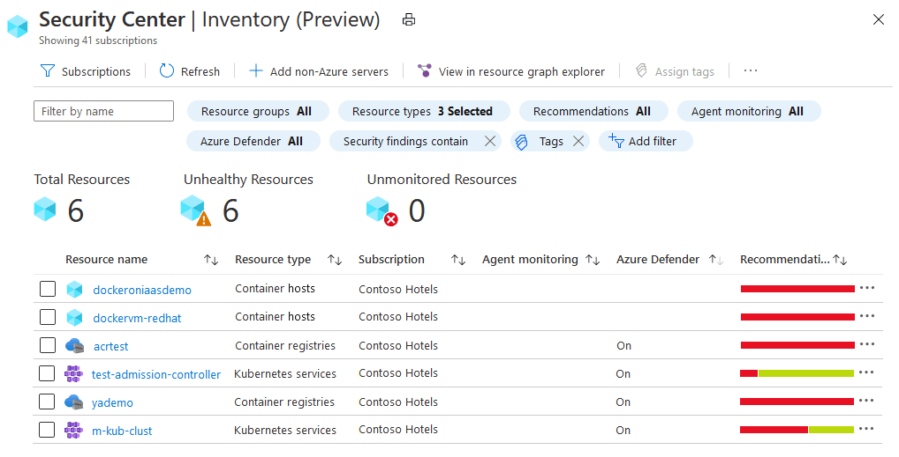

# Container security in Security Center

Azure Security Center is the Azure-native solution for container security. Security Center is also the optimal single pane of glass experience for the security of your cloud workloads, VMs, servers, and containers.

This article describes how Security Center helps you improve, monitor, and maintain the security of your containers and their apps. You'll learn how Security Center helps with these core aspects of container security:

* Vulnerability management
* Hardening of the container's environment
* Runtime protection

For instructions on how to use these features, see [Monitoring the security of your containers](monitor-container-security.md).

## Vulnerability management - scanning container images
To monitor your ARM-based Azure Container Registry, ensure you're on Security Center's standard tier (see [pricing](/azure/security-center/security-center-pricing)). Then, enable the optional Container Registries bundle. When a new image is pushed, Security Center scans the image using a scanner from the industry-leading vulnerability scanning vendor, Qualys.

When issues are found – by Qualys or Security Center – you'll get notified in the Security Center dashboard. For every vulnerability, Security Center provides actionable recommendations, along with a severity classification, and guidance for how to remediate the issue. For details of Security Center's recommendations for containers, see the [reference list of recommendations](recommendations-reference.md#recs-containers).

Security Center filters and classifies findings from the scanner. When an image is healthy, Security Center marks it as such. Security Center generates security recommendations only for images that have issues to be resolved. By only notifying when there are problems, Security Center reduces the potential for unwanted informational alerts.

## Environment hardening

### Continuous monitoring of your Docker configuration
Azure Security Center identifies unmanaged containers hosted on IaaS Linux VMs, or other Linux machines running Docker containers. Security Center continuously assesses the configurations of these containers. It then compares them with the [Center for Internet Security (CIS) Docker Benchmark](https://www.cisecurity.org/benchmark/docker/).

Security Center includes the entire ruleset of the CIS Docker Benchmark and alerts you if your containers don't satisfy any of the controls. When it finds misconfigurations, Security Center generates security recommendations. Use the **recommendations page** to view recommendations and remediate issues. You'll also see the recommendations on the **Containers** tab that displays all virtual machines deployed with Docker. 

For details of the relevant Security Center recommendations that might appear for this feature, see the [container section](recommendations-reference.md#recs-containers) of the recommendations reference table.

When you're exploring the security issues of a VM, Security Center provides additional information about the containers on the machine. Such information includes the Docker version and the number of images running on the host. 

>[!NOTE]
> These CIS benchmark checks will not run on AKS-managed instances or Databricks-managed VMs.

### Continuous monitoring of your Kubernetes clusters (Preview)
Security Center works together with Azure Kubernetes Service (AKS), Microsoft's managed container orchestration service for developing, deploying, and managing containerized applications.

AKS provides security controls and visibility into the security posture of your clusters. Security Center uses these features to:
* Constantly monitor the configuration of your AKS clusters
* Generate security recommendations aligned with industry standards

For details of the relevant Security Center recommendations that might appear for this feature, see the [container section](recommendations-reference.md#recs-containers) of the recommendations reference table.

## Run-time protection - Real-time threat detection

Security Center provides real-time threat detection for your containerized environments and generates alerts for suspicious activities. You can use this information to quickly remediate security issues and improve the security of your containers.

We detect threats at the host and AKS cluster level. For full details, see [threat detection for Azure containers](https://docs.microsoft.com/azure/security-center/security-center-alerts-compute#azure-containers-).

## Container security FAQ

### What types of images can Azure Security Center scan?
Security Center scans Linux OS based images that provide shell access. 

The Qualys scanner doesn't support super minimalist images such as [Docker scratch](https://hub.docker.com/_/scratch/) images, or "Distroless" images that only contain your application and its runtime dependencies without a package manager, shell, or OS.

### How does Azure Security Center scan an image?
The image is pulled from the registry. It's then run in an isolated sandbox with the Qualys scanner that extracts a list of known vulnerabilities.

Security Center filters and classifies findings from the scanner. When an image is healthy, Security Center marks it as such. Security Center generates security recommendations only for images that have issues to be resolved. By only notifying when there are problems, Security Center reduces the potential for unwanted informational alerts.

### How often does Azure Security Center scan my images?
Image scans are triggered on every push.

### Can I get the scan results via REST API?
Yes. The results are under [Sub-Assessments Rest API](/rest/api/securitycenter/subassessments/list/). Also, you can use Azure Resource Graph (ARG), the Kusto-like API for all of your resources: a query can fetch a specific scan.
 

## Next steps

To learn more about container security in Azure Security Center, see these related articles:

* To view the security posture of your container-related resources, see the containers section of [Protect your machines and applications](security-center-virtual-machine-protection.md#containers).

* Details of the [integration with Azure Kubernetes Service](azure-kubernetes-service-integration.md)

* Details of the [integration with Azure Container Registry](azure-container-registry-integration.md)