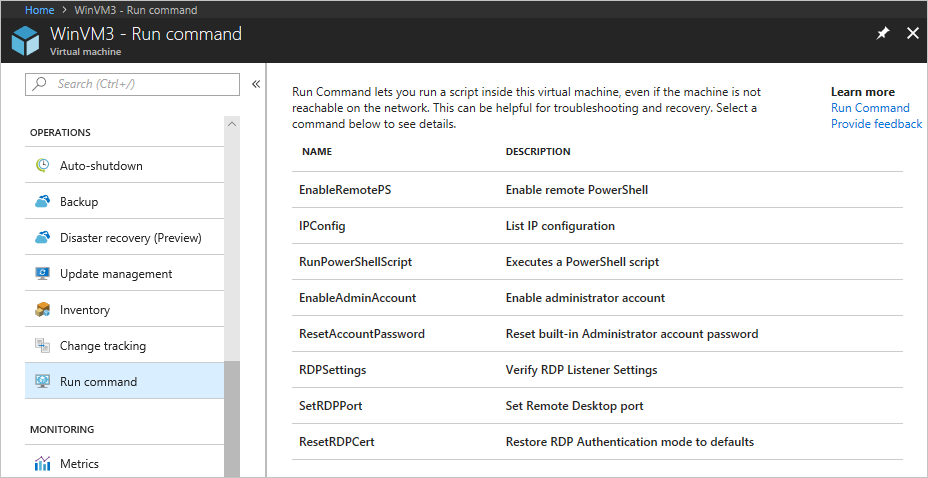

# Run PowerShell scripts in your Windows VM with Run Command

Run Command allows you to run PowerShell scripts within an Azure Windows VM regardless of network connectivity. These scripts can be used for general machine or application management, and can be used to quickly diagnose and remediate VM access and network issues and get the VM back to a good state.

## Benefits

There are multiple options that can be used to access your virtual machines. Run Command can run scripts on your virtual machines regardless of network connectivity and is available by default (no installation required). Run Command can be used through the Azure portal, [REST API](/rest/api/compute/virtual%20machines%20run%20commands/runcommand), [Azure CLI](/cli/azure/vm/run-command?view=azure-cli-latest#az-vm-run-command-invoke), or [PowerShell](/powershell/module/azurerm.compute/invoke-azurermvmruncommand).

This capability is useful in all scenarios where you want to run a script witin a virtual machines, and is one of the only ways to troubleshoot and remediate a virtual machine that is not connected to the network due to improper network or administrative user configuration.

## Restrictions

The following restrictions apply when using Run Command:

* Output is limited to last 4096 bytes
* The minimum time to run a script is about 20 seconds
* Scripts run as System on Windows
* One script at a time may run
* You cannot cancel a running script
* The maximum time a script can run is 90 minutes, after which it will time out

## Run a command

Navigate to a VM in [Azure](https://portal.azure.com) and select **Run command** under **OPERATIONS**. You are presented with a list of the available commands to run on the VM.



Choose a command to run. Some of the commands may have optional or required input parameters. For those commands the parameters are presented as text fields for you to provide the input values. For each command you can view the script that is being run by expanding **View script**. **RunPowerShellScript** is different from the other commands as it allows you to provide your own custom script.

> [!NOTE]
> The built-in commands are not editable.

Once the command is chosen, click **Run** to run the script. The script runs and when complete, returns the output and any errors in the output window. The following screenshot shows an example output from running the **RDPSettings** command.


## Commands

This table shows the list of commands available for Windows VMs. The **RunPowerShellScript** command can be used to run any custom script you want.

|**Name**|**Description**|
|---|---|
|**RunPowerShellScript**|Executes a PowerShell script|
|**EnableRemotePS**|Configures the machine to enable remote PowerShell.|
|**EnableAdminAccount**|Checks if the local Administrator account is disabled, and if so enables it.|
|**IPConfig**| Shows detailed information for the IP address, subnet mask and default gateway for each adapter bound to TCP/IP.|
|**RDPSettings**|Checks registry settings and domain policy settings. Suggests policy actions if machine is part of a domain or modifies the settings to default values.|
|**ResetAccountPassword**| Resets built-in Administrator account password.|
|**ResetRDPCert**|Removes the SSL certificate tied to the RDP listener and restores the RDP listerner security to default. Use this script if you see any issues with the certificate.|
|**SetRDPPort**|Sets the default or user specified port number for Remote Desktop connections. Enables firewall rule for inbound access to the port.|

## PowerShell

The following is an example using the [Invoke-AzureRmVMRunCommand](/powershell/module/azurerm.compute/invoke-azurermvmruncommand) cmdlet to run a PowerShell script on an Azure VM.

```azurepowershell-interactive
Invoke-AzureRmVMRunCommand -ResourceGroupName '<myResourceGroup>' -Name '<myVMName>' -CommandId 'RunPowerShellScript' -ScriptPath '<pathToScript>' -Parameter @{"arg1" = "var1";"arg2" = "var2"}
```

## Limiting access to Run Command

Listing the run commands or showing the details of a command require the `Microsoft.Compute/locations/runCommands/read` permission, which the built-in [Reader](../../role-based-access-control/built-in-roles.md#reader) role and higher have.

Running a command requires the `Microsoft.Compute/virtualMachines/runCommand/action` permission, which the [Contributor](../../role-based-access-control/built-in-roles.md#virtual-machine-contributor) role and higher have.

You can use one of the [built-in](../../role-based-access-control/built-in-roles.md) roles or create a [custom](../../role-based-access-control/custom-roles.md) role to use Run Command.

## Next steps

See, [Run scripts in your Windows VM](run-scripts-in-vm.md) to learn about other ways to run scripts and commands remotely in your VM.